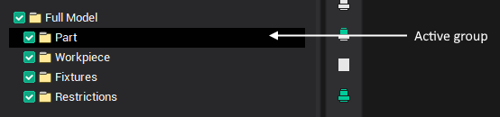

# Active folder

Only one group can be active at one time. Work ([import](772.md), detailing, transformations and etc.) is possible only with the objects located in the currently active group. The group, which is active is treated as a single object, and is considered indivisible. In order to work separately with elements located inside the group, you will have to "open" or activate it. These rules are similar to working with any file system (e.g. Windows). It is only possible to work with a folder or a file after having "entered" (opened) the folder containing it.

The currently active folder is shown in the [model structure window](718.md). In the window one can also find the list of geometrical and structural elements, which are inside the active folder. Selection of these elements can be performed both from the list directly and from the [graphic window](169.md). Selection of the active group is performed by selecting the corresponding tree-link in the model structure window or by selecting an object in the graphical window.
