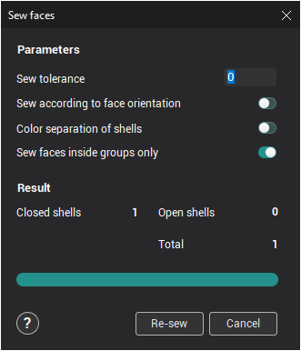
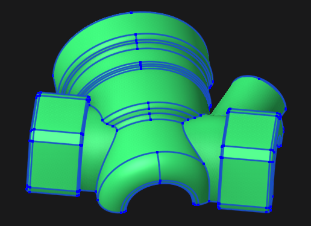
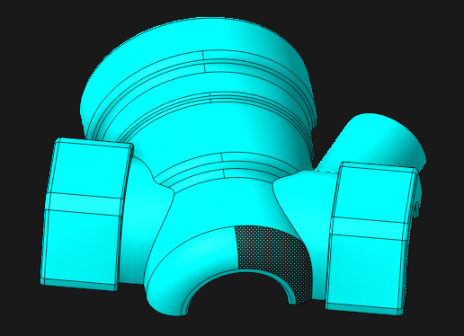
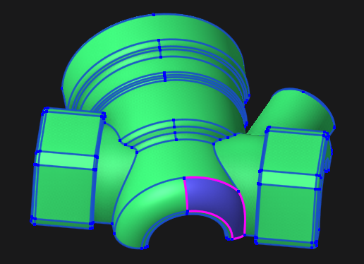

# Sew Faces

The **Sew faces** window can be opened either by pressing the  button on the **Model** panel, or by using the pop up menu in the [graphic window](169.md) or on the [geometrical structure window](718.md). This function assigned for sewing faces on 3D model together. At that in geometry model added edges and vertices of selected objects.

As result of sewing in geometry model becomes available special parametric objects – edges and vertices. Edges is special curves, that forms borders of faces and meshes. Vertices is points, that comes out from limits of edges.

Parametric objects has some peculiar properties. They keeps permanent connection with source object. When this faces is modified, that edges and vertices will be reconstructed too. In consequence there is some limitations on actions with them. Its cannot be copied, deleted, transformed, etc. Therefore this objects is not listed in [available objects](718.md). However this objects can be selected in [graphic window](45.md). So, edges, series of edges and vertices can be used in [Machining](54.md) mode as [Job assignment](301.md), [Part](330.md), [Workpiece](738.md), [Fixtures](10283.md) in all cases, when allowed addition of edges and vertices.

In **Sew tolerance** field assigned maximal value of deviation between edges and vertices of nearest faces. When tolerance is 0 this value taken automatically with account to overall dimensions of sewing objects.

The **Sew according to face orientatin** option allows you to take into account the normal direction of faces when sewing them. The default is off.

In some cases, errors may occur during import due to which the normals of some faces will be directed in the wrong direction:

Such models are not always possible to sew correctly:

To solve these problems, the following tools were added (appear when selecting a face):

-  - Inverts the selected faces.

-  - Inverts all faces of the shell.

-  - Inverts all faces whose normal is directed inside the shell.

-  - Enables color separation of shells mode.

The **Sew faces inside group only** option sets the boundaries for finding faces when sewing them. It is understood that closed shells must be in separate [Groups](603.md). Enabled by default. The option is not shown if no other groups with faces are found.

The **Result** panel shows count of closed and opened shells and its total count.

If results is correct, then the window should be closed using the **Ok** button. To cancel sewing, press the **Cancel** button.
