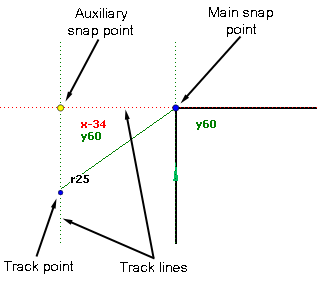
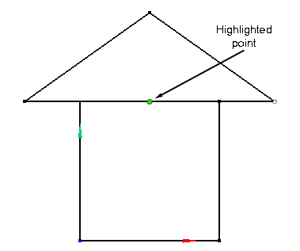
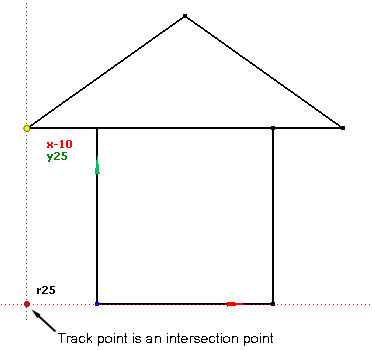
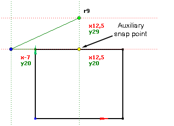
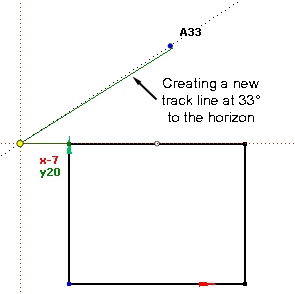
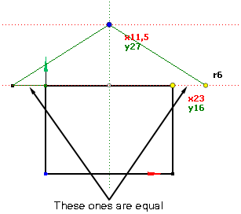

# Smart Snap

The <strong>Smart Snap</strong>  button enables or disables snapping to objects in the graphics window. This feature is useful when creating new geometric objects or editing existing ones, such as points, lines, contours, and coordinate systems.

For example, by using the <strong>Smart Snap</strong> feature, you can easily create precise, well-constrained drawings on the fly.

The main building blocks of <strong>Smart Snap</strong> are:

- <strong>Highlighted points:</strong> When you move the cursor over geometric entities, the points you can snap to are highlighted in lime color. These include terminating points of cuts and arcs, distinct points, the center points of arcs and circles, the middle points of cuts, intersection points, etc.

- <strong>Main snap point</strong>: Whenever you click the left or middle mouse button on a highlighted point or a track point (see below), you create a main snap point with an associated set of track lines. The main snap point is persistent, meaning it doesn't disappear when you move the cursor away. It is labeled with the point coordinates.

- <strong>Main track lines</strong>: These are lines originating from the main snap point. Some lines are aligned with the current Local Coordinate System, while others are aligned with neighboring geometric entities (e.g., if the main snap point is the termination point of a cut, the main track lines include lines parallel to and perpendicular to the direction of the cut).

- <strong>Current track point:</strong> The track point is the point on a track line. When you move the cursor over a track line, the track point moves as well. It is labeled with the distance from the current snap point, and may also represent the intersection of a geometric entity or another track line with the current track line. In this case, the track point is colored red.

- <strong>Auxiliary snap point:</strong> When you hover over a highlighted point or track point for some time, the point becomes an auxiliary snap point. It behaves like the main snap point but is not persistent, meaning it disappears when you move the cursor away from it and its track lines. The auxiliary snap point has its own set of track lines, allowing you to construct intersection points between the main and auxiliary track lines on the fly. This is a very useful feature.

- <strong>Dragging track lines with the middle mouse button:</strong> You can press the middle mouse button over a track line and, while holding the button, drag the line. This action creates a new track line at an angle relative to the source track line. While dragging the line, you can see the actual angle value on the screen.

- <strong>Keeping track of the last distances:</strong> When drawing, you may want to make cuts of equal length. To help with this, <strong>Smart Snap</strong> remembers the last three track distances you accepted when creating the drawing. When you move the cursor over the track line, the track point may be colored yellow, indicating that the distance from the track point to the snap point matches one of the last three distances.

