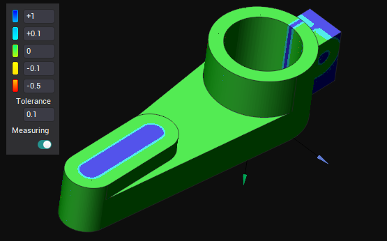
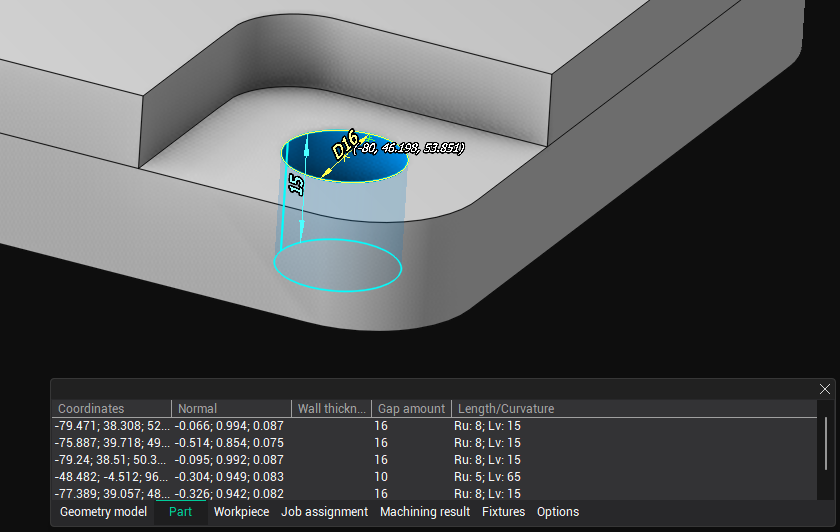
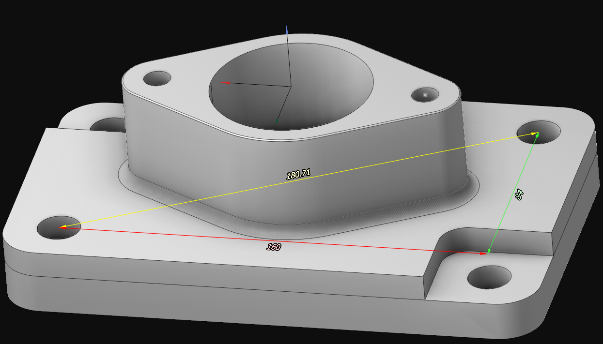

# Measurement and analysis

The CAM system includes tools for conveniently measuring geometrical parameters of a model and analyzing the results of simulated machining.

## Verify Compare

The <strong>Verify Compare</strong>  feature can be activated in either [Machining](10064.md) or [Simulation](10286.md) mode. This tool visually displays the differences between the original part and the machining result using a color scheme, where each color represents a specific deviation range between the compared elements.

## Geometry Measuring

The <strong>Geometry Measuring</strong>  tool helps you determine the primary geometric dimensions of the selected object in the graphics window. Upon activating this mode, an additional window appears, allowing you to choose the type of object being measured (e.g., part, workpiece, machining result, etc.) and configure measurement parameters. When you select an object, its key dimensions are displayed in the graphics window, and a row with the main parameters related to the selected point is added to the measurement window. Some dimensions may depend on the active geometrical coordinate system.

## Measure Tool

The <strong>Measure Tool</strong> button  enables the mode for measuring distances between two arbitrary points on the screen. After activation, select any two points in the graphics window. Three orthogonal sizes and one diagonal will appear on the screen. The orientation of these dimensions depends on the active geometric coordinate system. You can continue selecting additional pairs of points to measure the distances between them.

