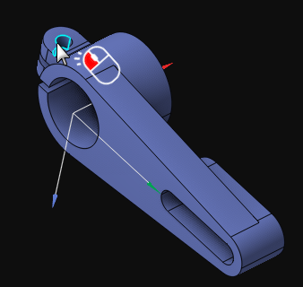
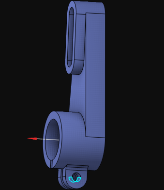
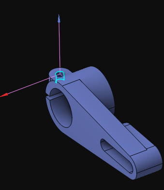
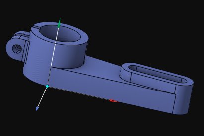
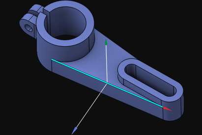
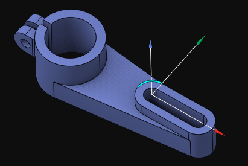
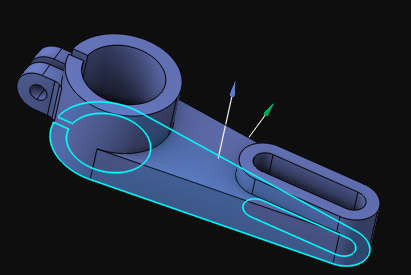
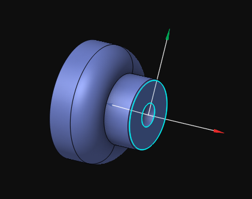
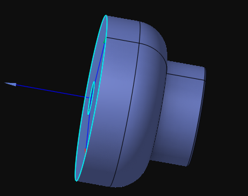

# Smart LCS creation

You can easily create a coordinate system with approximately two mouse clicks. It is very straightforward.

1. First, select in the graphic view a design feature that defines the location of the new coordinate system. You can select any entity that has an origin, an axis, or both. For example, a circular arc, a line, a revolution surface, or a plane defines both the origin and the axis. A point defines only the origin, while a vertex of a solid model defines both the origin, the Z axis (taken from the neighboring surface), and the X axis direction (taken from the neighboring edge). A straight edge of a solid model defines the origin placed in the middle of the edge, with the Z axis direction taken from the neighboring surface and the X axis direction taken from the edge itself.

2. Since no geometry entity defines a local coordinate system completely, the CAM system must decide how to select the missing parameters, such as the Z or X axis direction of the new LCS. You can easily guide the CAM system by rotating the view with the mouse. This way, the CAM system selects the missing parameters for the new LCS based on the orientation of the view, similar to how you orient the view using the smart middle mouse click.

3. The final step is a simple click on the  menu item on the [coordinate systems panel](753.md).

Examples of Smart LCS creation:

- LCS by a solid vertex:

- LCS by a solid straight edge:

- LCS by a solid circular edge:

- LCS in the center of a planar face with an inverted Z axis direction:

- XOY LCS in the center of a flat face:

- XOY LCS in the center of a flat face with an inverted X axis direction:

