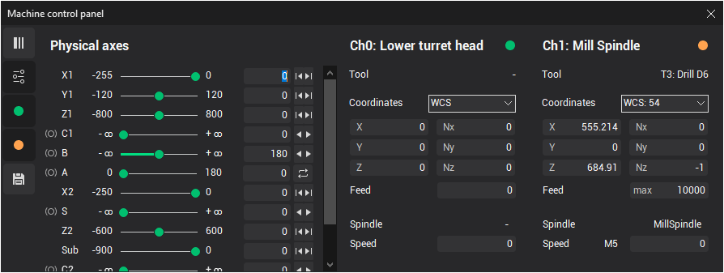
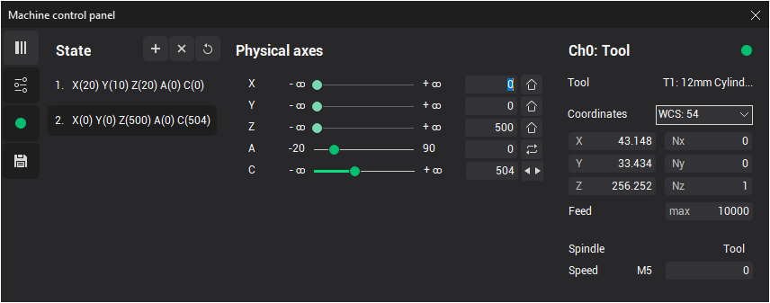

# Machine axes control panel

The <strong>Machine Axes Control</strong> window allows you to monitor and modify the current values for all machine/robot coordinates. To display this window, click the  corresponding button on the main toolbar. It is helpful when analyzing toolpaths in simulation mode, constructing manual approaches, or determining the initial machine position to calculate the technological operation.

Visually, the window is divided into several areas. The number of panels and their content may vary depending on the particular machine configuration. The toolbar at the top or left side controls the visibility of these panels.

-  <strong>Switch layout: vertical/horizontal:</strong> toggles the layout of panels between vertical and horizontal.

-  <strong>Physical axes panel visibility:</strong> shows/hides the panel with the list of physical machine axes.

-  <strong>Channel panel visibility:</strong> shows/hides the panel with information about the machine's control channels. There may be several such buttons, depending on the number of channels a machine has. The icon color indicates the unique color associated with each channel. All related information will be displayed in this color when referring to that channel.

-  <strong>States panel visibility:</strong> shows/hides the panel that displays a list of stored machine states.

The <strong>Channel panel</strong> displays the following values:

- Color, index, and name of the channel
- Active tool number and name of the channel
- Active WCS number combo, where you can select additional coordinate systems to display tool coordinates
- Tool coordinates and orientation angles, shown as vectors or quaternions in the specified spatial CS. The type of orientation angles can vary depending on the machine schema settings.
- Current feed value and measurement units (type of feed, e.g., mm/min, mm/rev or "max" for rapid feed).
- Current spindle name, speed, rotation direction (M3, M4, M5), and rotation mode (e.g., rev/min for RPM or m/min for CSS)

The <strong>Physical axes panel</strong> displays information for each machine axis, including:

- Axis name
- Current physical value of the axis, which does not depend on the current WCS, but rather on how the axis is defined in the machine schema. This value may turn red if the axis is out of range.
- Minimum and maximum limits of the axis
- Axis brake status, if applicable:
  -  Brake is off
  -  Brake is on
- Quick modification buttons for the axis value, based on axis properties:
  -  Returns the axis to its home position
  -  Moves the axis to its minimum limit
  -  Moves the axis to its maximum limit
  -  Subtracts one period for a rotary periodic axis (if within limits)
  -  Adds one period for a rotary periodic axis (if within limits)
  -  Switches the machine axes to an alternative solution if the same tool-workpiece relative position can be achieved in multiple ways

The State panel shows stored machine states and includes the following buttons:

-  <strong>Add new state</strong>: Saves the current machine state to the list
-  <strong>Delete selected state</strong>: Removes the selected state from the list
-  <strong>Delete all states</strong>: Clears the entire list of stored states

You can double-click on a state in the list to quickly switch the machine to that state. Using the **Remember state** feature is helpful when [constructing manual transitions](10267.md) on machines with complex axis configurations, such as 6-axis articulated robots.
