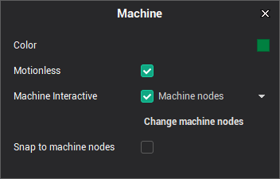
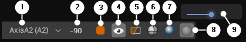
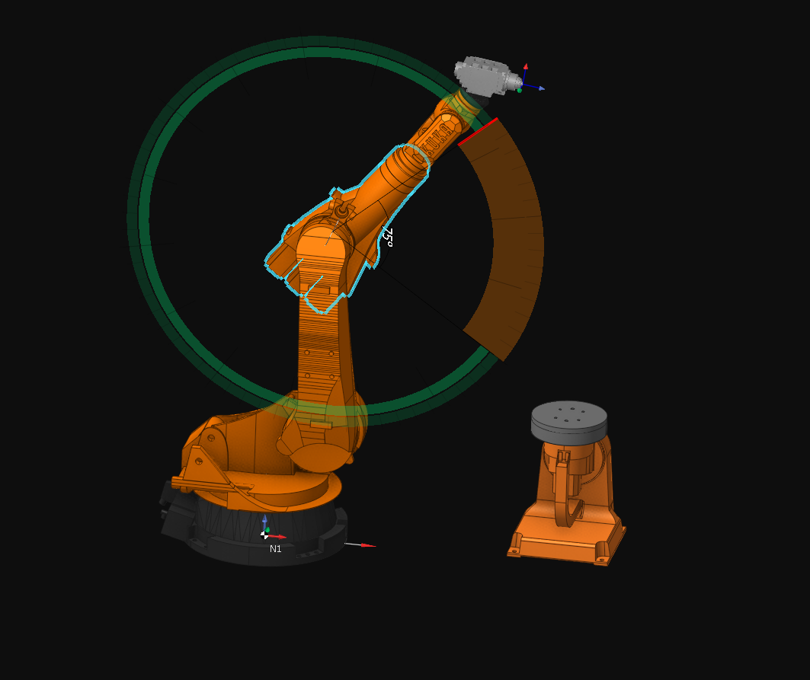

# Interactive Machine

The system provides the ability to interactively control the machine and change its visualization parameters. To enable or disable this feature, use the special item in the pop-up menu of the machine visibility button.

Machine components under the cursor will be highlighted. A dotted line shows the rotation axis for rotary axes. After clicking on any machine node, the visual parameters window will be displayed:

1 — <strong>Node name</strong>

2 — <strong>Current position of the axis</strong>: You can enter the desired value or use the mouse wheel to set it. This field is shown only for movable machine nodes.

3 — <strong>Machine node color</strong>: Click to open the Select Color dialog.

4 — <strong>Machine node visibility</strong>

5 — <strong>Switch to Ghost mode</strong>: In this mode, only invisible nodes will be shown

6 — <strong>Machine node painting mode</strong> (Wire, Shade, Edge-Shade)

7 — <strong>Turn on metallic mode</strong>

8 — <strong>Machine node transparency</strong>

9 — <strong>Machine node transparency level</strong>

You can move the machine nodes using drag-and-drop. If a node is not movable, the nearest movable parent node will be moved. For rotary nodes, an auxiliary circle showing the rotation plane will be displayed. The radius of the circle equals the distance from the axis of rotation to the point where the machine node is clicked.

It is also possible to set the entire machine's position by defining the desired tool position. The machine will adjust the nodes' positions to achieve the specified tool position. Drag-and-drop the tool to use this feature. If the machine does not have an active tool, a yellow point will be shown instead. The tool moves along the view plane, so set the view vector along the X, Y, or Z axes for precise control.
