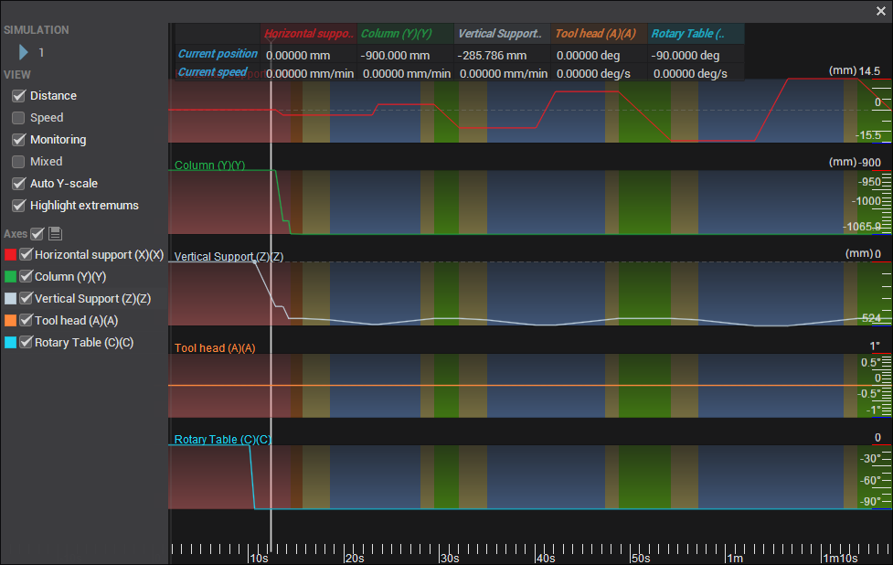
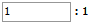
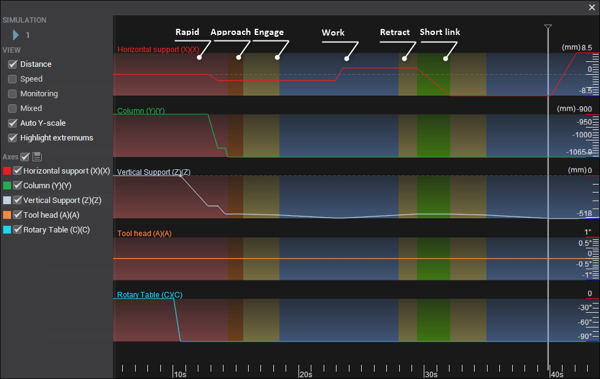

# Graph of the machine axes window

This feature allows you to view the change in the values of the machine axes over time as the tool travels along the path for the current operation, displayed as a set of graphs. To generate a graph, select the calculated operation from the list of operations, and click the corresponding button  on the main toolbar.

The window has the following layout:

- <strong>Simulation</strong>: The Simulation button starts the synchronized simulation of the tool movement and all machine axes, both in the main graphics window and on the axes graph. A running marker will show the current position on the axis chart. You can set the marker to an arbitrary point in time by clicking the left mouse button on the graph. You can also change the simulation speed by scrolling the mouse wheel or manually entering a value in the field .
- <strong>Distance</strong>: Displays the position of each machine axis throughout the machining process. For linear axes, the position is shown in millimeters or inches, and for rotary axes, it is displayed in degrees. This property allows you to track the exact position of each axis as the tool moves along the toolpath, providing a detailed overview of axis movements during the operation.
- <strong>Speed</strong>: Represents the first derivative of <strong>Distance</strong>, indicating the rate of change of each machine axis's position over time. For linear axes, this is shown as linear speed in millimeters per second (mm/s) or inches per second (in/s), and for rotary axes, it is displayed as angular speed in degrees per second (deg/s). This property allows you to monitor how quickly each axis moves or rotates during the machining process, providing valuable insight into machine dynamics and ensuring precise control.
- <strong>Monitoring</strong>: When activated, a table appears at the top of the window showing real-time data for each machine axis. The first row displays the current position of each axis in degrees (deg), while the second row shows the current speed of each axis in degrees per second (deg/s). This feature is useful for live tracking and analysis during operations.
- <strong>Mixed</strong>: When enabled, data for all axes is displayed on a single graph, allowing for comprehensive monitoring and comparison. This option simplifies visualization by consolidating information, making it easier to observe the relationship between axis movements in a unified view.
- <strong>Auto Y-scale</strong>: For easier viewing, the vertical size of each axis graph is stretched to the same height. When enabled, the vertical scale is automatically adjusted based on the maximum and minimum values of the axes. The horizontal scale can be changed by rotating the mouse wheel while the pointer is in the graphics area.
- <strong>Highlight extremums</strong>: Displays points where the direction of motion of the axis is reversed.
- <strong>Axes</strong>: You can disable the visibility of individual axes and assign a color to them by clicking on the colored square.

The background color below the graph indicates the type of feed being used: working, rapid, approach, return, etc.

