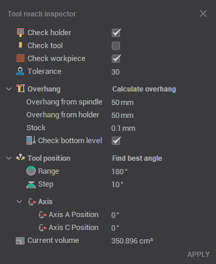
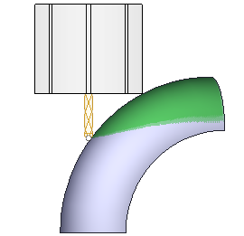
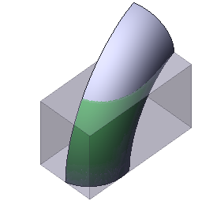
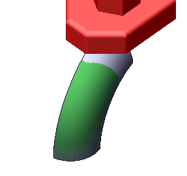
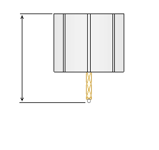

# Holder occlusion check utility

The <strong>Holder Occlusion Check</strong> panel allows you to view zones of the part where the toolholder has no collisions, and to determine the best angle for part processing.

This feature is helpful in preparing the technical process during part manufacturing.

To display this window, click the corresponding button  on the **Control** tab of the main panel.

Visually, the window is divided into two areas. The content of these areas may vary depending on the specific machine configuration.

The <strong>top panel</strong> displays the main operation parameters that affect the safe zone size for the toolholder.

- <strong>Check Holder</strong>: Detects segments of the toolpath where the toolholder collides with the part, and modifies those segments according to the specified strategy. This feature helps prevent collisions by adjusting the toolpath to avoid contact between the toolholder and the part, ensuring safe and efficient machining even in complex areas.

- <strong>Check Workpiece:</strong> Detects collisions between the tool and the workpiece during machining. Using this feature helps ensure that the tool can safely access the necessary areas of the part without damaging the workpiece, especially when working with complex geometries.

- <strong>Check Fixtures:</strong> Checks for potential collisions between the tool and any fixtures during machining. Using this feature ensures that the tool avoids collisions with clamps, chucks, or other fixtures, which is essential for preventing damage to both the part and the machine setup during complex operations.

- <strong>Overhang:</strong> Allows you to set the length of the toolholder extending from the spindle. Setting the correct overhang value is crucial for ensuring the toolholder has enough clearance to avoid collisions and optimize machining performance by minimizing deflection and tool vibration.

At the bottom of the window, the **Rotary Axis** panel displays information about the current machine axis status and provides a tool for finding the optimal tool angle for processing.
