# Operation parameters

## Application area:

This tab contains the main parameters for controlling the part, workpiece, fixture and other items, which allow you to change the trajectory.

<em>Below are all the parameters. Depending on the specific operation being used, certain parameters will be available.</em>

### Check part.

The part geometry is taken into account while calculating the toolpath. A gouge-free toolpath is guaranteed, however the calculation time can be long when the part geomety is complex.

Click here to expand..

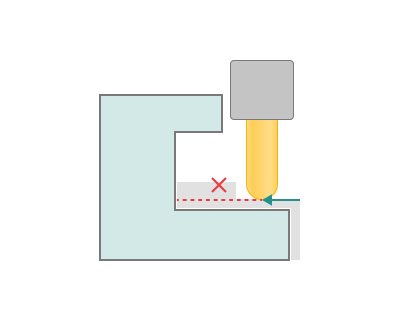

<strong>Tolerance.</strong> This feature defines the 'maximum deviation' between the 'ideal' and 'approximated' toolpath. A larger tolerance amount reduces the number of moves in the toolpath. The toolpath calculation aims to ensure that deviations from the part geometry do not exceed the specified tolerance.

One should note that <strong>increasing the tolerance</strong> would <strong>increase the calculation time</strong> and the size of the NC program.

The <strong>tolerance</strong> must be <strong>more than zero</strong>, otherwise it will be impossible to construct an approximated toolpath.

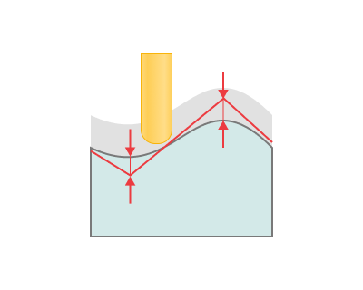

<strong>Radial stock.</strong> It defines the stock in radial direction of the tool for the future machining.

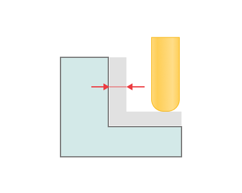

<strong>Axial stock.</strong> It defines the stock in axial direction of the tool for the future machining.

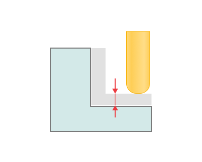

<strong>Use fast calculation method.</strong> It uses more fast algorithms for the calculation. Try to disable this option if toolpath tolerance doesn't suits you. If <strong>Use fast calculation method</strong> is used, toolpath calculation time reduces dramatically. A speedup on complex parts may reach up to 10–20 times.

By now, fast toolpath calculation methods use triangulated surfaces as input data. This fact involves some limitations that should be taken into consideration while generating toolpath. First of all, the quality of the generated toolpath may be worse than when using traditional exact methods. The maximum deviation of the toolpath depends heavily on the value specified in the <strong>Tolerance</strong> panel of the operation parameters dialog. This value determines the tolerance of model triangulation. Secondly, triangulated surfaces require a lot of operation memory.

Described limitations are today a common place for all CAM systems, and only our CAM systems gives you the alternative between speed of approximate calculation methods and the quality of exact calculation methods.

<strong>Use new calculation method.</strong> The new algorithm enables fast multi-core computation and ensures a smooth tool path, taking into account surface normals and the side angle. [Details](100125.md)

<strong>Disc diameter stock.</strong> This design allows for a stock to be left at the walls of the parts, ensuring sufficient material for subsequent processing or fitting

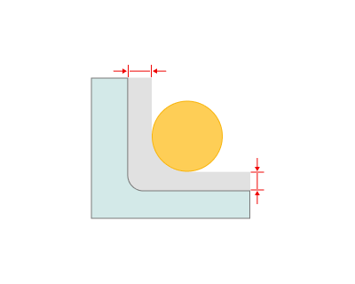

<strong>Disc thickness stock.</strong> Disc thickness stock allows for a margin to be left adjacent to the part wall on the side of the disc.

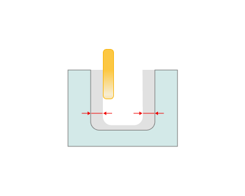

### Work passes interpolation.

Click here to expand..

<strong>Auto.</strong> The system automatically selects the interpolation mode based on machine capabilities and path type.

- If spatial arcs are supported and the path is 5-axis or 6-axis, "Spatial arcs" will be used.
- If only planar arcs (XY, YZ, ZX) are supported and the path is 3D, "Planar arcs and helices" will be used.
- If arcs are not supported, "Deviation-based" segmentation will be used.

<strong>Off.</strong> Toolpath is used as-is. No interpolation.

<strong>Deviation-based.</strong> Interpolates the path using linear segments within the specified linear and angular deviation limits.

Click here to expand..

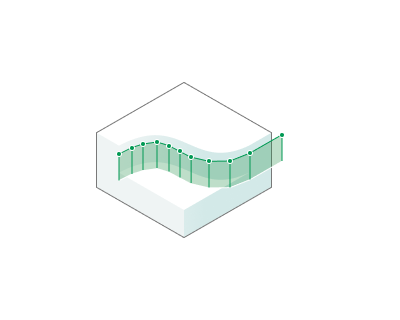

<strong>Max linear deviation.</strong> Sets the maximum distance the resulting line segment can deviate from the original spatial trajectory. Decreasing the value results in a more accurate approximation; increasing it results in a coarser approximation, fewer segments, and faster calculations, but may result in noticeable errors in the trajectory's shape.

<strong>Max angular deviation.</strong> Sets the maximum allowable rotation between adjacent line segments in the approximation. A low value smooths out the turns, creating more segments at the points of curvature; a high value allows sharper angles between segments.

<strong>Fixed segment length.</strong> Divides the path into equal-length segments. Works best for smooth trajectories. May clip sharp corners.

Click here to expand..

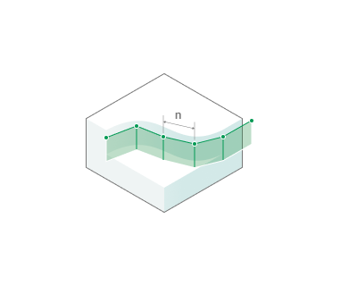

<strong>Segment length.</strong> Specifies a fixed length of linear segments into which the original toolpath is divided during interpolation.

<strong>Planar arcs/helices.</strong> Arcs interpolation in the XY / YZ / ZX planes with the Circle command (depending on the operation).

Click here to expand..

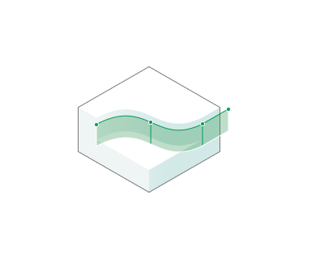

<strong>Max linear deviation.</strong> Sets the maximum distance the resulting line segment can deviate from the original spatial trajectory. Decreasing the value results in a more accurate approximation; increasing it results in a coarser approximation, fewer segments, and faster calculations, but may result in noticeable errors in the trajectory's shape.

<strong>Max angular deviation.</strong> Sets the maximum allowable rotation between adjacent line segments in the approximation. A low value smooths out the turns, creating more segments at the points of curvature; a high value allows sharper angles between segments.

### Links interpolation.

### Max motion length.

Click here to expand..

<strong>If enabled:</strong> The tool path motions will be divided to not exceed the given length. Smaller trajectory segments enhance contour-following accuracy, particularly on high-precision machines.

<strong>If disabled:</strong>. Motion moves will not be divided.

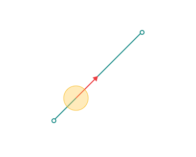 

### Max motion rotation.

Click here to expand..

<strong>If enabled:</strong> The tool motion trajectory is divided into segments so that the rotation angle on each segment does not exceed the specified value. The CAM system automatically inserts intermediate rotation points if the calculated rotation angle on a segment exceeds the Max motion rotation limit.

<strong>If disabled:</strong>. Motion moves will not be divided.

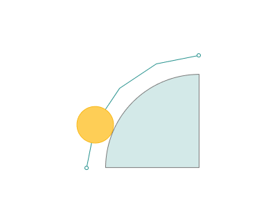 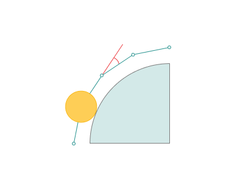

### Check workpiece.

Group of parameters, that define the way of workpiece calculation for the current operation.

Click here to expand..

.png) .png)

<strong>Radial ignore thickness.</strong> Unlike the <strong>stock</strong> in the <strong>Check part</strong> group, the algorithm relies on analyzing the workpiece after the previous operation: the toolpath is not generated in areas where the <strong>radial stock</strong> is less than the specified value. The parameter value must be less than the <strong>Depth step</strong> and <strong>Safe distance</strong>.

If, during the first pocket machining operation, the <strong>Radial stock</strong> and <strong>Axial stock</strong> values are set to 1 mm and the tool diameter exceeds the pocket's fillet radii, the stock allowance will be uneven. On straight wall sections, it will be 1 мм, whereas in corner areas it will exceed 1 mm.

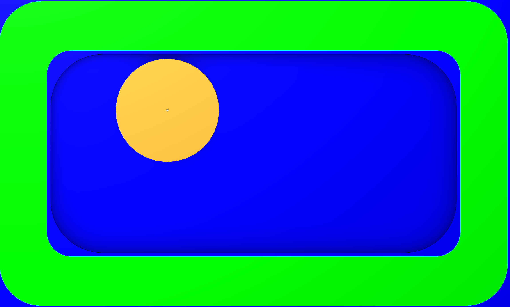

In the second machining operation, you can set the <strong>Radial ignore thickness</strong> and <strong>Axial ignore thickness</strong> values to 1,1 mm. When using a tool with a diameter smaller than the pocket's fillet radii, machining will be performed exclusively in the corner areas of the part — specifically where the stock allowance exceeds 1 mm.

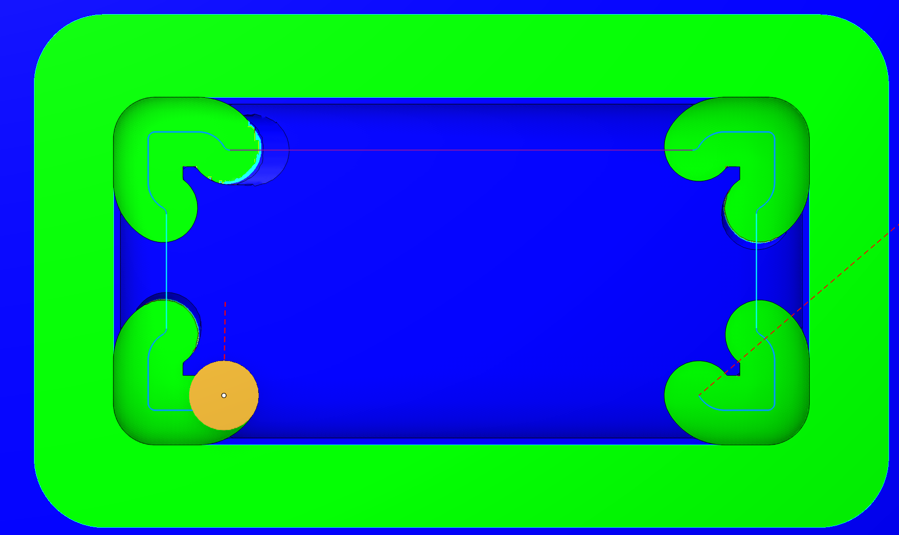

<strong>Axial ignore thickness.</strong> Unlike the <strong>stock</strong> in the <strong>Check part</strong> group, the algorithm relies on analyzing the workpiece after the previous operation: the toolpath is not generated in areas where the <strong>axial stock</strong> is less than the specified value. The parameter value must be less than the <strong>Depth step</strong> and <strong>Safe distance</strong>.

<strong>Extend toolpath.</strong> Extend the toolpath so that cutting starts before the workpiece edge. This is primarily used in finishing operations: <strong>Finishing waterline</strong> and <strong>Finishing plane</strong>, when the <strong>Check workpiece</strong> option is enabled and the toolpath is being constrained (a ccording to the workpiece ). This option allows extending the approach to the entery point.

The parameter is similar to the <strong>Safe</strong> <strong>distance</strong> setting on the <strong>Link/Leads</strong> tab. [Details](100139.md)

The difference is that the extended approach for <strong>Safe distance</strong> follows a tangent from the cutting point, while <strong>Extend toolpath</strong> contours around the workpiece.

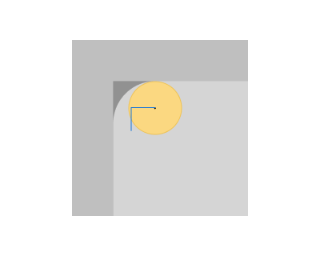 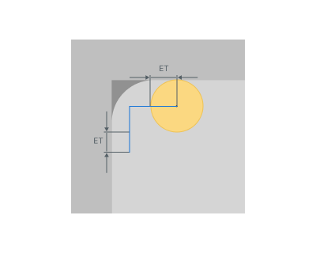

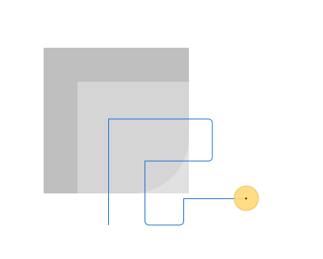 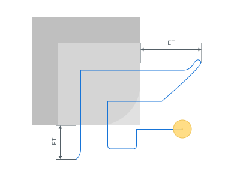

<strong>ET</strong> - Extend toolpath

<strong>Theoretical ignore thickness.</strong> Operation uses the virtual workpiece for the calculation. This workpiece contains the zones that was not available for some tool. The real toolpath of the previous operations don't play any role. Only tool is used.

Click here to expand..

<strong>After tool diameter.</strong> Defined tool diameter is used to calculate the virtual workpiece.

<strong>With corner radius.</strong> Toroidal or spherical tool can be defined to calculate the virtual workpiece.

<strong>Model resolution.</strong>

### Check fixtures.

When generating the toolpath, fixtures are treated as no-go zones to prevent collisions.

Click here to expand..

.png) .png)

### Weaving.

Mechanical weaving is used, for example, to compensate for tolerances or to bridge gaps in a seam. The torch moves across the seam in this instance and the weave oscillation is thus superposed on the seam motion. It is also possible to rotate the torch in relation to the plane of the weld (direction of welding). Can also be used for polishing. [Details](100114.md)

### Features.

The trajectory output method is used for <strong>Recognize features</strong>. [Details](100152.md)

Click here to expand..

<strong>Cycle format.</strong>

<strong>None.</strong> Only simple NC commands (Without indicating cycles or recognized features).

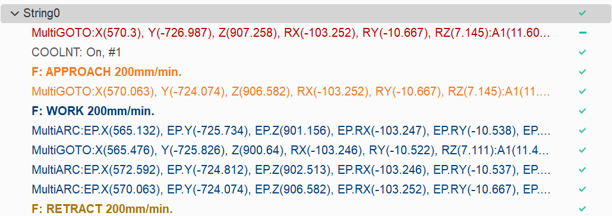

<strong>Without internal movements (EXTCYCLE only).</strong> Canned cycles are used, with identification of recognized machining features

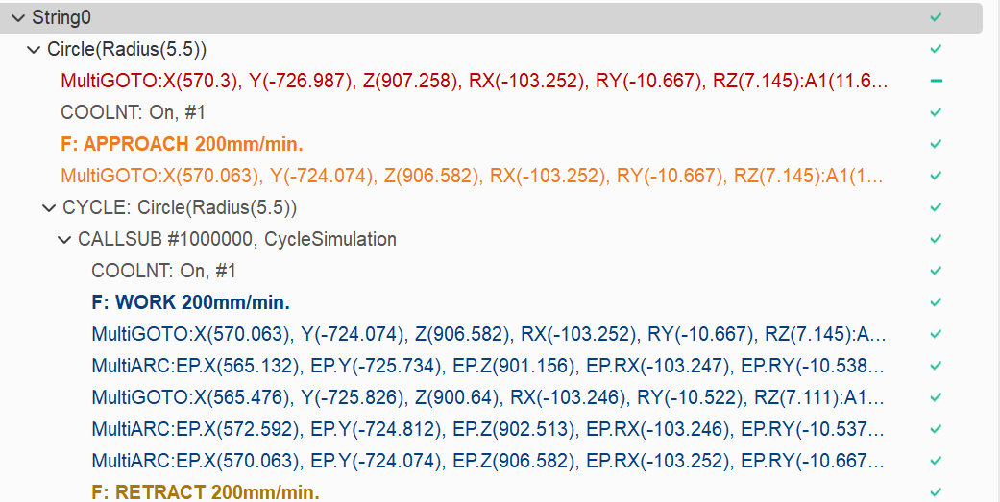

<strong>With internal movements.</strong> Only simple NC commands with indication of recognized features.

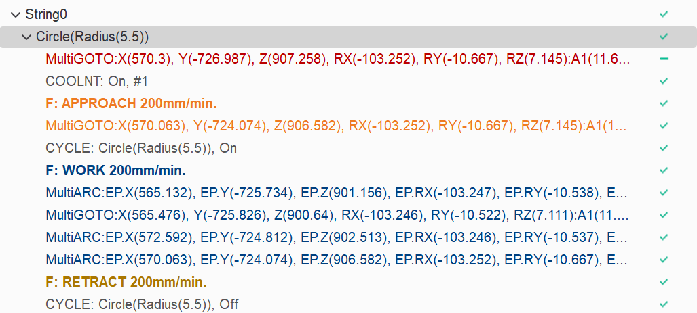

<strong>Start and end at center.</strong> The toolpath starts and ends at the center of the feature. When the option is disabled, cutting starts from the wall edge.

 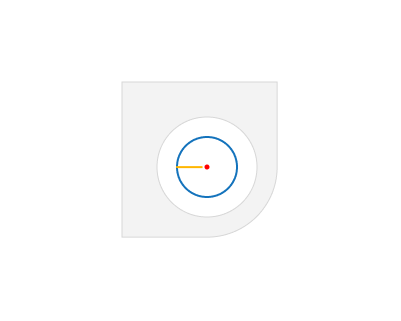

### Check Holder.

The "Check Holder" feature detects segments of the toolpath where the tool holder collides with the part and modifies those segments according with the specified strategy. [Details](11211.md)

### Plunge roughing.

Makes a plunge passes based on the current trajectory. [Details](10122.md)

### Advanced.

Click here to expand..

<strong>Small gap size.</strong> Merging small gaps formed after undercut inspection

<strong>Reverse side.</strong> Surface normal inversion.

### Simulation.

Group of parameters to define the simulation options for the current operation.

Click here to expand..

<strong>Check for gouges.</strong>

<strong>If enabled:</strong> If the toolpath of this operation gouges the part, the gouging motions will be highlighted in red.

<strong>If disabled:</strong> If the toolpath of this operation gouges the part, the gouging motions will not be highlighted.

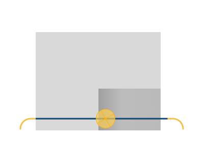 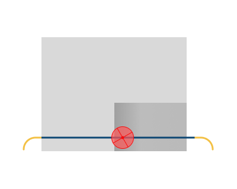

<strong>Simulation type.</strong>

<strong>Auto.</strong> The simulation type is automatically assigned based on the selected operation type.

<strong>Subtractive.</strong> Modeling is carried out by subtracting material.

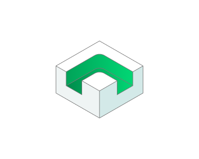

<strong>Additive.</strong> Modeling is done by adding material to the tool level.

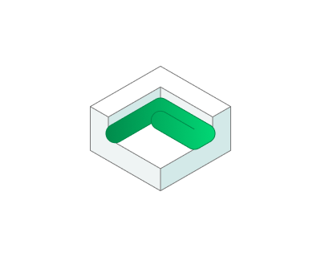

<strong>Painting.</strong> Modeling is done by adding material in layers. [Details](10330.md)

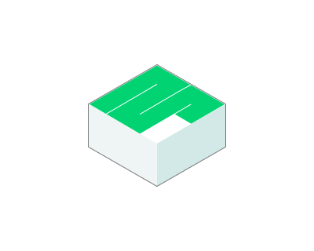

<strong>Effective feeds.</strong> Allows modeling the welding deposition process according to feed rules.

<strong>All non rapid.</strong> The material is added, if current feed type is NOT 'Rapid'.

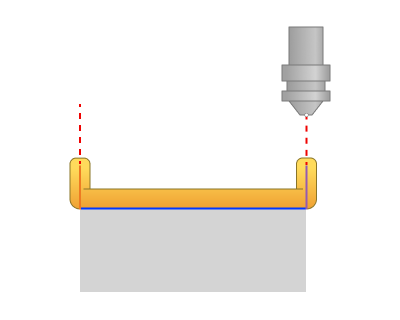

<strong>Working feed only.</strong> The material is added if the current feed type is 'Working', 'Finish pass' or 'First pass'.

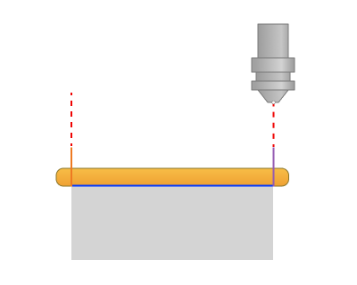

<strong>Working feed, retracts and engages.</strong> The material is added if the current feed type is 'Working', 'Retract' or 'Engage'.

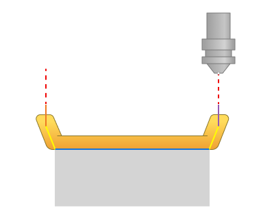

<strong>Custom.</strong> The material has been added to the chosen feed. (<strong>Work feed, Engage feed, Retract feed, Short link feed, Long link feed, Finish feed, First feed, Approach feed, Return feed, Plunge</strong> <strong>feed</strong>.)

<strong>Painting type.</strong> Specifies the type of paint application modeling. [Details](10330.md)

<strong>Thickness measurement.</strong> This type of painting simulation shows not only the areas to be painted, but also displays the approximate thickness of the future paintwork. To view the thickness result of the applied paint, you need to activate <strong>Verify Compare</strong> in the top toolbar within the simulation.

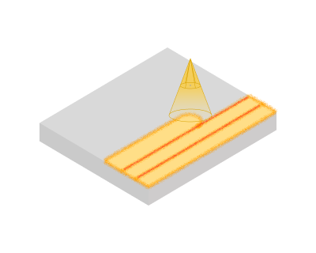

<strong>Paint flow rate.</strong> Paint flow rate is needed to ensure consistent and high‑quality application of paint.

<strong>Simple.</strong> This type of painting simulation shows which areas of the model will be painted.

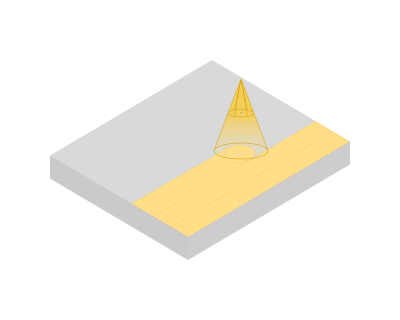

<strong>Delete chips.</strong>

The deleting chips will happen automatically at the end of the operation simulation process.

<strong>Disabled</strong>. The deleting chips is disabled.

.png) .png)

<strong>Check for plunges.</strong> Simulation checks for the incorrect tool lowering.

<strong>Allowed ramp angle.</strong> If the ramp angle of tool path is more than this value then simulation marks these lines by the error sign.

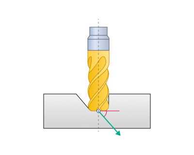

<strong>Allowed axial plunge.</strong> If the vertical lowering of the tool into the material is greater than this distance, then the tool path is marked with an error.

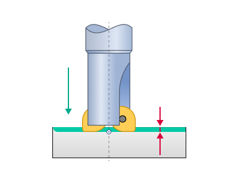

### Tolerance.

This feature defines the 'maximum deviation' between the 'ideal' and 'approximated' toolpath. A larger tolerance amount reduces the number of moves in the toolpath.

### Preferred tool orientation.

In turning operations, it defines the basic position of the cutting tool relative to the workpiece rotation axis.

Click here to expand..

<strong>Undefined.</strong> Indicates that the system imposes no rigid constraints on tool orientation relative to the workpiece rotation axis. The orientation is either user-defined or automatically determined based on the workpiece geometry and the type of operation performed.

<strong>Outer radial.</strong> The tool is oriented radially from the outside — the cutter approaches the workpiece from the side, perpendicular to the rotation axis, for machining external diameters.

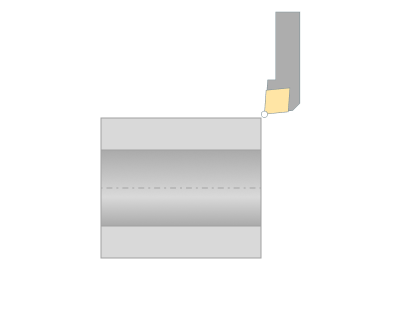

<strong>Inner radial.</strong> The tool is oriented radially inside — the cutter enters the bore and works on internal surfaces.

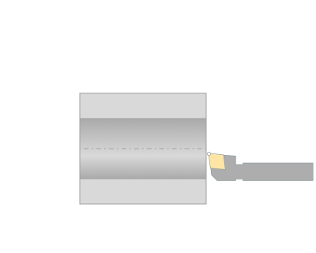

<strong>Axial.</strong> The tool is oriented along the rotation axis (Z‑axis), with feed parallel to the workpiece axis.

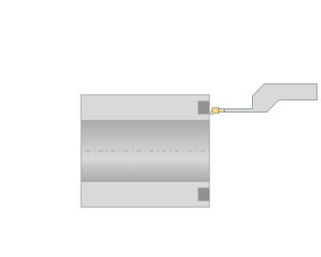

### Minimum layer time.

This group of parameters allows you to set the minimum allowed time in seconds for printing a single layer. [Details](100113.md)

### Power.

This option adjusts the extruder speed based on layer height, modifying the <strong>Power (material feed)</strong> parameter. [Details](202012.md)
