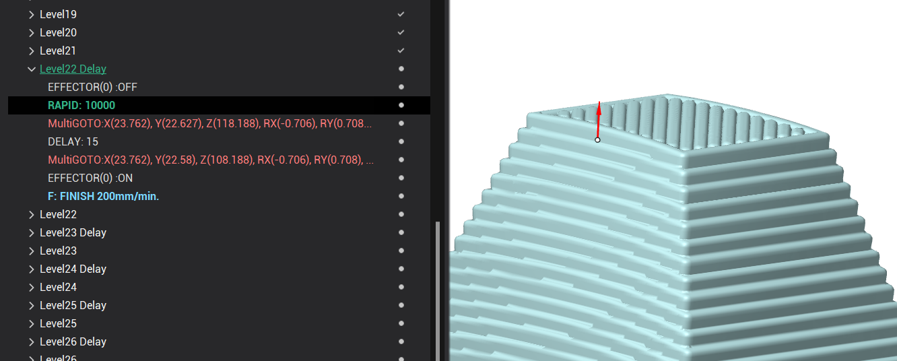

# Layer time

This page describes parameters that control how long a single layer is being printed in additive operations. Use "Minimum layer time" to make sure a fast layer has enough time to cool down before the next one, and "Maximum layer time" to avoid an overly long layer that would dry out before the next one starts (cold joint). Both groups can be used independently or together.

> Note
>
> You can find these parameters on a "Parameters" page in our "Additive" operations, inside the "Layer time" group.

## Minimum layer time

.png) -1.png)

### Description:

This group of parameters allows you to set the minimum allowed time in seconds for printing a single layer. If the layer is printed faster, the operation will be paused until the specified time is reached. Also it's available to use additional parameters such as "Lift head" and "Minimum feed".

.png) -1.png)

<strong>DW -</strong> Dwell

### Lift head:

This parameter allows you to additionally retract the extruder during the delay to the specified distance. The retract is performed strictly according to the normal to the last printing point.

).png) ).png)

<strong>DW -</strong> Dwell

<strong>LH</strong> - Lift head

### Minimum feed:

This parameter allows you to reduce the feed rate in order to increase the layer time and avoid inserting the "delay" command. The "Minimum feed" value defines the lowest limit for the feed rate. If all feeds have been reduced to this minimum but the layer time is still less than the minimum layer time, the "delay" command will be inserted.

).png) ).png)

> Example
>
> Let's say our minimum layer time is 100 seconds and actual layer time is 75 seconds with a feed rate of 180 mm/min (3 mm/sec). If this parameter is turned off, a 25-second delay will be inserted. However, if this parameter is set to 100 mm/min, the feed rate will be reduced to 135 mm/min (2.25 mm/sec). As a result, the layer time will become 100 seconds, and no delay will be inserted.

> Note
>
> The system will not reduce "Rapid" feed rate. Additionally, it will not reduce "Approach from safe surface feed", "Return to safe surface feed" and "Transition on safe feed" if they are set as "Rapid".

<strong>Result:</strong>

The result can be seen on the "Simulation" page. Delay command with additional commands will be added to a separate group in CLDATA and this group will be inserted before printing the next layer.

Inside this group with the added name "... Delay" we can see "Effector off" command, retract command, then DELAY command, approach command and "Effector on" command.

The DELAY command will be inserted with a time value in seconds, which equals the difference between the minimum layer time and the current layer time. So, the delay time is the time we need to wait before the minimum layer time is reached.

> Note
>
> If the "Lift head" parameter is off, then retract and approach commands will not be inserted.
>
> If the "Minimum feed" parameter is used, you will see reduced values of the feed rate in this tree, and in some cases delay will not be necessary.

## Maximum layer time

### Description:

This group of parameters allows you to set the maximum allowed time in seconds for printing a single layer. If the layer takes longer, the working feed is scaled up to the specified "Maximum feed" to fit within the limit. If even the "Maximum feed" is not enough, the operation continues and a warning is added to the affected layer in the CLData tree.

### Maximum feed:

This parameter defines the upper limit of the feed rate used to fit the layer within the maximum allowed time. Working feeds in the layer are scaled up but never exceed this value. Unlike "Minimum feed", this parameter has no on/off switch — it is always active when "Maximum layer time" is enabled.

> Example
>
> Let's say our maximum layer time is 10 seconds and actual layer time is 20 seconds with a feed rate of 180 mm/min (3 mm/sec). If we set "Maximum feed" to 360 mm/min (6 mm/sec), all working feeds in the layer will be scaled up by a factor of 2, so the layer time becomes 10 seconds and fits within the limit.

> Note
>
> The system will not increase "Rapid" feed rate. Additionally, it will not increase "Approach from safe surface feed", "Return to safe surface feed" and "Transition on safe feed" if they are set as "Rapid".

### Result:

The result can be seen on the "Simulation" page. In the CLDATA tree the working feed for the affected layer will be replaced with a higher percentage value, calculated to keep the layer within the maximum allowed time.

If even the "Maximum feed" is not enough to fit within the limit, an additional item will appear in the tree near the affected layer, showing the actual elapsed time and the limit — for example, MaxTimeExceeded: 117>100sec means the layer interval reached 117 seconds while the configured limit was 100 seconds. The operation log will also show a warning. Printing is not stopped — the layer is still printed at the maximum possible feed.
