# Weaving

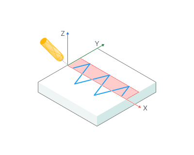

## Application area:

Mechanical weaving is used, for example, to compensate for tolerances or to bridge gaps in a seam. The torch moves across the seam in this instance and the weave oscillation is thus superposed on the seam motion. It is also possible to rotate the torch in relation to the plane of the <strong>weld</strong> (direction of welding). Can also be used for <strong>polishing.</strong>

## Weaving.

<strong>NC Code Format.</strong>

Defines how the trajectory is output.

Click here to expand..

<strong>Long Hang.</strong> The trajectory is output with transformation according to the parameters.

<strong>Canned Cycle.</strong> The trajectory is output as lines from the work order. At the beginning of each section, the cycle start command is output, and at the end, the cycle end command. In order for this to work, it is necessary to register the corresponding commands in the postprocessor.

<strong>Pattern.</strong> Pattern defining the type of weaving.

Click here to expand..

<strong>Triangle.</strong> Deflection of the welding torch in 1 direction as Triangle.

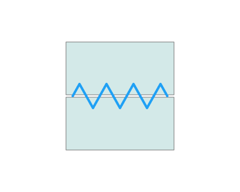

<strong>Trapezoid.</strong> Deflection of the welding torch in 1 direction with dual frequency.

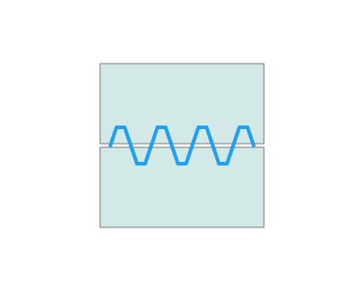

<strong>Unsymetric Trapecoid.</strong> Work with robot cycles.

<strong>Spiral.</strong> Deflection of the welding torch in 2 directions (amplitude = weave length/2).

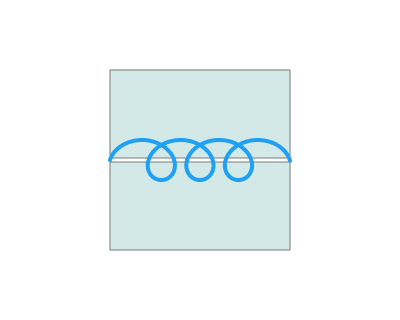

<strong>Double 8.</strong> Figure of eight weaving.

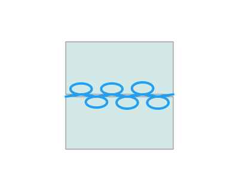

<strong>On Seam.</strong> Work with robot cycles

<strong>Edge Bottom.</strong> Work with robot cycles

<strong>Edge Top.</strong> Work with robot cycles

<strong>Curvy.</strong> Сreates a curved zigzag toolpath (with arcs) on the piece.

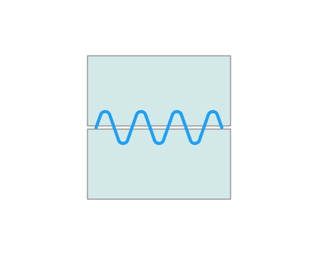

<strong>Crescent.</strong> Generates a template in the form сrescent.

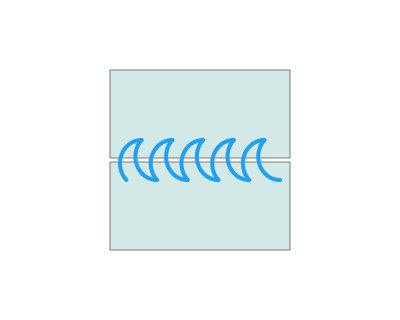

<strong>Weave length.</strong> Oscillation step

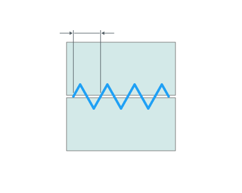

<strong>Amplitude.</strong> The maximum displacement of a point on wave from its equilibrium position.

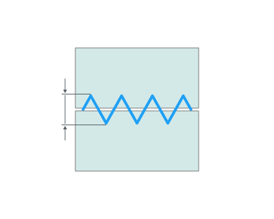

<strong>Weave plane.</strong> The plane in which it is determined weave.

Click here to expand..

<strong>Tool axis.</strong> The plane normal vector corresponds to <strong>the tool vector.</strong>

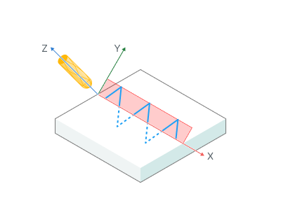

<strong>Normal to surface.</strong> The normal vector of a plane corresponds to <strong>the vector of the surfaces. Does not work with 5d Curve</strong>

<strong>Plane angle.</strong> Defines an additional angle of rotation of the plane

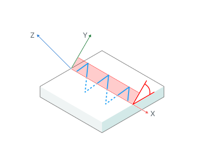

<strong>Radius.</strong> Radius for сrescent.

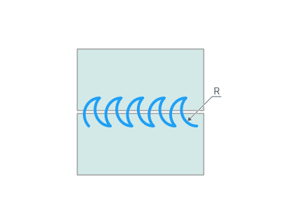

<strong>Project Onto Curve. <strong>If enabled:</strong></strong> Follows all the curves of the trajectory

.png)

<strong>If disabled:</strong> Oscillations are built on straight segments equal to the length of the oscillation.

.png)
