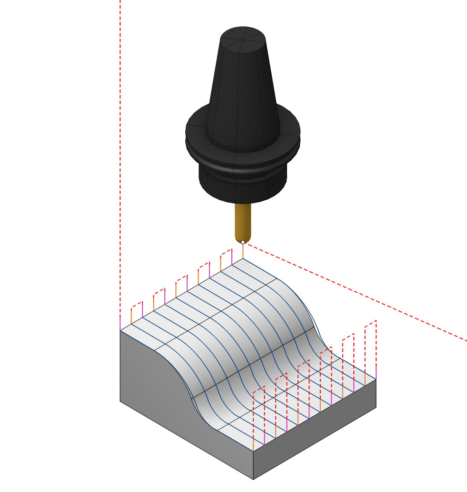

# Links/Leads

## Application Area:

In the <strong>Links/Leads</strong> tab, you define the parameters for rapid movements. These movements include tool approach from the tool change position, engage to the start of the working stroke, retraction after the final cutting motion, transitions between working passes, and return to the tool change point. You can configure the sequence of movements along the coordinates, the trajectory of these motions, and the magnitude of displacements.

Typically, the paths for non-cutting movements (idle strokes) consist of:

- <strong>Approach</strong> means the path the tool takes to arrive at the first point of an engage or plunge move either from a tool change position or from the last position of the previous operation.
- <strong>Lead In (Engage)</strong> involves a series of tool movements that facilitate a smooth transition to the initial point of the working stroke.
- <strong>Transitions</strong> are the toolpath sections between work passes.
- <strong>Lead Out (Retract)</strong> describes a sequence of tool passes, which allows its smooth departure from the last point of a working toolpath to the safe surface or to the safe distance.
- <strong>Return</strong> involves a series of tool movements that transition the tool from the exit point of the last operation to the tool change point via a safe plane.()
