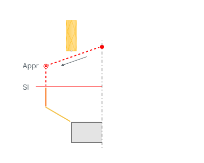
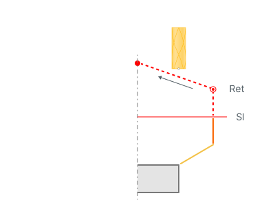
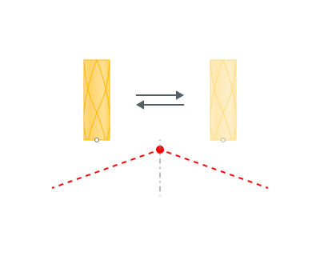

# Approach/Return

<strong>Appr -</strong> Approach

<strong>Ret -</strong> Return

<strong>Sl -</strong> Save level

## Application Area:

This group of parameters manages the tool movements from the tool change position to the start of the engage toolpathes, and back.

## Approach:

The approach describes the section of the toolpath that facilitates movement to the engage or to the lead in point for the initial working stroke from the tool change position or from the last position of the prior operation.

Typically, the approach divides into two movements:

1. Idle movement to a safe surface (<strong>Save level</strong>), safe distance, or designated level. Specify the safety surface and its location in the <strong>Safe Motions</strong> group, and for five-axis operations, use the <strong>Links</strong> group. You can create multiple trajectory segments during the approach. Methods to form the trajectory include: **Short**, **Avoid Collisions**, `Custom,` and `Rule from Previous/Root/Submachines`. [Details.](10071.md)
2. Move at an accelerated feed rate to the working feed distance for the first working stroke along the Z-axis of the machine (for 3D milling operations) or along the tool axis (for 5D milling operations). Specify the final approach target and the corresponding distance values in the <strong>Links</strong> and <strong>Distances</strong> groups.

<strong>Appr -</strong> Approach

<strong>Sl -</strong> Save level

## Return:

The return describes a series of tool movements that facilitate the tool's transition from the departure point of the final working stroke to the tool change point, passing through a safe surface or a safe distance.

Typically, the return divides into two movements:

1. Move at an accelerated feed rate from the retraction point of the last working stroke along the machine's Z-axis to a safe surface, safe distance, feed switch level, or a designated level. The principle for forming the withdrawal remains the same as for the approach.
2. Idle movement to the tool change position.

<strong>Ret -</strong> Return

<strong>Sl -</strong> Save level

## Tool Change Position:

The tool change point is the machine position where the tool change occurs. In the CAM system, you can define the tool change position for the overall tech process or for separate operations. [Details.](10067.md)

