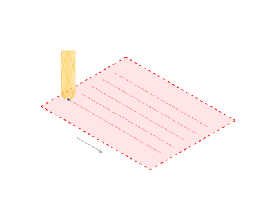
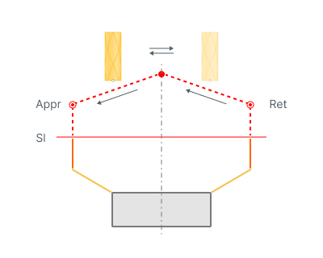
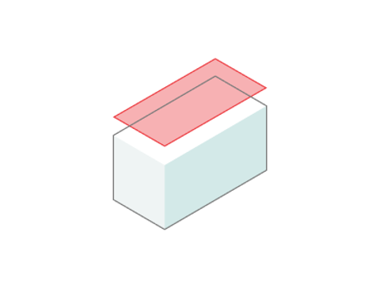
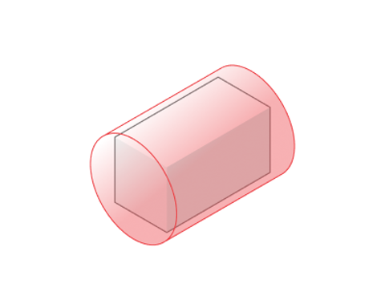
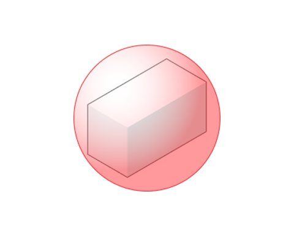
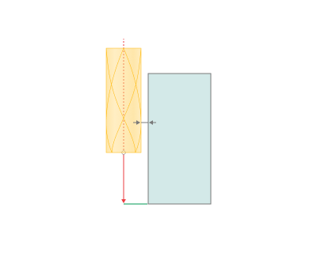

# Safe Motions

## Application Area:

Defines the type of <strong>Safety Surface</strong> and the distance from the workpiece to it. This surface facilitates transitions between the processed surfaces or tool paths, and the first stage of approach or return occurs toward it.

## Safe Level:

By default, sets the distance from the most protruding part of the workpiece to the <strong>Safe surface</strong>.

Click here to expand..

<strong>Appr</strong> - Approach <strong>Ret</strong> - Return <strong>Sl</strong> - Safe level

## Safe Surface:

Defines the surface shape that determines the transition path between the working passes of the tool if the links type is specified as **On Safe Surface**.

Click here to expand..

<strong>Plane.</strong> The path for transitions is set on a plane located at the <strong>Safe Level</strong> above the workpiece. This type of surface is the only option for three-axis operations.

<strong>Cylinder</strong>. The transition path is set on the cylindrical surface located at a <strong>Safe Level</strong> above the most protruding part of the workpiece. This surface option is applicable for four- and five-axis operations.

<strong>Sphere.</strong> The transition path is set on the surface of a sphere located at a <strong>Safe Level</strong> above the most prominent part of the workpiece. This surface option is applicable for five-axis operations.

The following options can be used to define surfaces:

<strong>Origin</strong>.

For a <strong>Plane</strong>, it establishes the base point from which the <strong>Direction</strong> vector begins, aligned with the normal to the plane. For a <strong>Cylinder</strong>, it sets the starting point of the axis. For a <strong>Sphere</strong>, it defines the sphere's center.

<strong>Center of the Part.</strong>

The <strong>Origin</strong> point is located at the geometric center of the part.

<strong>Custom Point.</strong>

The <strong>Origin</strong> point is defined by its X, Y, Z coordinates.

<strong>Direction.</strong>

For a <strong>Plane</strong>, it sets the direction of the normal vector to the plane. For a <strong>Cylinder</strong>, it sets the axis vector.

<strong>Auto</strong>.

The system automatically sets the direction vector: for a <strong>Plane</strong>, it runs along the tool axis; for a <strong>Cylinder</strong>, it follows the part axis or the machine axis with rotational coordinates.

<strong>Custom Vector.</strong>

The <strong>Direction</strong> results from projecting the unit vector onto the X, Y, and Z axes.

## Max Retraction Distance:

It enables the restriction of the maximum retraction height. This option applies only to certain operations, including Hole Machining and Probing.

## Avoid Collisions at Safe Plane:

When the flag is set, the system automatically generates a trajectory for transitions within the operation while avoiding collisions. This option applies only to certain operations, including Chamfering, 5D Cladding, Point Welding, 6D Welding, and Spraying, mainly in robotic applications.

Click here to expand..

<strong>Check Workpiece.</strong>

If the option is active, the system considers collisions with the workpiece when generating transitions that avoid collisions.

If the option is inactive, the transition paths consider only collisions with the part during collision avoidance. Use this option if the workpiece and the part of the operation differ slightly (or differ within a safe distance). This parameter also affects the approach and return with collision avoidance.

.png) .png)

<strong>Safe distance.</strong>

If the collision avoidance for links is enabled, the parameter defines the minimum allowed distance between the tool, part (workpiece) and the machine parts. This parameter also influences the approach/return with collision avoidance.

