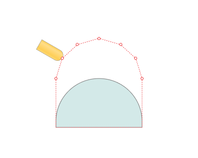

# Advanced Links Settings

## Application Area:

This group of parameters specifies the features of trajectory formation for primarily five-axis operations, considering optimal movements of rotational axes.

## Approximate Safe Motions:

This parameter manages the trajectory composition for safe movements on surfaces like cylinders and spheres, in five-coordinate operations, where safe motions utilize rotational coordinates.

Click here to expand..

<strong>Off</strong>. Safe motions on the safety surface execute in a single block.

<strong>Always</strong>. The trajectory on the safety surface divides into basic movements, so the angular coordinate shift does not exceed the specified value.

<strong>When Needed</strong>.

## Advanced Axes Limits Control:

Using this option prevents two specific problems in the five-axis trajectory:

1. The system excludes overturn during the working pass whenever feasible. Overturn take place not during working passes but in segments of the trajectory with rapid movements.

2. The system creates a smooth path in singularity zones. A singularity zone refers to a position of the machine where the coordinate of one axis cannot be calculated. For example, if axis A equals zero, then axis C can take any value.

Click here to expand..

<strong>Avoid Singularity on Safe Surface.</strong>

<strong>Allowed Axis Deviation in Singularity.</strong>

The parameter defines the angle by which the machine or robot joints can deviate from the nominal calculated position to bypass the singularity zone.

## Machine Optimized Transitions:

When the option is disabled, the transitions at the level defined by the **Rapid Distance** are made by the **euclidian space shortest path**. Let's say you want to move from point1(X1,Y1,Z1,Nx1,Ny1,Nz1) to point2(X2,Y2,Z2,Nx2,Ny2,Nz2), where X, Y, Z are coordinates of the tool center, and Nx, Ny, Nz are coordinates of the tool axis direction vector. The euclidian shortest path is a linear interpolation of these geometrical vectors. It means that the shape of the connecting curve is a straight line with linearly interpolated tool axis direction vector along it.

When the option is enabled, the transitions at the level defined by the **Rapid Distance** are made by the **machine space shortest path**. Let's say you want to move from point1(A1,C1,X1,Y1,Z1) to point2(A2,C2,X2,Y2,Z2), where X, Y, Z, A, C are machine axes. The machine coordinates shortest path is a linear interpolation of these axes. It means that the shape of the connecting curve depends on an actual machine schema configuration. Machine optimized transitions look longer, but in fact they are more optimal in many cases than the geometrical ones.
