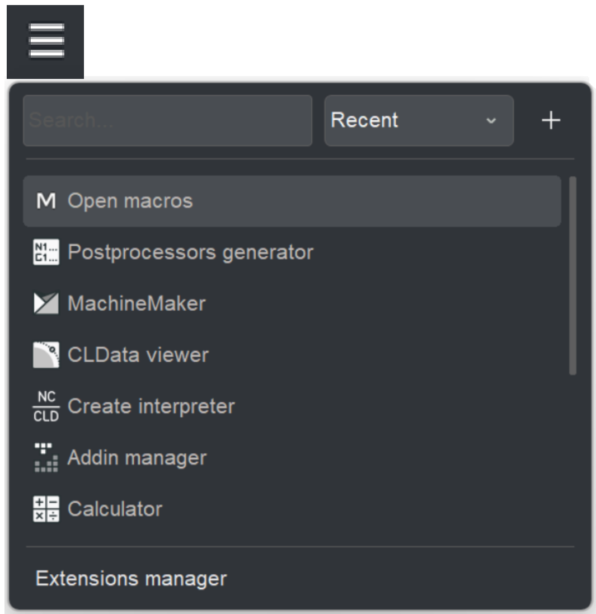
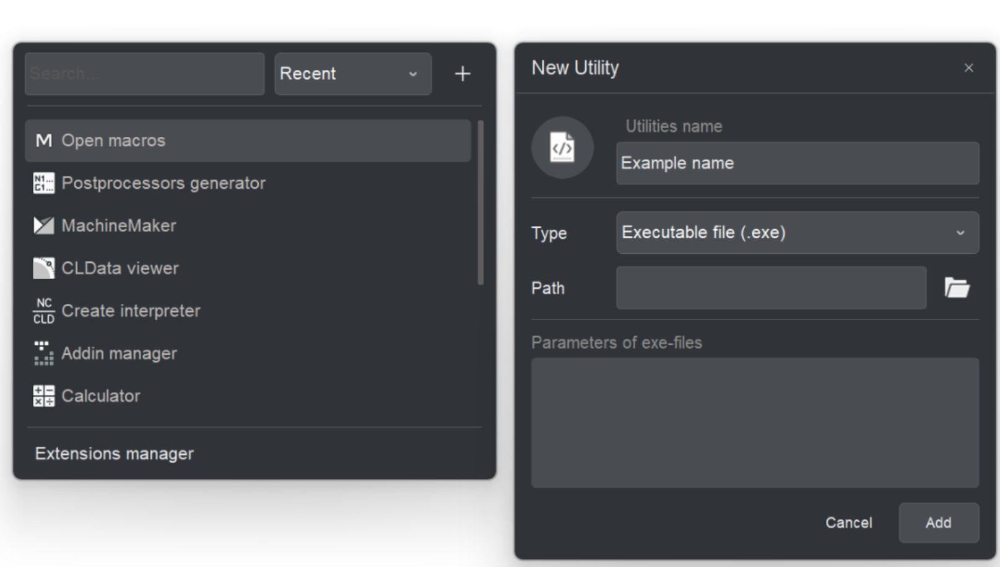

# Utilities button of main panel

## Application area:

The <strong>Utilities</strong> window provides quick access to built-in and user-defined tools directly from the main application window. It combines search, sorting, launching, management of custom utilities, and access to the extensions manager in a single panel.

The window is <strong>opened</strong> with the <strong>hamburger button (three horizontal lines)</strong> on the main panel.

The window is used to locate and launch auxiliary tools without leaving the main application.

Typical scenarios:

- Starting a built-in tool — Postprocessors generator, MachineMaker, CLData viewer, Create interpreter, Addin manager, Calculator, Open macros and etc.
- Registering and launching an external program, library, or script as a custom utility.
- Opening the <strong>Extensions manager</strong> to manage installed extensions.

### Window layout.

The window consists of a top control bar and the utilities list.

- <strong>Search field.</strong> A text field on the left of the control bar for filtering the list.
- <strong>Sort selector.</strong> A drop-down list for choosing the sort order.
- <strong>Add button (+).</strong> A button on the right of the control bar that opens the <strong>New Utility dialog</strong>.
- <strong>Utilities list.</strong> The scrollable list of all available utilities, each shown with an icon and a name.
- <strong>Extensions manager.</strong> A link at the bottom of the window. [Details](/pages/createpage.action?spaceKey=SCUM20ENRC&title=Configure+utilities+window&linkCreation=true&fromPageId=157858745)

### Launching a utility.

<strong>Launch.</strong> Each item in the list represents one utility. To run a utility, click it with the mouse or select it and press <em>Enter</em>. The window closes automatically after launch.

### Searching.

<strong>Search field.</strong> The search field at the top of the window filters the list by utility name.

- The search is case-insensitive and matches by substring — any part of the name.
- Typing any printable character automatically moves the focus to the search field, so the search can be started without clicking the field first.

To clear the filter, delete the text in the search field. The full list is then restored.

### Sorting.

<strong>Sort selector.</strong> The drop-down list to the right of the search field switches the sort mode of the list:

- Recent — by usage frequency, most frequently used utilities first.
- A – Z — in alphabetical order by name.
- Z – A — in reverse alphabetical order.

### Adding a custom utility.

<strong>Add button (+).</strong> The <strong>+</strong> button opens the <strong>New Utility</strong> dialog for creating a custom utility.

The dialog contains the following fields:

- <strong>Icon.</strong> The icon shown for the utility in the list. Click the icon area to assign a custom image.
- <strong>Utilities name.</strong> The display name of the utility in the list.
- <strong>Type.</strong> The type of the utility. The supported types are:
  - <strong>Executable file</strong> — applications with the extensions.exe.
  - <strong>Library</strong> —.dll.
  - <strong>Script</strong> —.spr.
- <strong>Path.</strong> The path to the utility file. Click the folder button to the right of the field to select the file through the standard file-open dialog.
- <strong>Parameters of exe-files.</strong> Optional command-line parameters passed to the utility on launch. The field is available for all utility types and does not change when the type is switched.

Click <strong>Add</strong> to create the utility and add it to the list, or <strong>Cancel</strong> to close the dialog without saving.

### Editing and deleting custom utilities.

When a custom utility is hovered in the list, two controls appear on the right of its row:

- <strong>More button (…).</strong> Opens the <strong>Utility parameters</strong> dialog, where the name, type, path, parameters, and icon can be changed.
- <strong>Delete button (×).</strong> Removes the custom utility from the list.

> Built-in utilities are protected from modification. The editing and deletion controls are available for user-defined utilities only.

### 

### Built-in tools.

The Utilities menu contains items for running additional internal tools and external user utilities. It can be customized with the <strong>Configure utilities</strong> menu item. Some items may be hidden depending on the <strong>Show expert tools</strong> option in the system settings.

| Button | Description |
|---|---|
|  | <strong>Configure utilities</strong>: Opens the [Utility manager window](/pages/createpage.action?spaceKey=SCUM20ENRC&title=Configure+utilities+window&linkCreation=true&fromPageId=157858745). |
|  | <strong>MachineMaker</strong>: Starts the [application to create Machine schemas](https://docs.encycam.com/MachineMaker/1/robots/en/1.html). |
|  | <strong>Calculator</strong>: – Runs the internal calculator. |
|  | <strong>System logs:</strong> Opens [a window displaying a list of events](10026.md), that have occurred in the application since launch. |
|  | <strong>Postprocessors generator:</strong> Launches the [Postprocessors generator, an application for generating postprocessor tuning files.](730.md) |
|  | <strong>Create script operation:</strong> Opens a dialog to [create a scriptable operation](10350.md). |
|  | <strong>Create interpreter</strong>: Opens the [Create interpreter](https://docs.encycam.com/Interpreters/1/en/10292.html) tool. |
|  | <strong>Addin Manager</strong>: Opens the [Addin Manager window](900.md). |
|  | <strong>Operations manager</strong>: Starts the manager that allows enabling/disabling external operations, whose parameters are described in separate XML files and[stfc-containers](10024.md). |
|  | <strong>CLData viewer</strong>: Starts the [CLData viewer](https://docs.encycam.com/Inp.Net/1/en/src/inpcoreorganization/devtools.html), an application that helps in creating C#-based postprocessors. |
|  | <strong>Scripts IDE</strong>: Opens a window for writing and debugging [CAM system script](10348.md) files. |
