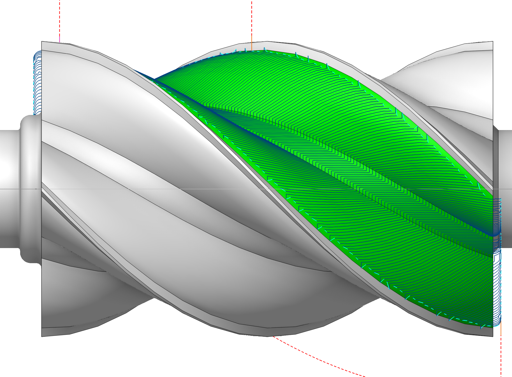
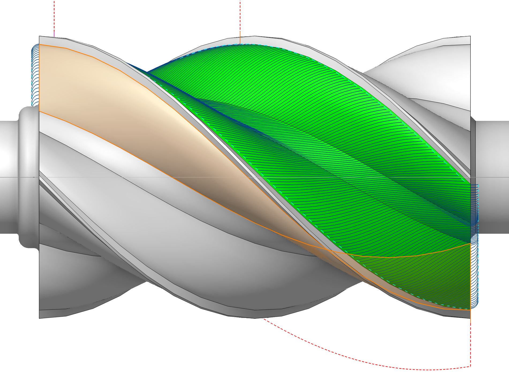

# Use new calculation method for Rotary roughing/finishing

## 

## Application area:

To resolve issues with unsatisfactory toolpath quality in the normal direction relative to the surface, the calculation algorithm for the rotary finishing operation has been rewritten. [Details](10136.md)

This parameter is located on the <strong>Parameters tab</strong> and allows running the old calculation algorithm when <strong>disabled</strong>, or the new one when <strong>enabled</strong>.

### Benefits of the Updated Calculation Algorithm.

<strong>Enhanced Performance.</strong> The calculation process is significantly accelerated by distributing the computational load across all available CPU cores, maximizing hardware utilization.

<strong>Optimized Toolpath Smoothness.</strong> When the tool axis orientation is set to follow the surface normal, the resulting toolpath is notably smoother. Additionally, users can fine‑tune the smoothing effect by adjusting the <strong>Normal smoothing distance parameter.</strong> [Details](10136.md)

<strong>Superior Toolpath Geometry.</strong> The algorithm demonstrates a marked improvement in toolpath quality when the <strong>Side Angle</strong> strategy is employed, leading to more efficient and precise machining.

 

