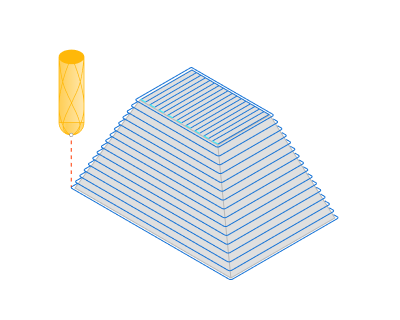
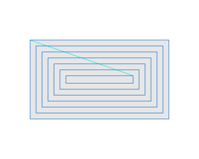
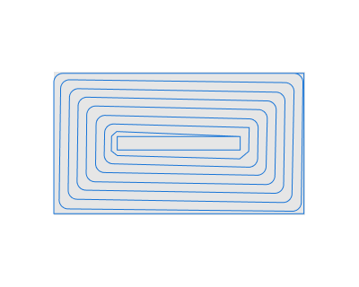
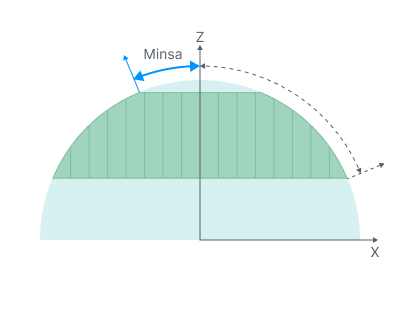
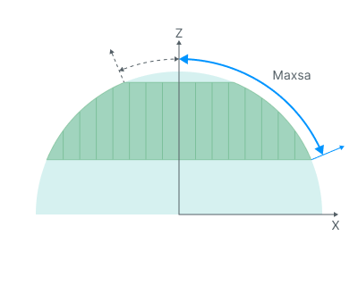
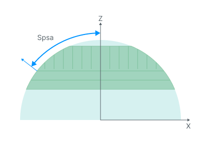

# Combo Finish

## Application area:

This operation can replace outdated legacy operations and address associated issues.

Advantages:

- Support for generating helices for waterline passes (helical machining).

- In combined strategies, gentle and steep areas are processed using different strategies. This ensures a uniform scallop pattern on the surface and improves cutting conditions.

- Combined strategies feature smoothing/merging of machining zones based on the Smooth distance parameter. This helps produce a more solid toolpath with fewer unnecessary passes and transitions.

- Intelligent toolpath merging for combined strategies has been implemented.

- The calculation process is fully parallelized.

### Setup:

The <strong>Setup</strong> tab is used to configure the primary parameters of the project. This can involve the positioning of the part on the equipment, the coordinate system of the part, and more. [Details](1022.md)

### Job assignment:

<strong>Machining surfaces.</strong> Select various surfaces of the part as the working task. The system will calculate the trajectory based on the chosen surfaces. [Details](102121.md)

<strong>Restrict surfaces.</strong>

<strong>Job Zone.</strong> Job zones are used to define the part areas that have to be machined by roughing and finishing milling operations. [Details](10151.md)

<strong>Restrict Zone.</strong> In addition to <strong>Job Zones</strong> in system you can use <strong>Restrict Zones</strong> to specify the workpiece areas that have not to be machined in the current operation. [Details](10152.md)

<strong>Top Level.</strong> Specifying the top level by model elements. [Details](10153.md)

<strong>Bottom Level.</strong> Specifying the bottom level by model elements. [Details](10153.md)

<strong>Properties.</strong> Displays the properties of an element. It is possible to add the stock. You can also call this menu by double clicking on an item in the list.

<strong>Delete.</strong> Removes an item from the list.

<strong>Restrictions.</strong> It allows you to restrict areas that should not be machined. [Details](101231.md)

### Strategy:

#### Strategy.

This parameter enables the user to create a toolpath with different strategies.

Click here to expand..

<strong>Plane.</strong> The <strong>plane finishing</strong> is designed for the machining of smooth areas of a model's surfaces, and also for areas close to vertical, whose (steep) trajectories are along the toolpath.

<strong>Waterline.</strong> The <strong>waterline finishing</strong> gives a good result when machining models or their parts that have their main surface areas close to <strong>vertical</strong>.

<strong>Scallop.</strong> The <strong>Scallop</strong> toolpath starts from the curves lying on the part surfaces and is generated by repeatedly offsetting those curves inwards until the curves collapse. This method creates a toolpath similar to equidistant strategy.

<strong>Plane + Waterline.</strong> The plane toolpath machines only areas with the slope angle less than the Split slope angle while the waterline toolpath machines areas where the surface slope angle is greater than the <strong>Split slope angle</strong>. By default the split slope angle is set to 45 degrees. This strategy ensures that <strong>shallow areas</strong> are machined with the <strong>plane toolpath</strong>, and <strong>steep areas</strong> are machined with the <strong>waterline toolpath</strong>.

<strong>Scallop + Waterline.</strong> The plane toolpath machines only areas with the slope angle less than the Split slope angle while the waterline toolpath machines areas where the surface slope angle is greater than the Split slope angle. By default the split slope angle is set to 45 degrees. This strategy ensures that <strong>shallow areas</strong> are machined with the <strong>scallop toolpath</strong>, and <strong>steep areas</strong> are machined with the waterline toolpath.

<strong>Step.</strong> Material removed in one pass along the tool axis between the <strong>Top</strong> and <strong>Bottom levels</strong>.

<strong>Angle.</strong> Assigns the cut angle direction for the plane operations.

<strong>Spiral Machining</strong>. Setting the flag configures the toolpath as a continuous spiral to minimize links.

 

<strong>Smooth Corners.</strong> Setting the flag smooths sharp corners in the toolpath.

.png) .png)

#### Milling type.

Сan be assigned in almost all operations, except for the curve machining operations. This allows the user to control the required milling type (climb or conventional) during the toolpath calculation process. This parameter group works similarly to the <strong>Waterline roughing operation.</strong> [Details](736.md)

#### Sorting.

Controls the sequence of toolpath passes during the surface machining.

Click here to expand..

<strong>Start Point.</strong> The point defining the beginning of the plunge.

 

<strong>Machining order.</strong>

<strong>Downwards.</strong> For models, which have surface areas close to the vertical, machining <strong>downwards</strong> is recommended.

<strong>Upwards.</strong> Machining <strong>upwards</strong> is advised for use on models with form-creating surfaces which are closer to horizontal.

#### Job zone.

Enables additional modification of the working area initially selected on the <strong>Job assignment</strong> tab.

Click here to expand..

<strong>Min slope angle.</strong> In the system it is possible to perform selective machining of the model surface areas, depending on the angle between the normal to the surface and the vertical axis Z. The range being machined can be defined by the <strong>minimum</strong> and maximum slope angles.

<strong>Max slope angle.</strong> In the system it is possible to perform selective machining of the model surface areas, depending on the angle between the normal to the surface and the vertical axis Z. The range being machined can be defined by the minimum and <strong>maximum</strong> slope angles.

<strong>Frontal angle.</strong> The frontal angle is the angle between projections onto the horizontal plane of the tool movement direction and the normal to the surface at the cutting point. [Details](163.md)

<strong>Split slope angle.</strong> Angle between vertical and horizontal passages.

<strong>Smooth distance.</strong> Sets the distance used to smooth and merge adjacent machining regions in the combined strategies (Plane + Waterline, or Scallop + Waterline). Neighbouring areas located within the specified distance are joined into a single continuous region, which eliminates short, fragmented passes and produces a smoother, more uniform toolpath.

#### Machining levels.

It defines the range along tool axis for the machining. This parameter group works similarly to the <strong>Waterline roughing operation.</strong> [Details](736.md)

#### Corners smoothing.

When there is a sudden change of the tool direction, the milling control performs deceleration before starting the turn, and then accelerates again. This fact can lead to vibrations and high tool and milling machine wear. The problem can be solved if the toolpath has very few or no breaks. For this reason, in the system there is the toolpath smoothing function using the defined radius for machining inner or outer corners of the model.

#### Trimming.

Allows for the skipping of surfaces not intended for machining and allows for the extension of the toolpath. Some parameter group works similarly to the <strong>Waterline roughing operation.</strong> [Details](736.md)

### Parameters:

This tab contains the main parameters for controlling the part, workpiece, fixture and other items, which allow you to change the trajectory. [Details](100112.md)

### Links/Leads:

In the Links/Leads tab, you define the parameters for rapid movements. These movements include tool approach from the tool change position, engage to the start of the working stroke, retraction after the final cutting motion, transitions between working passes, and return to the tool change point. You can configure the sequence of movements along the coordinates, the trajectory of these motions, and the magnitude of displacements.

Click here to expand..

<strong>Сonsists of:</strong>

<strong>Approach/Return.</strong> This group of parameters manages the tool movements from the tool change position to the start of the engage toolpathes, and back. [Details](100116.md).

<strong><strong>Links.</strong></strong> Defines the rules governing Entry/Exit links and links between work moves. [Details](100130.md).

<strong>Leads.</strong> Allows you to add additional engage and retract to the working moves using their feed. [Details](100136.md).

<strong>Safe motions.</strong> Defines the type of <strong>Safety Surface</strong> and the distance from the workpiece to it. This surface facilitates transitions between the processed surfaces or tool paths, and the first stage of approach or return occurs toward it. [Details](100117.md).

<strong>Advanced links settings.</strong> This group of parameters specifies the features of trajectory formation for primarily five-axis operations, considering optimal movements of rotational axes. [Details](100118.md).

<strong>Distances.</strong> Distances used in Links rules [Details](100140.md).

### Feeds/Speeds:

Using this dialogue the user can define the spindle rotation speed; the rapid feed value and the feed values for different areas of the toolpath. Spindle rotation speed can be defined as either the rotations per minute or the cutting speed. The defining value will be underlined. The second value will be recalculated relative to the defining value, with regard to the tool diameter. [Details](100142.md)

### Transformations:

Parameter's kit of operation, which allow to execute converting of coordinates for calculated within operation the trajectory of the tool. [Details](10168.md).

### Part:

A Part is a group of geometrical elements that defines the space to check for gouges. [Details](330.md)

### Workpiece:

A workpiece model of an operation defines the material to be machined. [Details](738.md)

### Fixtures:

As the Fixtures the fixing aids such as chucks, grips, clamps, etc., and the restriction areas of any other nature are usually specified. [Details](10283.md)
