# コンボ仕上げ

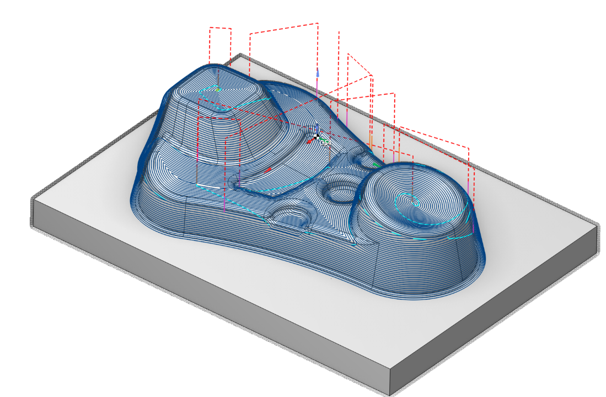

## 適用分野:

このオペレーションは、従来のオペレーションを置き換え、それらに伴う問題に対処できます。

利点：

- ウォーターラインパスでヘリカル軌跡を生成する機能（ヘリカル加工）に対応しています。

- 複合方法では、緩斜面と急斜面を異なる方法で加工します。これにより、サーフェス上のカスプ模様を均一にし、切削条件を改善します。

- 複合方法では、Smooth distanceパラメータに基づいて加工領域を滑らかにつなぎ合わせます。不要なパスや移動を減らし、より連続性の高いツールパスを生成できます。

- 複合方法に、ツールパスを最適につなぎ合わせる機能を実装しました。

- 計算処理は完全に並列化されています。

### セットアップ：

<strong>セットアップ</strong>タブでは、設備上のパーツの配置、パーツの座標系など、プロジェクトの基本パラメータを設定します。[詳細](1022.md)

### ジョブ割り当て：

<strong>加工面</strong> 部品のさまざまなサーフェスを加工対象として選択します。システムは、選択されたサーフェスに基づいて軌道を計算します。[詳細を見る](102121.md)

<strong>制限面</strong>

<strong>ジョブゾーン。</strong> 荒加工および仕上げのミーリングオペレーションで、加工するパーツの領域を定義します。[詳細](10151.md)

<strong>制限領域</strong> システム内の<strong>ジョブゾーン</strong> に加えて、カーブやエッジから作成した <strong>制限領域</strong> の要素を使用して、現在のオペレーションで加工を避けるワーク領域を指定できます。 [詳細を見る](10152.md)

<strong>上部高さ</strong> モデル要素に基づいて上部高さを指定します。[詳細を見る](10153.md)

<strong>底部高さ</strong> モデル要素に基づいて底部高さ指定します。[詳細を見る](10153.md)

<strong>プロパティ</strong> 要素のプロパティを表示します。サーフェスセットの場合、<strong>軸方向残し代</strong>と<strong>径方向残し代</strong>がオペレーションの残し代に加算されます。デフォルトでは、径方向残し代は軸方向残し代と同じです。リスト内の項目をダブルクリックすることでも、このメニューを表示できます。

<strong>削除</strong> リストから項目を削除します。

<strong>制限</strong> 加工してはならない領域を制限することができます。[詳細を見る](101231.md)

### 加工設定：

#### 加工設定：

このパラメータにより、複数の方法を使用したツールパスを作成できます。

詳細を表示

<strong>平面 平面仕上げ</strong>は、モデル表面の滑らかな領域、および垂直に近い領域の加工を目的としており、その（急勾配）軌跡はツールパスに沿って生成されます。

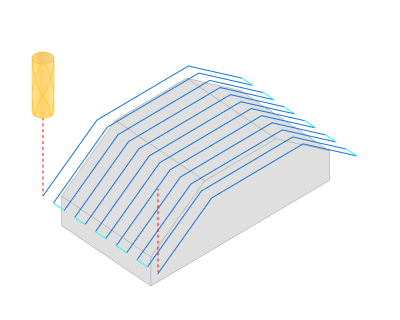

<strong>ウォーターライン ウォーターライン仕上げ</strong>は、主要なサーフェス領域が<strong>垂直</strong>に近いモデルまたはその一部を加工する場合に良好な結果を得られます。

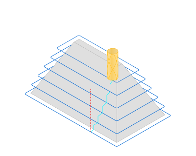

<strong>スキャロップ スキャロップ</strong>ツールパスは、パーツサーフェス上にある曲線から開始し、それらの曲線を内側へ繰り返しオフセットして、曲線が消滅するまで生成されます。この方法では、等距離方法に似たツールパスを作成します。

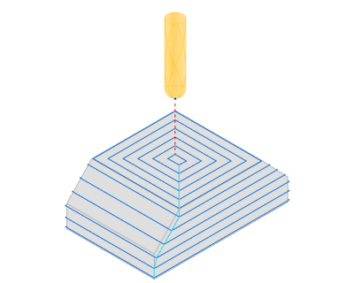

<strong>平面 + ウォーターライン</strong> 平面ツールパスは、傾斜角が分割傾斜角より小さい領域のみを加工し、ウォーターラインツールパスは、サーフェスの傾斜角が<strong>傾斜角度の分割</strong>より大きい領域を加工します。既定では、分割傾斜角は45度に設定されています。この加工方法により、<strong>浅い領域</strong>は<strong>平面ツールパス</strong>で加工され、<strong>急峻な領域</strong>は<strong>ウォーターラインツールパス</strong>で加工されます。

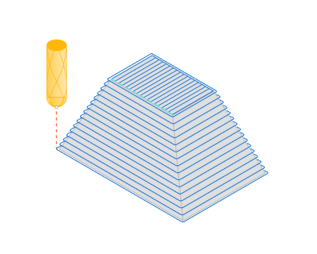

<strong>スキャロップ + ウォーターライン</strong> スキャロップツールパスは、傾斜角が分割傾斜角より小さい領域のみを加工し、ウォーターラインツールパスは、サーフェスの傾斜角度の分割より大きい領域を加工します。既定では、分割傾斜角は45度に設定されています。この加工方法により、<strong>浅い領域</strong>は<strong>スキャロップツールパス</strong>で加工され、<strong>急峻な領域</strong>はウォータラインツールパスで加工されます。

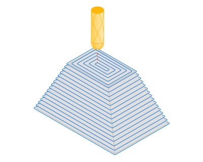

<strong>ステップ</strong> <strong>上部高さ</strong>と<strong>底部高さ</strong>の間で、工具軸に沿って1パスで除去される材料量です。

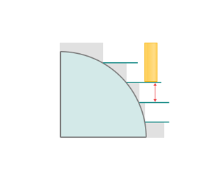

<strong>平坦部認識</strong> 水平な平坦部の高さにウォーターラインパスを追加します。デフォルトで有効で、<strong>平面</strong>以外の場合に表示され、ツールパスのウォーターライン部分に影響します。

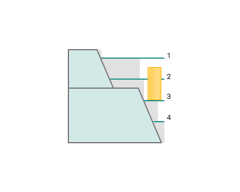 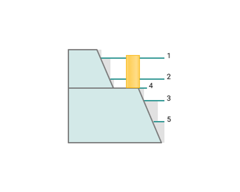

<strong>アダプティブステップ</strong> ステップを投影上ではなくサーフェスに沿って維持し、傾斜した領域にパスを追加して、サーフェス上の距離が<strong>ステップ</strong>を超えないようにします。<strong>スキャロップ</strong>方法では使用できません。

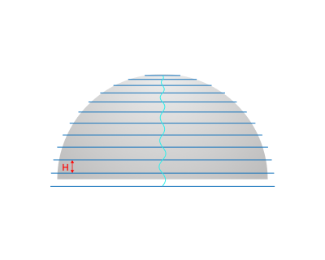 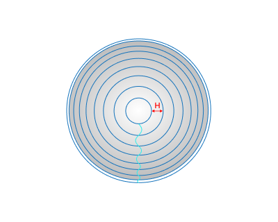

<strong>H</strong> - スキャロップ高さ／ステップ

<strong>スキャロップ</strong> 隣接するパス間のスキャロップ高さを制限します。<strong>ステップ</strong>は最大値として維持されます。<strong>スキャロップ</strong>方法では使用できず、<strong>アダプティブステップ</strong>が有効な場合は無視されます。

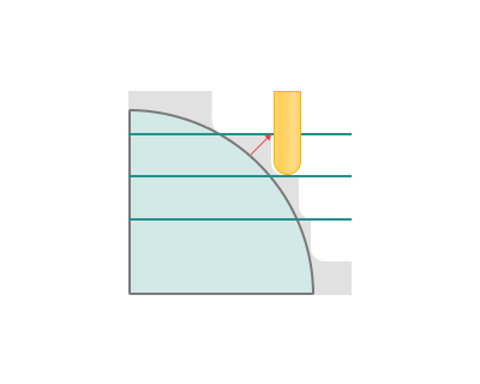

<strong>渦巻き加工</strong> フラグを設定すると、リンクを最小限に抑えるため、ツールパスが連続した渦巻として構成されます。

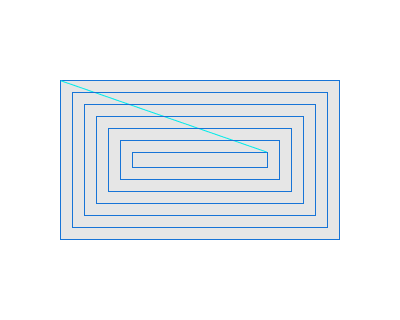 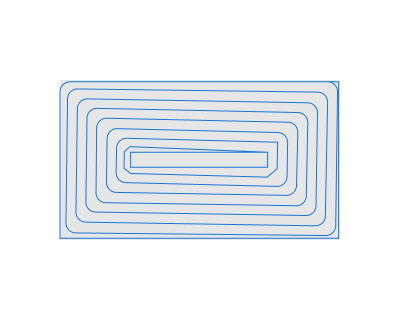

<strong>コーナーの円滑化</strong> 指定した<strong>半径</strong>で鋭いコーナーを丸め、減速を抑えます。すべての方法で機能します。

.png) .png)

<strong>角度</strong> 平面加工における切削角度の方向を指定します。

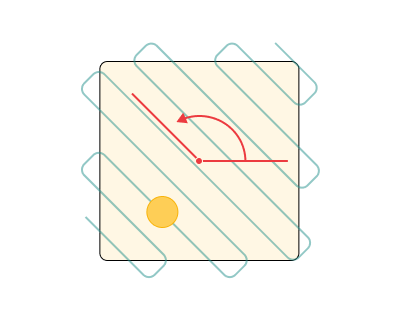

#### ミーリングタイプ：

曲線加工オペレーションを除き、ほとんどすべての加工で設定可能です。これにより、ユーザーはツールパスの計算プロセス中に、必要なフライス加工タイプ（ダウンカットまたはアップカット）を設定できます。 ミーリングタイプのパラメータは <strong>ウォータライン荒加工オペレーション</strong>と同様です。[詳細を見る](736.md)

#### 並べ替え：

サーフェス加工中のツールパスの順序を設定します。

詳細を表示

<strong>開始点</strong> プランジ開始位置を定義する点です。

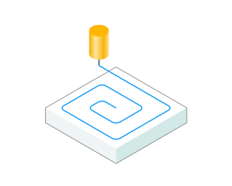 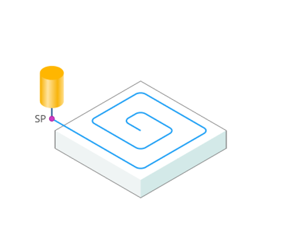

<strong>開始点のシフト</strong> 継ぎ目が1か所に集中しないように、次の各閉じたパスの開始点をずらします。デフォルトは300 %です。<strong>渦巻き加工</strong>では適用されません。

<strong>加工順序</strong>

<strong>下方向</strong> サーフェス領域が垂直に近いモデルでは、<strong>下方向</strong>の加工が推奨されます。

<strong>上方向</strong> 水平に近い形状生成サーフェスを持つモデルでは、<strong>上方向</strong>の加工が推奨されます。

#### ジョブゾーン：

<strong>ジョブ割り当て</strong> タブで最初に選択した加工領域の追加修正が可能 です。

詳細を表示

<strong>サーフェスロールタイプ</strong> <strong>サーフェスのみ</strong>（デフォルト）は選択したサーフェスのみを加工し、<strong>エッジ付き</strong>はサーフェスのエッジ上での工具の転動（ロール）も行います。<strong>パーツチェック</strong>が有効な場合に機能します。

<strong>最小傾斜角度</strong> デフォルト値は45度です。無効にすると、最小値の制限は適用されません。<strong>スキャロップ</strong>では表示されません。システムでは、サーフェスの法線と垂直Z軸との角度に応じて、モデルサーフェス領域の選択加工を実行できます。加工範囲は、<strong>最小</strong>傾斜角度と最大傾斜角度によって定義できます。

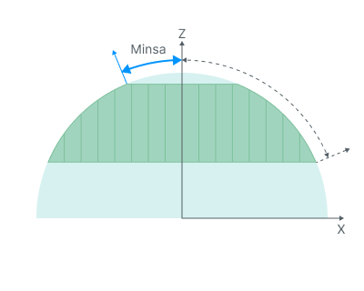

<strong>最大傾斜角度</strong> デフォルト値は45度です。無効にすると、最大値の制限は適用されません。システムでは、サーフェスの法線と垂直Z軸との角度に応じて、モデルサーフェス領域の選択加工を実行できます。加工範囲は、最小傾斜角と<strong>最大</strong>傾斜角によって定義できます。

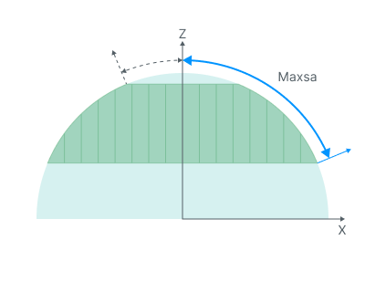

<strong>正面角度</strong> 正面角度とは、工具の移動方向と切削点におけるサーフェス法線を水平面に投影したものの間の角度です。 [詳細を見る](163.md)

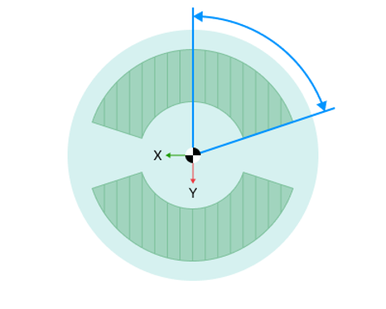

<strong>傾斜角度の分割</strong> 垂直パスと水平パスの間の角度です。

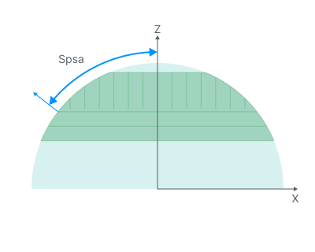

<strong>Spsa</strong> - 傾斜角度の分割

<strong>Merge distance</strong>（結合距離） 複合加工方法（平面 + ウォーターライン、またはスキャロップ + ウォーターライン）で隣接する加工領域を平滑化して結合するために使用する距離を設定します。指定距離内にある隣接領域は単一の連続領域に結合され、短く断片化されたパスがなくなり、より滑らかで均一なツールパスが生成されます。

#### 加工高さ：

工具軸方向の加工範囲を設定します。このパラメータグループは、<strong>ウォーターライン荒加工オペレーション</strong>と同様に機能します。[詳細](736.md)

#### コーナーのスムージング：

工具の進行方向が急変すると、フライス盤の制御装置は旋回前に減速し、その後で再び加速します。この動作は振動を引き起こし、工具およびフライス盤の摩耗を増大させる場合があります。ツールパスの不連続箇所を減らすか、なくすことで、この問題を軽減できます。そのため、システムには、モデルの内側または外側のコーナーを指定した半径で滑らかにつなぐツールパスのスムージング機能があります。

#### トリミング：

<strong>穴埋め</strong>は、デフォルトで直径が工具直径の2倍の開口部を閉じます。加工しないサーフェスをスキップしたり、ツールパスを延長したりできます。一部のパラメータグループは、<strong>ウォーターライン荒加工オペレーション</strong>と同様に機能します。[詳細](736.md)

### パラメータ：

このオペレーションでは、<strong>ワークチェック</strong>に<strong>径方向厚さ無視</strong>、<strong>軸方向厚さ無視</strong>、および<strong>Theoretical rest material</strong>（理論上の残り材料）が含まれます。

このタブには、パーツ、ワーク、治具などを制御し、ツールパスを変更するための主要なパラメータが含まれています。[詳細](100112.md)

### リンク／リード：

リンク／リードタブでは、早送り動作のパラメータを設定します。これには、工具交換位置からのアプローチ、加工動作の開始点への進入、最後の切削動作後の退避、加工パス間の移動、および工具交換位置への復帰が含まれます。座標軸に沿った動作の順序、移動経路、および移動量を設定できます。

詳細を表示

<strong>次の項目で構成されます。</strong>

<strong>アプローチ／リターン。</strong> このパラメータグループは、工具交換位置から進入動作の開始位置までの工具移動と、その復帰動作を管理します。[詳細](100116.md)。

<strong>リンク。</strong> 進入／退出リンクと加工動作間のリンクに関するルールを設定します。[詳細](100130.md)。

<strong>リード。</strong> 加工動作に、その送り速度を使用した追加の進入・退避動作を設定できます。[詳細](100136.md)。

<strong>安全な動作。</strong> <strong>安全サーフェス</strong>の種類と、ワークからこのサーフェスまでの距離を設定します。加工サーフェス間やツールパス間の移動に使用し、アプローチまたはリターンの最初の段階では、このサーフェスに向かって移動します。[詳細](100117.md)。

<strong>高度なリンク設定。</strong> このパラメータグループでは、主に5軸加工について、回転軸の最適な動きを考慮したツールパス生成の設定を行います。[詳細](100118.md)。

<strong>距離。</strong> リンクのルールで使用する距離です。[詳細](100140.md)。

### 送り速度設定：

このダイアログでは、主軸回転速度、早送り速度、およびツールパスの各領域の送り速度を設定できます。主軸回転速度は、毎分回転数または切削速度のいずれかで指定できます。基準となる値には下線が表示されます。もう一方の値は、工具径を考慮して基準値から再計算されます。[詳細](100142.md)

### 変換：

オペレーション内で計算したツールパスの座標変換を行うためのパラメータグループです。[詳細](10168.md)。

### パーツ：

パーツは、食い込みをチェックする対象空間を定義する幾何要素のグループです。[詳細](330.md)

### ワーク：

オペレーションのワークモデルは、加工対象の素材を定義します。[詳細](738.md)

### 治具：

治具には通常、チャック、グリップ、クランプなどの固定補助具や、その他の制限領域を指定します。[詳細](10283.md)
