# Blade Machining

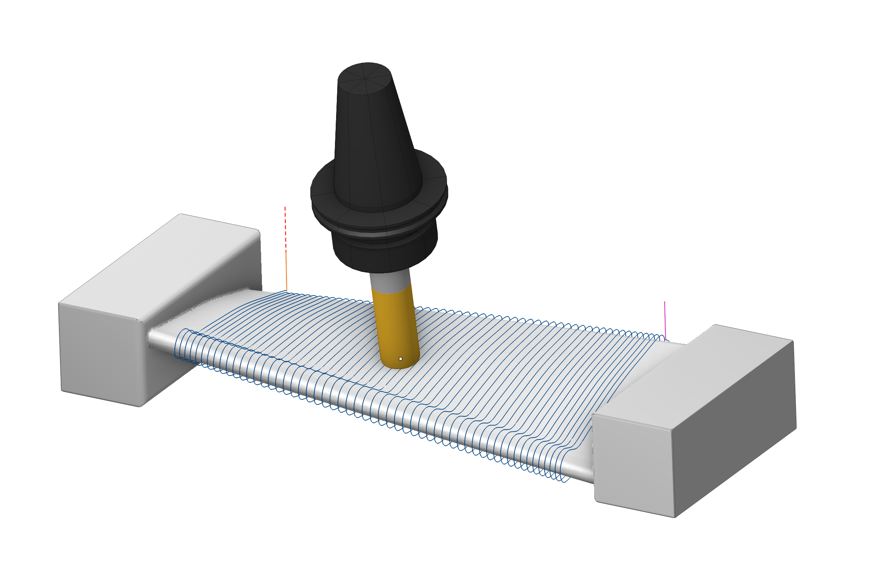  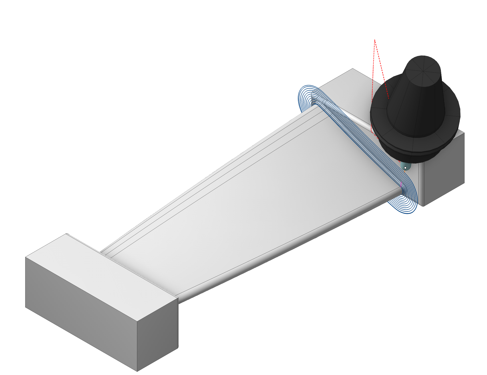

## Application area:

The Blade Milling operation is a specialized multi-axis finishing operation for machining <strong>single blades of compressors</strong>, <strong>turbines</strong>, and <strong>impellers</strong>. The operation machines the blade airfoil, the hub (platform) surfaces with fillets, the blade root zone, and the leading and trailing edges, using a rotary-axis machining model: toolpath passes are built around a user-defined rotary axis and projected onto the part surfaces.

What it is used for typical scenarios:

- Finishing of the airfoil profile with a continuous <strong>Spiral</strong> pass, separate <strong>Circular</strong> loops, or longitudinal <strong>Linear</strong> passes between the edges.
- Machining of the hub (flow-path) surfaces and fillets adjacent to the blade.
- Additional cleanup passes in the root zone of the blade next to the hub.
- Dedicated longitudinal machining of the leading and trailing edges with control of the tool contact point height.
- Compensation of thin-blade deflection by a smoothly varying finishing stock (<strong>Bend compensation stock)</strong>.

### Setup:

The <strong>Setup</strong> tab is used to configure the primary parameters of the project. This can involve the positioning of the part on the equipment, the coordinate system of the part, and more. [Details](1022.md)

### Job assignment:

<strong>Blade surfaces.</strong> The set of faces forming the blade airfoil (pressure side, suction side, and edge surfaces). Required when the <strong>Target zone</strong> is <strong>Blade</strong>, <strong>Root zone of blade</strong>, or <strong>Edges</strong>.

<strong>Hub surfaces.</strong> The set of faces forming the hub (platform, flow path) together with the fillets between the hub and the blade. Required when the <strong>Target zone</strong> is <strong>Hub.</strong> For the <strong>Root zone of blade</strong> the hub surfaces act as the limiting geometry of the machined area; they may be omitted — the calculation then runs without the hub limitation.

<strong>Properties.</strong> Displays the properties of an element. It is possible to add the stock. You can also call this menu by double clicking on an item in the list.

<strong>Delete.</strong> Removes an item from the list.

<strong>Restrictions.</strong> It allows you to restrict areas that should not be machined. [Details](101231.md)

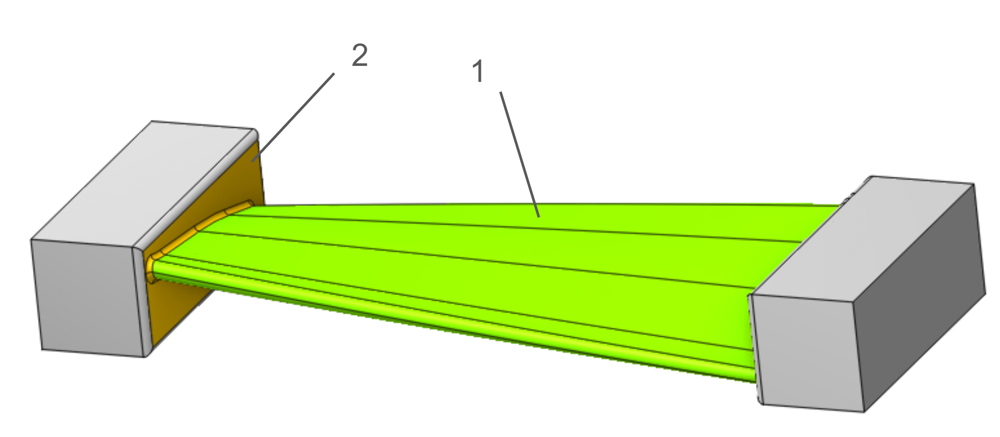

<strong>1-Blade Surfaces, 2-<strong>Hub Surfaces</strong></strong>

### Strategy.

#### Target zone.

The <strong>Target zone</strong> parameter selects which structural element of the blade is machined. It is the main switch of the operation: it defines the machining strategy, the required geometry groups, and the set of visible parameters.

Click here to expand..

<strong>Blade.</strong> Machining of the airfoil profile. Passes are generated around the rotary axis over the whole working range of the blade and projected onto the <strong>Blade surfaces</strong>. All three trajectory forms are available (<strong>Spiral</strong>, <strong>Circular</strong>, <strong>Linear</strong>).

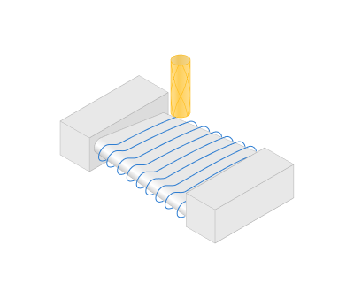

<strong>Root zone of blade.</strong> Additional passes over the lower part of the blade surfaces adjacent to the hub. The machined band is limited by the <strong>Zone height</strong> value measured from the hub. The zone is intended for cleanup with a different (usually smaller or tapered) tool after the main airfoil machining.

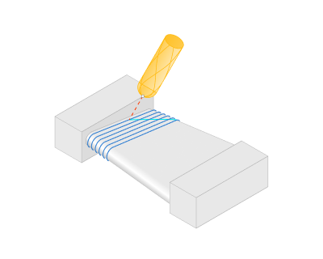

<strong>Hub.</strong> Machining of the hub surfaces and fillets: equidistant offset passes are built successively from the contour at the blade outwards with the constant <strong>Step</strong> over the <strong>Hub surfaces</strong>. The working band along the blade axis is set by the <strong>Zone height</strong> parameter. Outside the outer hub contour the passes are extended automatically; on the extension the next-pass feed is applied.

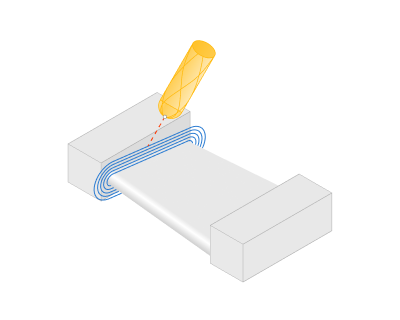

<strong>Edges.</strong> Dedicated machining of the leading edge (LE) and the trailing edge (TE) by longitudinal passes. The edges are detected automatically as curvature peaks of the airfoil cross-sections; the passes run along each edge and are distributed across the edge according to the <strong>Pass count</strong> and <strong>Arc length</strong> parameters. The height of the tool contact point can be controlled along the pass - <strong>Tool contact point</strong>.

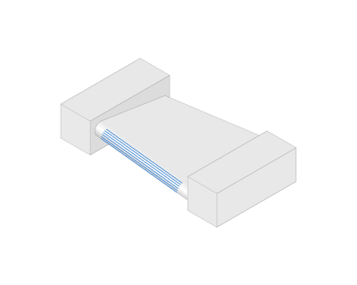

#### Job zone.

It enables additional modification of the working area initially selected on the <strong>Job assignment</strong> tab.

Click here to expand..

<strong>Rotary axis.</strong> The system directs tool's axis vector from the designated <strong><strong>Rotary Axis.</strong></strong> The rotary axis position can be defined in the properties inspector. You can adjust the rotary axis interactively using the arrow or select it from the drop-down menu.

If the mode is set to the <strong>Along X</strong>, <strong>Along Y</strong> or <strong>Along Z</strong>, then the axis of rotation will be oriented along the corresponding axis of the coordinate system.

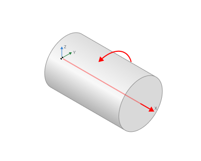

<strong>Direction.</strong> If mode is <strong>Custom(WCS)</strong> then axis vector must be defined manually in the fields <strong>X,Y,Z</strong> of custom direction group. Specify the direction cosines relative to each axis.

<strong>Origin.</strong> The <strong>Origin</strong> field defines the point that acts as the coordinate start for the chosen rotary axis.

<strong>Base CS.</strong> The Base Coordinate System (Base CS) changes the coordinate system between the global and local coordinate systems of the part.

<strong>Start margin.</strong> The offset of the machining start from the blade root.

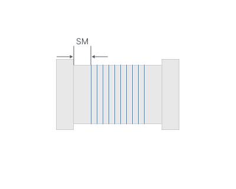

<strong>End margin.</strong> The offset of the machining end from the blade tip.

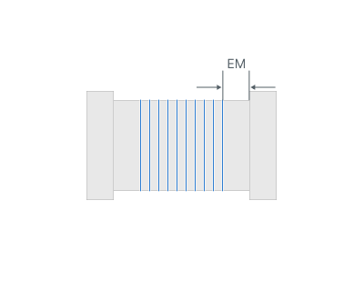

<strong>Zone height.</strong> For the <strong>Root zone of blade</strong> and <strong>Hub</strong> target zones: the height of the machined band measured from the hub along the blade axis.

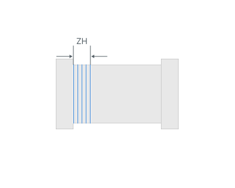

#### Trajectory form.

The trajectory output format.

Click here to expand..

The trajectory can be in one of the following forms:

<strong>Linear.</strong> When you select this option, the work passes form as intersection lines between the machined surfaces and planes through the <strong>Rotary Axis</strong>..

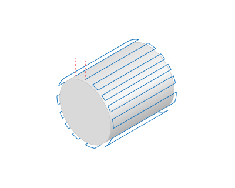

<strong>Circular.</strong> When you select this option, the work passes form as intersection lines between the machined surfaces and planes perpendicular to the <strong>Rotary Axis.</strong>

<strong>Spiral.</strong> Activating this option shapes the toolpath into a continuous helical line. The pattern is well suited for machining parts like screws and impellers.

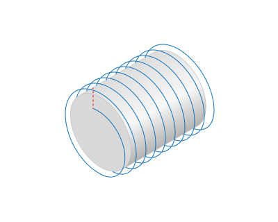

<strong>Step.</strong> It is the distance between tool passes along the rotary axis.

<strong>Axial direction.</strong> Depending on the feature of the <strong>Trajectory Form</strong> parameter, it either defines the direction of the tool passes themselves or the sequence of several tool passes. In the case of a spiral whose step matches the machining <strong>Step</strong>, this parameter influences the direction of the spiral's twist.

<strong>Forward.</strong> The tool passes is ordered in the <strong>Rotary</strong> Axis vector direction.

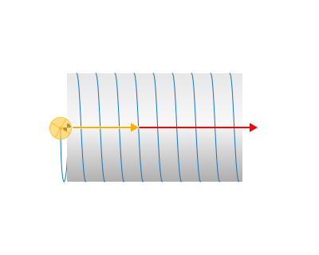

<strong>Backward.</strong> The tool passes are ordered in the <strong>reverse</strong> direction of the <strong>Rotary</strong> Axis vector.

<strong>Side.</strong> For <strong>Linear</strong> and <strong>Circular</strong> modes in the Blade zone: selects which side of the airfoil is machined. In <strong>Circular mode</strong> with a single side selected the loops become open arcs limited by the edge margins.

<strong>Both.</strong> The tool can perform processing from both sides of the surface.

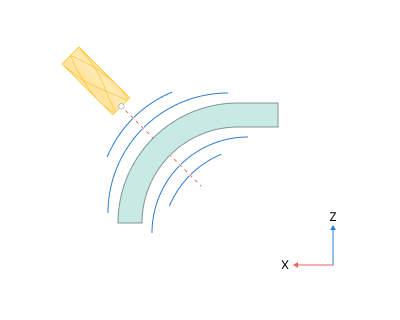

<strong>Convex</strong> (suction side). The tool can only process from the side with the positive direction of the surface normal vector.

.png)

<strong>Concave</strong> (pressure side). The tool can only perform processing from the side opposite to the surface normal vector.

.png)

<strong>LE margin.</strong> Offset from the leading‑edge peak along the airfoil arc; default equals tool diameter.

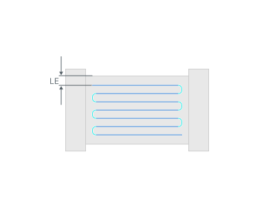

<strong>TE margin.</strong> Offset from the trailing‑edge peak along the airfoil arc.

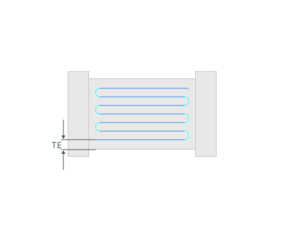

#### Tool contact point.

Сhange the tool's contact point.

Click here to expand..

<strong>One point.</strong> A fixed contact point held constant along the whole pass. Tool Contact Point (TCP) is a specific location on a cutting tool that defines the primary interaction point between the tool and the workpiece surface or geometric entities during machining operations. <strong>This group works similarly 5D Surfacing operation - Tool contact point</strong>. [Details](10135.md)

<em>Changing the tool contact point along the pass</em>

<strong>Two point.</strong> С hange the tool's contact point from the initial line to the final line. <strong>This group works similarly 5D Surfacing operation - Contact Points</strong>. [Details](10135.md)

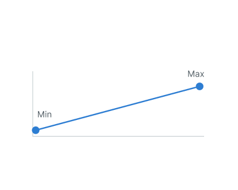

Changing <em>the tool contact point along the pass</em>

<strong>Wave.</strong> The contact point oscillates sinusoidally between the <strong>Start point</strong> and <strong>End point</strong> values with the specified <strong>Wave period</strong> (the wavelength measured along the pass, default — 20 linear units).

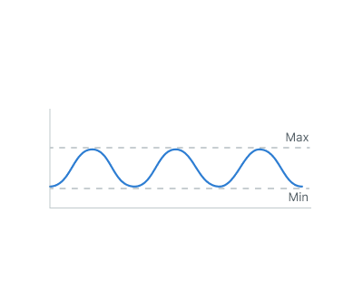

Changing the tool contact point along the pass

<strong>Wave period.</strong> Wave distribution gives the most uniform wear of the tool corner radius.

> Note.
>
> The lead angle in every point of the pass is computed from the current contact height <strong>h</strong> and the tool corner radius <strong>r</strong> as:
>
> lead = arccos(1 - h/r)
>
> The Lead angle field of the Tool orientation group is hidden while the block is active.
>
> 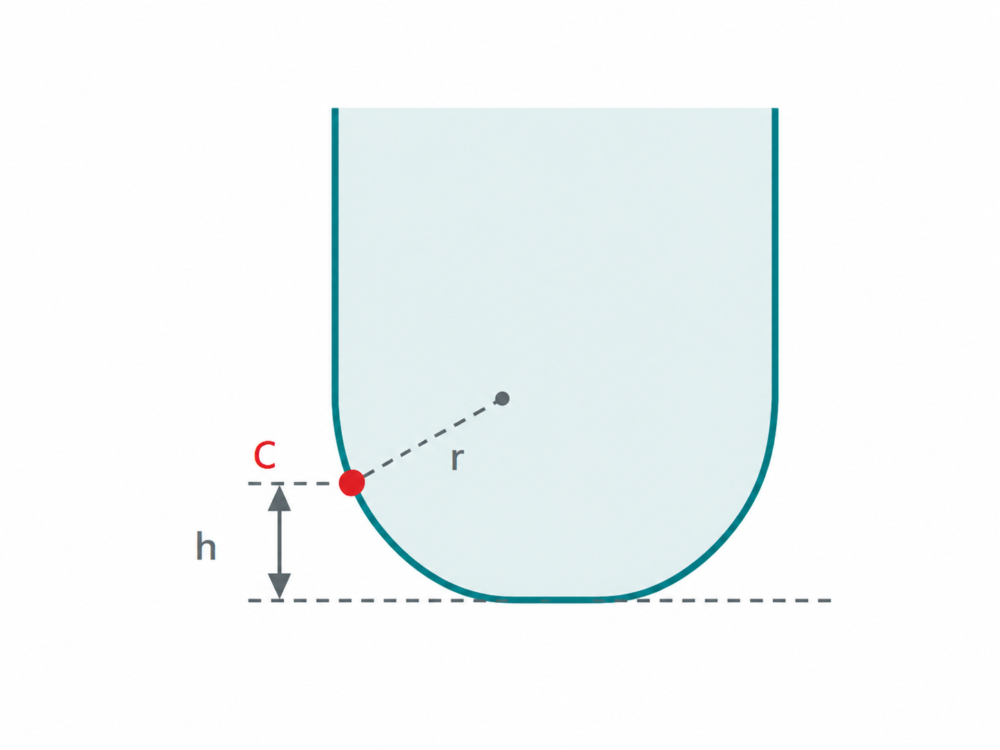

#### Tool orientation.

The <strong>Tool orientation</strong> group controls the direction of the tool axis relative to the machined surface.

Click here to expand..

<strong>To Rotary Axis.</strong> The system directs the tool axis vector from the designated <strong>Rotary axis</strong>. The axis is defined in the <strong>Job zone</strong> group.

<strong>In Rotary Axis Plane.</strong> The tool axis lies in a plane containing the <strong>Rotary axis</strong> and is tilted according to the surface normal.

<strong>By Surface Normal.</strong> The system orients the tool axis normal to the machined surface. This is the default orientation mode.

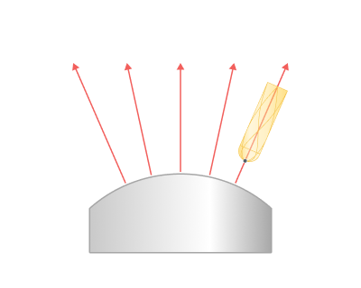

<strong>Lead angle.</strong> Specifies an additional tool tilt angle within the plane of motion direction. Available in <strong>In Rotary Axis Plane</strong> and <strong>By Surface Normal</strong> modes. The default value is 5°.

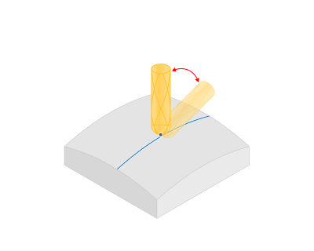

<strong>Auto min lead angle.</strong> When <strong>ON</strong>, automatically increases the lead angle where the surface rises behind the tool and the rear (heel) part of the cutter bottom would engage the surface. The effective angle is the greater of the specified <strong>Lead angle</strong> and the detected surface rise plus <strong>Back angle</strong>; the automatically increased angle is limited to 60°. Where no increase is required, the specified <strong>Lead angle</strong> is retained. When <strong>OFF</strong>, this automatic adjustment is disabled. The option applies to the <strong>Blade</strong> target zone and has no effect on a spherical tool, which has no flat bottom.

<strong>Back angle.</strong> Specifies the additional heel clearance angle added to the detected surface rise. The value is edited in the <strong>Auto min lead angle</strong> row and defaults to the <strong>Lead angle</strong> value.

<strong>Side angle.</strong> Specifies the inclination angle of the tool axis relative to the axis designated as the <strong>Rotary axis</strong>. The value in this row defines the inclination at the start of the working zone. The default value is 0°.

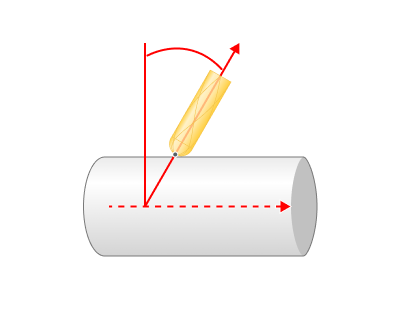

<strong>End angle.</strong> Specifies the inclination angle of the tool axis relative to the <strong>Rotary axis</strong> at the end of the working zone. Expand <strong>Side angle</strong> to access this field. By default, it equals <strong>Side angle</strong>. If the values differ, the inclination changes linearly along the blade axis between them.

The corresponding orientation and angle settings are described for the <strong>Surfacing</strong> operation. [Details](10135.md#tool-orientation)

<em>In the <strong>Edges</strong> target zone, enabling <strong>Tool contact point</strong> hides the <strong>Lead angle</strong> field. The lead angle is then calculated from the specified contact height on the tool corner radius.</em>

#### Edge normal smoothing.

The <strong>Edge normal smoothing</strong> block smooths the contact normal of the tool in the approach zone near the leading and trailing edges. On thin edges the surface curvature changes abruptly, which causes a sharp "dive" of the tool axis when the pass crosses the edge; the smoothing blends the normal over a distance before the edge and removes the jerk of the rotary axes.

<strong>Bend compensation stock.</strong>

The <strong>Bend compensation stock</strong> block adds a smoothly varying <strong>stock</strong> along the blade to compensate the elastic deflection of a thin blade. Under the cutting force the free end of the blade bends away from the tool, so a uniform finishing pass leaves an uncut layer near the tip. The block leaves an intentional, smoothly growing stock in the flexible region; this stock is removed by a final light pass with small cutting forces. <strong>The maximum additional stock at the peak position, in linear units (default — 0.05).</strong>

Click here to expand..

<strong>Start position.</strong> The relative position (0…1) along the working zone where the additional stock begins (default — 0.3). The range 0…1 corresponds to the working zone between the resolved start and end margins.

<strong>Peak position.</strong> The relative position where the additional stock reaches <strong>Max stock</strong> (default — 0.8).

<strong>End position.</strong> The relative position where the additional stock ends (default — 1.0).

<strong>Profile.</strong> The shape of the stock variation between the positions: <strong>Linear</strong>, <strong>Parabolic</strong> (default), or <strong>Sine</strong>.

> Note.
>
> The block is available for the <strong>Blade</strong> and <strong>Root zone of blade</strong> target zones. In the <strong>Hub</strong> and <strong>Edges</strong> zones it is ignored.

#### Milling type.

Сan be assigned in almost all operations, except for the curve machining operations. This allows the user to control the required milling type (climb or conventional) during the toolpath calculation process. This parameter group works similarly to the <strong>Waterline roughing operation.</strong> [Details](736.md)

#### Sorting.

Controls the sequence of toolpath passes during the surface machining.

Click here to expand..

<strong>Start Point.</strong> The point defining the beginning of the plunge.

 

#### Hole capping:

<strong>Hole capping.</strong> Allows holes in the model to be ignored during surface machining. The toolpath is generated as if the holes were closed, allowing working passes to continue across them.

The holes may be circular or non-circular. The specified size represents the diameter of a disk that can completely cover a hole.

Click here to expand..

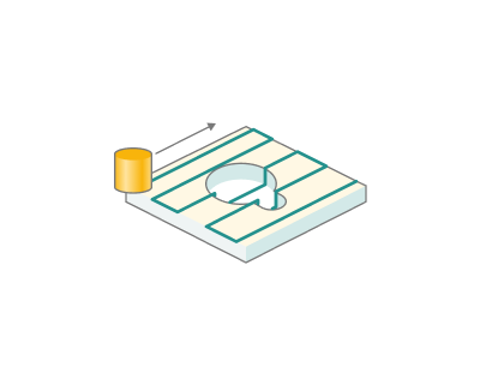 

### Parameters:

<strong>Parameters.</strong> Contains the main settings for controlling how the part, workpiece, fixtures, and other geometry affect the generated toolpath. [Details](100112.md)

### Links/Leads:

<strong>Links/Leads.</strong> Defines tool movements before, between, and after working passes, including approach from the tool change position, engagement, retraction, links between passes, and return to the tool change position. The settings control the sequence, shape, and distances of these movements.

Click here to expand..

<strong>Consists of:</strong>

<strong>Approach/Return.</strong> Controls tool movements from the tool change position to the beginning of the engage path and back. [Details](100116.md)

<strong>Links.</strong> Defines the rules for entry and exit links and links between working passes. [Details](100130.md)

<strong>Leads.</strong> Adds engage and retract motions to working passes and defines their shape and dimensions. These motions use their corresponding feed rates. [Details](100136.md)

<strong>Safe motions.</strong> Defines the type of <strong>Safety Surface</strong> and its distance from the workpiece. The surface is used for links between machining areas or toolpaths and for approach and return movements. [Details](100117.md)

<strong>Advanced links settings.</strong> Controls additional aspects of link generation for five-axis machining, taking rotary-axis movements into account. [Details](100118.md)

<strong>Distances.</strong> Defines the distances used by the linking rules, including feed switching and retraction distances. [Details](100140.md)

### Feeds/Speeds:

<strong>Feeds/Speeds.</strong> Defines the spindle speed, rapid feed, and feed rates for different parts of the toolpath. Spindle speed can be specified in revolutions per minute or as a cutting speed. The defining value is underlined; the other value is calculated from it using the tool diameter. [Details](100142.md)

### Transformations:

<strong>Transformations.</strong> Defines coordinate transformations applied to the toolpath calculated for the operation. [Details](10168.md)

### Part:

<strong>Part.</strong> Defines the geometry used to check the toolpath for gouges. [Details](330.md)

### Workpiece:

<strong>Workpiece.</strong> Defines the material to be machined in the operation. [Details](738.md)

### Fixtures:

<strong>Fixtures.</strong> Defines workholding devices, such as chucks, grips, and clamps, and other restricted geometry considered during toolpath calculation. [Details](10283.md)
