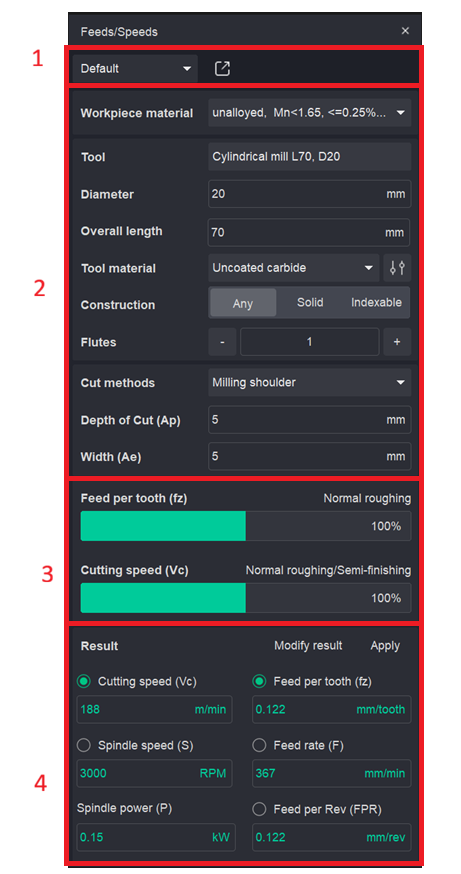
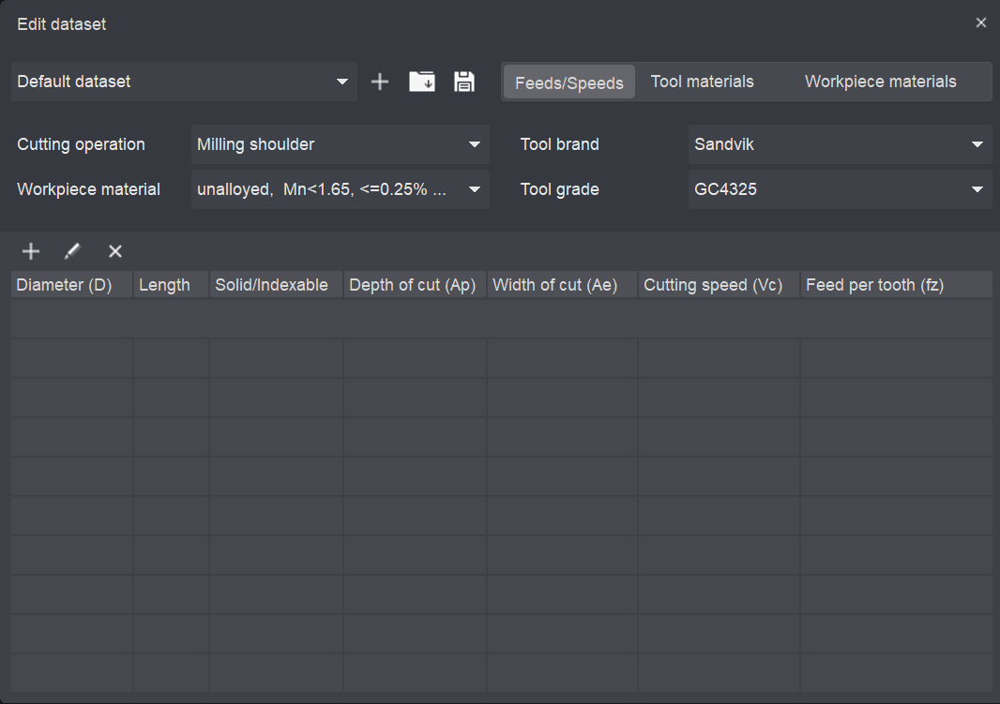

# Feeds/Speeds (Calculate)

## Application Area:

The <strong>Feeds/Speeds</strong> calculator computes cutting parameters — cutting speed, spindle speed, feed per tooth and feed rate — from the selected tool, workpiece material and cut method. Computed values are written into the machining operation and can be fine-tuned manually before they are applied. <strong>The calculation of cutting parameters is performed automatically in real-time upon modification of any parameter, without the need to press a dedicated Calculate button.</strong>

The calculator panel is divided into four areas, top to bottom:

1. <strong>Toolbar area.</strong> It allows the user to manage custom tables for populating data used by the calculator.
2. <strong>Input area.</strong> Defines the tool, the workpiece material and the cutting conditions.
3. <strong>Load sliders</strong>. Set the cutting load relative to the recommended range.
4. <strong>Result.</strong> Shows the computed cutting parameters.

### Toolbar.

<strong>Dataset selector.</strong> Selects the active cutting data dataset. Defaults to <strong>Default dataset</strong>. These tables allow the user to define their own cutting parameters, tool materials, and workpiece materials.

<strong>Open editor.</strong> Opens the Edit dataset window for managing the tool and workpiece material databases.

Click here to expand..

<strong>The filters and displayed list dynamically adapt according to the type of the selected table. (Feeds/Speeds, Tool materials, Workpiece materials)</strong>

<strong>Toolbar.</strong>

<strong>Dataset selector.</strong> Selects the dataset to edit.

<strong>Add.</strong> Creates a new dataset.

<strong>Open.</strong> Loads an existing dataset.

<strong>Save.</strong> Saves the current dataset.

<strong>Tabs.</strong> Feeds/Speeds, Tool materials, Workpiece materials — switch between the edited sections.

<strong>Feeds/Speeds tabs.</strong>

<strong>Filters</strong>

Define which records are shown and edited:

Cutting operation. The operation type the data applies to.

Workpiece material. The material being filtered.

Tool brand. Manufacturer (for example, Sandvik).

Tool grade. Manufacturer grade (for example, GC4325).

ISO group. Material group — P M K N S H O. Select the group the material belongs to.

Subgroup. Refines the ISO group (for example, Unalloyed).

<strong>List.</strong> It displays a data list depending on the selected table.

### Input parameters.

<strong>Workpiece material.</strong> The material being machined, selected from the dataset (for example, unalloyed, Mn<1.65, <=0.25%C).

<strong>Tool.</strong> The tool the calculation applies to (for example, End Mill L70, D20). Taken from the active operation.

<strong>Diameter.</strong> Tool cutting diameter, mm.

<strong>Overall length.</strong> Total tool length, mm.

<strong>Tool material.</strong> Cutting material of the tool (for example, Uncoated carbide). The icon to the right switches the material preset.

<strong>Construction.</strong> Tool body type: Any, Solid or Indexable.

<strong>Flutes.</strong> Number of cutting edges. Adjust with the – / + buttons.

<strong>Cut methods.</strong> The milling strategy (for example, Milling shoulder).

<strong>Depth of Cut (Ap).</strong> Axial depth of cut, mm.

<strong>Width (Ae).</strong> Radial width of cut, mm.

### Load sliders.

Two sliders set the working load as a percentage of the recommended range. The caption above each slider shows the corresponding machining condition.

<strong>Feed per tooth (fz).</strong> Sets the feed load. The caption shows the regime, for example Normal roughing. Expressed as 0–100%.

<strong>Cutting speed (Vc).</strong> Sets the speed load. The caption shows the regime, for example Normal roughing/Semi-finishing. Expressed as 0–100%.

<em>Moving a slider re-evaluates the dependent result fields when you press <strong>Calculate</strong>.</em>

### Result.

| Parameter | Symbol | Unit | Example |
|---|---|---|---|
| Cutting speed | Vc | m/min | 153 |
| Feed per tooth | fz | mm/tooth | 0.115 |
| Spindle speed | S | RPM | 2435 |
| Feed rate | F | mm/min | 280 |
| Spindle power | P | kW | 0.15 |
| Feed per Rev | FPR | rev/min | 0.115 |

The computed values. Click <strong>Modify result</strong> to edit a value manually.

The <strong>Apply</strong> function enables the transfer of computed cutting parameters to a designated machining operation. Within this interface window, the user specifies the format for data output to the operation, including options to define parameters as cutting speed and feed rate in mm/min or as spindle speed and feed rate in mm/rev.
