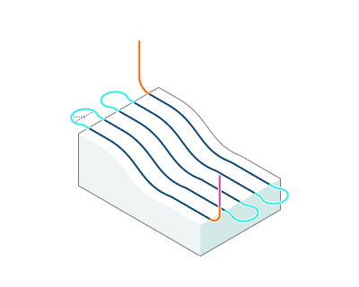
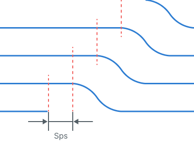
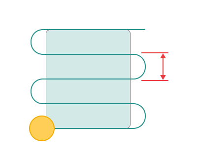
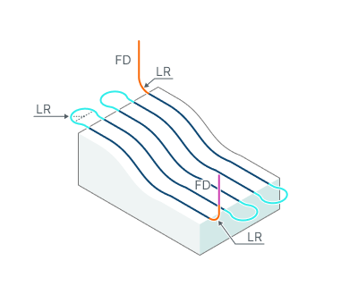
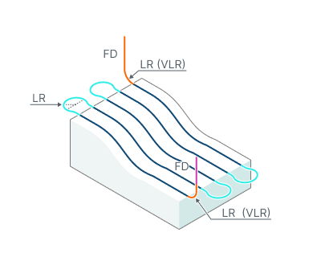

# Links for 3D/5D advanced operations

## Application Area:

Defines the rules governing Entry/Exit links and links between work moves.

<strong>Start point shift (For additive operations).</strong>

Click here to expand..

The start point shift relative to the previous layer allows to get a more even distribution of zones where the feed of material starts/stops and where the quality of the formed surface is usually lower.

<em>Note: For "Non-planar slicing" operation this option is available only if "Start points" parameter on the "Strategy" page is set to "Auto" or "Custom for first layers" mode.</em>

<strong>Sps</strong> - Start point shift

<strong>Entry/Exit links.</strong> Defines the general rule of approach/return.

Click here to expand..

<strong>Straight.</strong>

With this rule, the approach to the part is carried out: 1. <strong>Tool change position</strong> 2.<strong>Appr</strong>- Approach 3. <strong>LD</strong> - Leads (If they are enabled) The returnl is carried out in the reverse order: 1. <strong>LD</strong> - Leads (If they are enabled) 2.<strong>Ret</strong> - Return 3. <strong>Tool change position</strong>

.png)

<strong>By Feed Distance.</strong>

With this rule, the approach to the part is carried out: 1. <strong>Tool change position</strong> 2.<strong>Appr</strong>- Approach 3. <strong>FD</strong> - Feed distance 4. <strong>LR</strong> - Linking Radius (depends on the type of Leads. If the Leads is located vertically, then as a rule, the arc is not built) 5. <strong>LD</strong> - Leads (If they are enabled) The returnl is carried out in the reverse order: 1. <strong>LD</strong> - Leads (If they are enabled) 2. <strong>LR</strong> - Linking Radius (depends on the type of Leads. If the Leads is located vertically, then as a rule, the arc is not built) 3.<strong>FD</strong> - Feed distance 4.<strong>Ret</strong> - Return 5. <strong>Tool change position</strong>

.png)

<strong>By Rapid Distance.</strong>

With this rule, the approach to the part is carried out: 1. <strong>Tool change position</strong> 2. <strong>Appr</strong>- Approach 3. <strong>RD</strong> - Rapid distance 4. <strong>FD</strong> - Feed distance 5. <strong>LR</strong> - Linking Radius (depends on the type of Leads. If the Leads is located vertically, then as a rule, the arc is not built) 6. <strong>LD</strong> - Leads (If they are enabled) The returnl is carried out in the reverse order: 1. <strong>LD</strong> - Leads (If they are enabled) 2. <strong>LR</strong> - Linking Radius (depends on the type of Leads. If the Leads is located vertically, then as a rule, the arc is not built) 3. <strong>FD</strong> - Feed distance 4. <strong>RD</strong> - Rapid distance 5. <strong>Ret</strong> - Return 6. <strong>Tool change position</strong>

.png)

<strong>On Safe Surface.</strong>

With this rule, the approach to the part is carried out: 1. <strong>Tool change position</strong> 2.<strong>Appr</strong>- Approach 3.<strong>SL</strong> - Safe level 4. <strong>FD</strong> - Feed distance 5.<strong>LR</strong> - Linking Radius (depends on the type of Leads. If the Leads is located vertically, then as a rule, the arc is not built) 6. <strong>LD</strong> - Leads (If they are enabled) The returnl is carried out in the reverse order: 1. <strong>LD</strong> - Leads (If they are enabled) 2. <strong>LR</strong> - Linking Radius (depends on the type of Leads. If the Leads is located vertically, then as a rule, the arc is not built) 3. <strong>FD</strong> - Feed distance 4. <strong>SL</strong> - Safe level 5. <strong>Ret</strong> - Return 6. <strong>Tool change position</strong>

.png)

<strong>Short links/Long links.</strong> Defines the rule for transition between work moves.

Click here to expand..

<strong>Straight.</strong> Links are made by the shortest distance.

.png)

<strong>Smooth.</strong> Links are made by a smooth spline curve.

-1.png)

<strong>High Speed.</strong> Links are made by a smooth curve in such a way that the <strong>Link radius</strong> is nowhere exceeded.

-1.png)

<strong>By Feed Distance.</strong>

The links made from from the <strong>Feed distance</strong>. Additionally transition curves may be smoothed by the <strong>Link radius</strong>. <strong>FD</strong> - Feed distance <strong>LR</strong> - Link radius

.png)

<strong>By Rapid Distance.</strong>

The links made from from the <strong>Linking Radius</strong> and <strong>Rapid distance</strong>. <strong>RD</strong> - Rapid distance <strong>LR</strong> - Linking Radius

.png)

<strong>On Safe Surface.</strong>

The links made from from the <strong>Linking Radius</strong> + <strong>Feed distance</strong> to the <strong>Safe level</strong>. <strong>LR</strong> - Linking Radius <strong>FD</strong> - Feed distance <strong>SL</strong> - Safe level

.png)

<strong>On Offset Surface.</strong>

Works as a displacement of the treated surface by a distance Feed distance. Works with milling type: Climb, Conventional. <strong>FD</strong> - Feed distance

.png)

<strong>Short link max distance.</strong> Sets the maximum distance at which links are made by the short link type.

<strong>Linking Radius.</strong>

Click here to expand..

<strong>Link radius</strong> sets the radius of smoothing for

- <strong>Highspeed links</strong> - <strong>Feed distance links</strong> (depends on the type of Leads. If the <strong>Leads</strong> is located vertically, then as a rule, the arc is not built)

<strong>FD -</strong> Feed distance <strong>LR -</strong> Link radius

<strong>Vertical Lead Radius.</strong>

Click here to expand..

The Vertical Lead Radius parameter, in combination with the Linking Radius, expands the connection zone to include a vertical displacement, enabling "Frog Jump" transitions.

<strong>FD -</strong> Feed distance <strong>LR -</strong> Link radius <strong>VLR -</strong> Vertical Lead Radius

