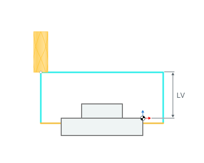
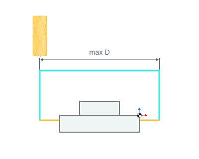
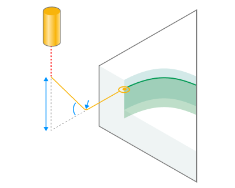
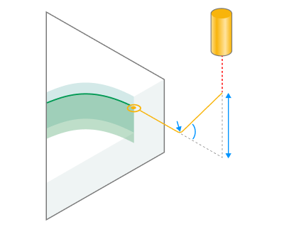

# Links for countouring operations

.png)

## Application Area:

This group defines the settings for cutting in or transitions between areas.

<strong>Transitions.</strong>

Click here to expand..

<strong>Via safe plane.</strong> The transition is carried out through a safe level

2.png)

<strong>FD</strong> - Feed distance <strong>SL</strong> - Safe level <strong>LD</strong> - Leads

<strong>Around workpiece.</strong> The transition is carried out at the level of the working path. For its operation, it is necessary to enable <strong>Check workpiece</strong> in the <strong>Parameters</strong> tab. The algorithm will build the shortest tool path without crashing into the workpiece.

.png)

<strong>FD</strong> - Feed distance <strong>LD</strong> - Leads

<strong>By level.</strong> The transition is carried out through a level that is measured from the <strong>Workpiece coordinate system.</strong>

.png)

<strong><strong>FD</strong> - Feed distance <strong>LD</strong> - Leads</strong>

<strong>Level.</strong> Level that is measured from the <strong>Workpiece coordinate system</strong>

<strong>Maximal distance.</strong> Defines the distance at which the transition through the level is performed. If the distance is greater than the value in the parameter, then the transition is performed through the safety level.

<strong>Plunge on Lead In/</strong> <strong>Rise on Lead Out.</strong>

Click here to expand..

Allows you to set up the plunge/rise method.

.png)  .png) 

<strong>Height.</strong> Determines the height for plunge/rise at an angle.

<strong>Ramp angle.</strong> Determines the angle of plunge/rise.

<strong>Smooth arc radius.</strong> Allows you to smooth the trajectory through the radius when plunge/rise.

