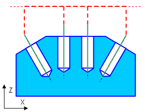
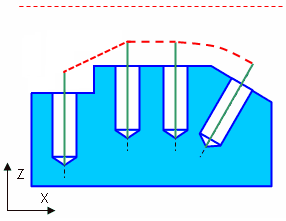
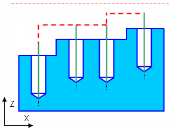

# Links in drilling operations

_(Via_safe_surface).png)

## Application Area:

The parameters of this group detail the final point for the approach/return movements and specify the technique for auxiliary movements when transitioning between holes.

<strong>First Link Type.</strong> Defines the method for bringing the tool to the first processing hole.

Click here to expand..

<strong>Via Safe Surface.</strong> The toolpath continues until the hole axis intersects with the specified safe surface (plane, cylinder or sphere).

_(Via_safe_surface).png)

With this rule, the approach to the first hole is carried out: 1. <strong>Tool change position</strong> 2.<strong>Appr</strong>- Approach 3.<strong>SL</strong> - Safe level 4. <strong>Amsl</strong> - Air move safety level. If enable <strong>Start cycles at air move safety level</strong>, else <strong>RD</strong> - Rapid distance 5.<strong>FD</strong> - Feed distance Retraction to the tool change point is carried out through <strong>Ret</strong> -Return

<strong>Via Air Move Safety Level</strong>. The toolpath continues along the hole axis up to the air move safety level.

_(Via_air_move_safety_level).png)

With this rule, the approach to the first hole is carried out: 1. <strong>Tool change position</strong> 2.<strong>Appr</strong>- Approach 3.<strong>Amsl</strong> - Air move safety level 4.<strong>RD</strong> - Rapid distance (If disable <strong>Start cycles at air move safety level</strong>) 5.<strong>FD</strong> - Feed distance Retraction to the tool change point is carried out through <strong>Ret</strong> -Return

<strong>Straight</strong>. Straight transition between holes' first cycle points

_(Straight).png)

With this rule, the approach to the first hole is carried out: 1. <strong>Tool change position</strong> 2.<strong>Appr</strong>- Approach 3.<strong>Amsl</strong>- Air move safety level. If enable <strong>Start cycles at air move safety level</strong>, else <strong>RD</strong> - Rapid distance 4.<strong>FD</strong> - Feed distance Retraction to the tool change point is carried out through <strong>Ret</strong> -Return

<strong>Last Link Type.</strong> Specifies how the tool is retracted from the last processed hole.

Click here to expand..

<strong>Via Safe Surface</strong>. The toolpath continues until the hole axis intersects with the specified safe surface (plane, cylinder or sphere).

_(Via_safe_surface).png)

With this rule, the approach to the last hole is carried out: 1.<strong>SL</strong> - Safe level 2. <strong>Amsl</strong> - Air move safety level. If enable <strong>Start cycles at air move safety level</strong>, else <strong>RD</strong> - Rapid distance 3.<strong>FD</strong> - Feed distance Retraction to the tool change point is carried out through <strong>Ret</strong> -Return

<strong>Via Air Move Safety Level</strong>. The toolpath continues along the hole axis up to the air move safety level.

_(Via_air_move_safety_level).png)

With this rule, the approach to the last hole is carried out: 1.<strong>Amsl</strong> - Air move safety level 2.<strong>RD</strong> - Rapid distance (If disable <strong>Start cycles at air move safety level</strong>) 3.<strong>FD</strong> - Feed distance Retraction to the tool change point is carried out through <strong>Ret</strong> -Return

<strong>Straight</strong>. Straight transition between holes' first cycle points

_(Straight).png)

With this rule, the approach to the last hole is carried out: 1.<strong>Amsl</strong>- Air move safety level. If enable <strong>Start cycles at air move safety level</strong>, else <strong>RD</strong> - Rapid distance 2.<strong>FD</strong> - Feed distance Retraction to the tool change point is carried out through <strong>Ret</strong> -Return

<strong>Long Link Type.</strong> Defines the method for transitioning the tool between consecutive processing holes when the transition length exceeds the value set in the <strong>Short Link Max Distance</strong> parameter.

Click here to expand..

<strong>Via Air Move Safety Level</strong>. The tool follows the shortest path to the next hole, arriving at the coordinate specified by the <strong>Air Move Safety Level</strong> parameter, and then moves towards the <strong>Feed Distance</strong> along the tool's normal.

<strong>Via Safe Surface</strong>. The tool moves along the <strong>Safe Surface</strong> to the next hole, arriving at the coordinate set by the <strong>Safe Surface Level</strong> parameter, then proceeds toward the <strong>Feed Distance</strong> in the direction of its normal.

<strong>Straight</strong>. The tool follows the shortest route to the next hole, arriving at the coordinate specified by the <strong>Rapid Distance</strong> parameter, then moves toward the <strong>Feed Distance</strong> along the tool's normal direction.

<strong>Orthogonal</strong>. If the <strong>Rapid Distance</strong> at the next hole exceeds that of the current hole, the tool retracts along its normal to the next hole's <strong>Rapid Distance</strong> level, then follows the shortest path to the next hole, and then lowers along its normal to the <strong>Feed Distance</strong>.

<strong>Short Link Type.</strong> Defines the method for transitioning the tool between consecutive processing holes when the transition length is smaller than the value set in the <strong>Short Link Max Distance</strong> parameter. This option uses the same parameters as the <strong>Long Link Type</strong>.

<strong>Short link max angle / Short link max distance.</strong>

Click here to expand..

Using the Short link max distance and the Short link max angle parameters you can divide the long and short transition cases to be possible to make diferent type of links. If <strong>Short link max distance</strong> and <strong>Short link max angle</strong> less than the distance between the holes, then the transition is performed as <strong>Long link type</strong>. Otherwise it will be executed on <strong>Short link type</strong>

.png) .png)

<strong>SLMD</strong> - Short link max distance

<strong>SLMA</strong> - Short link max angle

<strong>SLT</strong> - Short link type

<strong>LLT</strong> - Long link type

