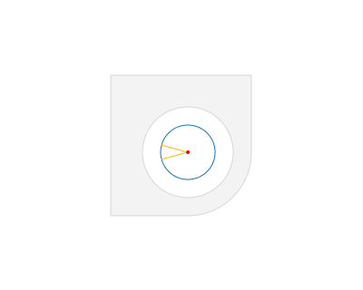
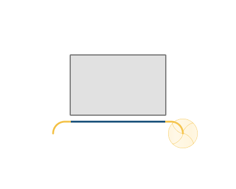
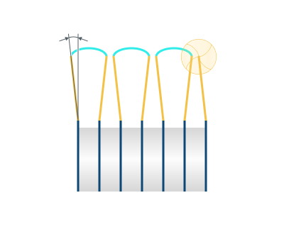

# Leads for 3D/5D advanced operations

<strong>Sl</strong> - Safe level

<strong>LD</strong> - Leads

## Application Area:

Allows you to add additional engage and retract to the working moves using their feed.

<strong>Lead from hole center (available for the chamfer operation).</strong>

Click here to expand..

<strong>Enable:</strong> The lead is formed from the center of the hole.

<strong>Disable:</strong> The lead is formed according to the <strong>Lead in/out for closed curves</strong> or <strong>Lead in/out for open curves</strong> rule.

 

<strong>Engage.</strong>

Click here to expand..

<strong>Off.</strong> The Engage and Retract toolpath parts is not generated.

.png)

<strong>By Vertical Normal.</strong> The engage is performed along the tool axis to the first point of the work pass.

.png)

<strong>By Surface Normal.</strong> The engage is performed along the normal to surface at the first point of the work pass

.png)

<strong>By Horizontal Normal.</strong> The engage is performed perpendicular to the tool axis to the first point of the work pass

.png)

<strong>By Tangent.</strong> The engage is performed tangentially to the first machining point.

.png)

<strong>By Line.</strong> The engage is performed by angle to tangent to the first machining point.

.png)

<strong>By Vertical Arc.</strong> The system adds an arc to the first point on the curve using the defined radius. The arc lies in the vertical plane and is tangent with the first toolpath applied to the contour. The angle of the curve is defined by user. The tool plunge is performed at the vertical end of the arc, and then moves along the arc and then onto the work pass.

.png)

<strong>By Normal Arc.</strong> The system adds an arc to the first point on the curve using the defined radius. The arc lies in the vertical plane and is tangent with the first toolpath applied to the contour. The angle of the curve is calculated so that the tangent on the other side of the arc is vertical. The tool plunge is performed at the vertical end of the arc, and then moves along the arc and then onto the work pass.

.png)

<strong>By Horizontal Arc.</strong> Used when constructing a trajectory in the horizontal direction. The system adds a tangent with an angle in the horizontal direction.

<strong>Depending on the engage, it becomes possible to control additional parameters:</strong>

<strong>Length (Radius).</strong> Changes the length

.png)

<strong>Angle.</strong> Changes the vertical angle

.png)

<strong>Plane angle.</strong> Changes the horizontal angle

<strong>Retract.</strong>

Click here to expand..

<strong>Off.</strong> The Engage and Retract toolpath parts is not generated.

.png)

<strong>By Vertical Normal.</strong> The retraction – along the tool axis from the last point of the work pass.

.png)

<strong>By Surface Normal.</strong> The approach is performed along the normal to surface at the first point of the work pass

.png)

<strong>By Horizontal Normal.</strong> The retraction is performed perpendicular to the tool axis from the last point of the work pass.

.png)

<strong>By Tangent.</strong> The approach is performed tangentially to the first machining point.

.png)

<strong>By Line.</strong> The approach is performed by angle to tangent to the first machining point.

.png)

<strong>By Vertical Arc.</strong> The system adds an arc to the first point on the curve using the defined radius. The arc lies in the vertical plane and is tangent with the first toolpath applied to the contour. The angle of the curve is defined by user. The tool plunge is performed at the vertical end of the arc, and then moves along the arc and then onto the work pass.

.png)

<strong>By Normal Arc.</strong> The system adds an arc to the first point on the curve using the defined radius. The arc lies in the vertical plane and is tangent with the first toolpath applied to the contour. The angle of the curve is calculated so that the tangent on the other side of the arc is vertical. The tool plunge is performed at the vertical end of the arc, and then moves along the arc and then onto the work pass.

.png)

<strong>By Horizontal Arc.</strong> Used when constructing a trajectory in the horizontal direction. The system adds a tangent with an angle in the horizontal direction.

<strong>Depending on the engage, it becomes possible to control additional parameters:</strong>

<strong>Length (Radius).</strong> Changes the length

.png)

<strong>Angle.</strong> Changes the vertical angle

.png)

<strong>Plane angle.</strong> Changes the horizontal angle

<strong>Use leads for short links. Enable:</strong> When enabled leads are added to all links, including the short ones.

<strong>Disable:</strong> When disabled leads are added only to long links and entry/exit inks.

.png) .png)
