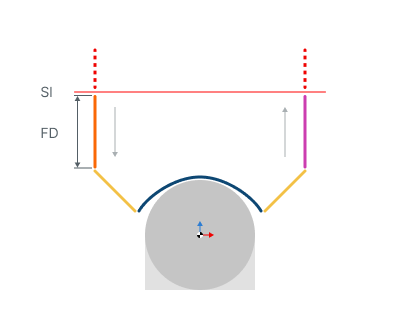

# Distance for 3D operations

## Application Area:

Distances required to switch feeds.

<strong>Feed distance (level).</strong> The distance measured along the tool axis from the activation of approach feed to the point where it switches to the work feed or engage feed.

Click here to expand..

<strong>SL</strong> - Safe Surface

<strong>FD</strong> - Feed Distance

The approach feed starts during movement toward the workpiece from the <strong>Safe Surface</strong> or from the <strong>Rapid Distance</strong>. Within this distance, the approach feed is active. The switch to the work feed occurs at the level of the working passes or when the engage motion with engage feed begins. This value can be set:

- in length units from the engage start point;

- in length units relative to the workpiece level;

- as a percentage of the tool diameter;

- as a percentage of the distance between passes.

