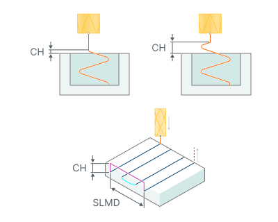

# Distances based on the Roughing waterline

## Application Area:

Distances required to switch feeds

<strong>Clearance height.</strong>

Click here to expand..

This distance is used to back-off the tool, when it goes over the already machined zone (If the transition value is greater than the value `*Short link max distance*`). It is also used as a clearance value when cutting into closed areas.

<strong>CH</strong> - Сlearance height <strong>SLMD</strong> - Short link max distance

<strong>Safe distance.</strong>

Click here to expand..

The distance from the workpiece when switch from/to rapid feed or long link feed.

<strong>Feed distance (level).</strong> The distance measured along the tool axis from the activation of approach feed to the point where it switches to the work feed or engage feed.

Click here to expand..

The approach feed starts during movement toward the workpiece from the <strong>Safe Surface</strong> or from the <strong>Rapid Distance</strong>. Within this distance, the approach feed is active. The switch to the work feed occurs at the level of the working passes or when the engage motion with engage feed begins. This value can be set:

- in length units from the engage start point;
- in length units relative to the workpiece level;
- as a percentage of the tool diameter;
- as a percentage of the distance between passes.

