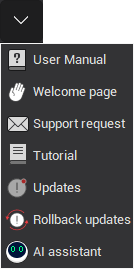

# Help button of main panel

The <strong>Help</strong> menu consists of actions that allow you to find answers to any questions that may arise.

| Button | Description |
|---|---|
|  | <strong>User Manual:</strong> Shows the CAM system help. |
|  | <strong>Welcome page:</strong> Opens a page with up-to-date information from the CAM system website. |
|  | <strong>Support request:</strong> Prepares a message to the technical support service of ENCY SOFTWARE LTD., e-mail: support@encycam.com. |
|  | <strong>Tutorial:</strong> Runs the CAM system tutorial. |
|  | <strong>Updates:</strong> Checks for available updates. |
|  | <strong>Rollback updates:</strong> Rollback to a previous version of the software, if necessary. |
|  | <strong>[AI Assistant:](10428.md)</strong> A virtual assistant that helps users with various aspects of the CAM workflow. |
