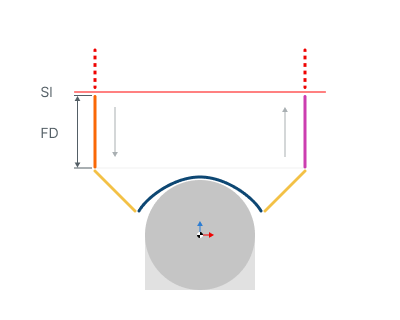
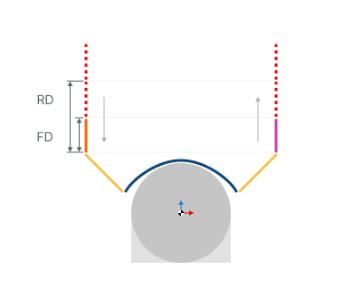
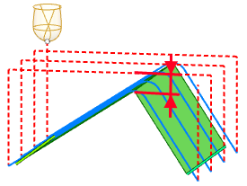

# Distances for 3D/5D advanced operations

## Application Area:

Distances used in Links rules

<strong>Feed Distance.</strong>

Click here to expand..

The distance measured along the tool axis from the activation of approach feed to the point where it switches to the work feed or engage feed.

<strong>SL</strong> - Safe Surface

<strong>FD</strong> - Feed Distance

The approach feed starts during movement toward the workpiece from the <strong>Safe Surface</strong> or from the <strong>Rapid Distance</strong>. Within this distance, the approach feed is active. The switch to the work feed occurs at the level of the working passes or when the engage motion with engage feed begins. This value can be set:

- in length units from the engage start point;
- as a percentage of the tool diameter;

<strong>Rapid Distance.</strong>

Click here to expand..

It is the distance from the workpiece where entry movements take place at machining start or exit movements after its completion.

<strong><strong>FD</strong> -</strong> Feed distance

<strong>RD -</strong> Rapid distance

This serves as an alternative method to specifying the entry/exit or links levels for the tool instead of the <strong>Safety Surface</strong>. The <strong>Rapid Distance</strong> must exceed the <strong>Feed Distance</strong>.

<strong>Max Retraction Distance.</strong>

Click here to expand..

The longest distance the tool can travel along its axis while retracting at rapid speed.

<strong>Enable:</strong> If the option is turned on, the tool first moves this distance along its axis during Links and Retracts, and the remaining travel to the <strong>Safety Surface</strong> occurs perpendicular to it.

<strong>Disable:</strong> When the option is disabled, the tool travels to the Safety Surface along its axis during Links and Retracts.

.png) .png)

<strong>Disable Enable</strong>

<strong>MRD -</strong> Max retraction distance

<strong>Rapid move safe distance</strong>

Click here to expand..

When making a <strong>rapid distance link</strong> the tool is checked against the workpiece. At positions where the distance between the tool and the workpiece along the tool axis direction is less thatn the <strong>Air move safety distance</strong>, the tool is raised by the rapid distance. So, for this type of link, Air move safety distance is the minimum distance, while the rapid distance is the maximum distance between the tool and the workpiece along the tool axis direction.

