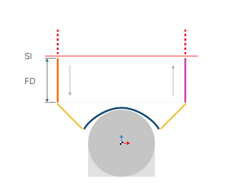
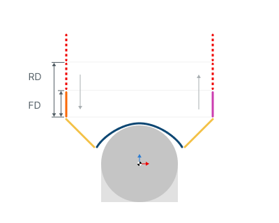
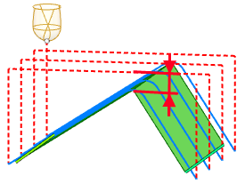

# 3D/5D高度なオペレーションの距離

## 適用分野：

リンクルールで使用される距離

### 送り距離

拡大

アプローチの送りが作動してから、ワークの送りまたは切込みの送りに切り替わるまでの工具軸に沿って測定される距離。

<strong>SL</strong> - 安全サーフェス

<strong>FD</strong> - 送り距離

<strong>安全サーフェス</strong>または <strong>早送り距離</strong>からワークに向かって移動する間に、アプローチ送りが開始されます。この距離内では、アプローチの送りが有効になります。ワークの送りへの切り替えは、ツールパスの高さ、または切込みの送りとの切込み動作が始まるときに行われます。この値は以下の方法で設定できます。

- 切込み開始点からの長さ単位
- ワークの高さに対する長さ単位
- 工具径に対する割合
- パス間の距離に対する割合

### 早送り距離

拡大

加工開始時の進入動作や加工終了後の退出動作が行われるワークからの距離。

<strong>FD</strong> -</strong> 送り距離

<strong>RD-</strong> 早送り距離

これは、 <strong>安全サーフェス</strong>の代わりに、工具の進入/退出またはリンク高さを指定する代替方法として役立ちます。 <strong>早送り距離</strong>は<strong>送り距離</strong>を上回る必要があります。。

### 最大の退避距離

拡大

工具を高速で退避させながら、その軸に沿って移動できる最長距離。

<strong>有効：</strong>オプションがオンの場合、リンクと退避の間に工具はまず軸に沿ってこの距離を移動し、 <strong>安全サーフェス</strong>への残りの移動は軸に垂直に行われます。

<strong>無効：</strong>オプションを無効にすると、リンクと退避中に工具は軸に沿って安全面まで移動します。

 

<strong>無効 有効</strong>

<strong>MRD -</strong> 最大退避距離

<strong>早送り動作の安全距離</strong>

拡大

<strong>高速距離リンク</strong>を作るとき、工具はワークに対してチェックされます。工具軸方向に沿った工具とワーク間の距離が、 <strong>エア移動の安全距離</strong>より小さい位置では、工具は早送り距離だけ上昇します。つまり、このタイプのリンクでは、エア移動安全距離は最小距離であり、早送り距離は工具軸方向に沿った工具とワーク間の最大距離であります。

