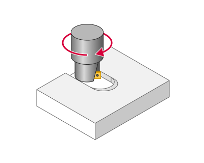
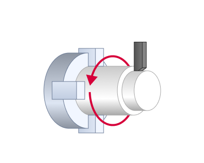
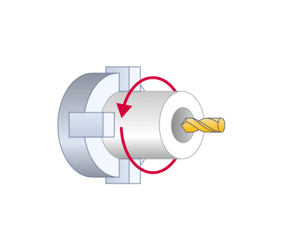
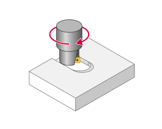
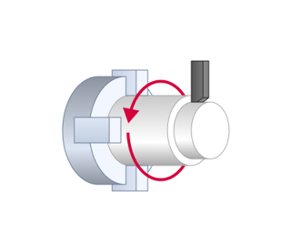
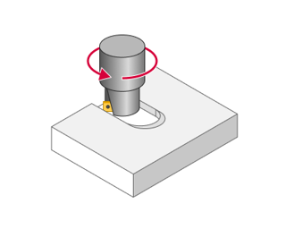
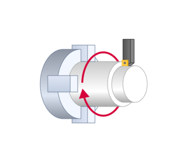

# Feeds/Speeds

  

## Application Area:

Using this dialogue the user can define the spindle rotation speed; the rapid feed value and the feed values for different areas of the toolpath. Spindle rotation speed can be defined as either the rotations per minute or the cutting speed. The defining value will be underlined. The second value will be recalculated relative to the defining value, with regard to the tool diameter.

## Feeds/Speeds (Calculate).

The calculator enables users to set and automatically calculate spindle speeds and feed rates. [Details](100128.md)

## Spindle.

This parameter group configures the spindle rotation properties.

Click here to expand..

<strong>Spindle Speed.</strong>

Specify the direct spindle speed in revolutions per minute (RPM) or cutting speed in meters per minute (CSS). In the second case, the CNC system continuously calculates and adjusts the spindle's revolutions per minute based on the current workpiece diameter. Instead of a fixed revolutions per minute, only the maximum allowable value is specified.

<strong>Max RPM.</strong>

If the spindle speed is set via cutting speed, it is necessary to specify the maximum rotational speed to restrict its increase when the diameter changes.

<strong>RPM before CSS.</strong>

In turning operations, this parameter enables RPM mode at the tool change position and activates CSS mode following the approach moves.

If the tool is positioned at the tool change point and the spindle is activated in CSS mode, its rotation will be slow since the tool is far from the workpiece's rotational axis. During the first rapid movement when the tool approaches the workpiece, the spindle accelerates significantly, causing extreme loads on the machine. To prevent this, some machine manufacturers recommend initially running the spindle in constant RPM mode and switching to CSS after the tool approaches the workpiece. When the "RPM before CSS" option is enabled, the spindle first runs in RPM mode at the speed corresponding to the first cutting feed point, then the approach movement is executed, and finally, the mode switches to CSS.

<strong>Range.</strong>

Specify the range number required to obtain the desired spindle speed on a machine with a mechanical gearbox.

<strong>Rotation direction.</strong>

Configure the spindle rotation direction.

<strong>Forward.</strong>

This is a clockwise spindle rotation when viewed from the motor side, represented in the NC program by M3. If a tool is installed, this direction tightens a right-hand screw. In turning operations, the spindle rotates towards the operator.

 

<strong>Reverse.</strong>

This is a counterclockwise spindle rotation when viewed from the motor side, represented in the NC program by M4. If a tool is installed in the spindle, this direction corresponds to tightening a left-hand screw. In turning operations, the spindle rotates away from the operator.

 

<strong>Grip RPM.</strong> The subspindle performs the part capture at this RPM.

<strong>Plunge speed.</strong>

In a <strong>Roughing Waterline</strong> operation, a specific spindle speed can be defined for the cutter's plunge movement into the material when milling enclosed surfaces like pockets. [Details.](744.md)

## Coolant:

This parameter group controls the coolant supply to the cutting area. The postprocessor uses these parameters to generate the appropriate commands for enabling and disabling coolant flow in the NC program. Users can define coolant supply methods and configure their parameters in the <strong>Coolants</strong> section under the <strong>Equipment</strong> tab. [Details.](1021.md)

Click here to expand..

<strong>Flood</strong>.

Activating this parameter initiates coolant supply through the nozzle.

<strong>Mist</strong>.

Compressed air sprays the liquid to produce a mist and transports the air-liquid mixture to the cutting zone.

<strong>Tool</strong>.

Activating the parameter enables coolant delivery under pressure through the tool channels.

<strong>Coolant 4</strong>.

Activating the parameter enables coolant delivery to the tool using an alternative method, such as an air blast.

## Cut Feeds:

This parameters group determines the feed rates for cutting, tool engagement, approach, and retraction. Each parameter can be specified in speed units such as mm/rev, mm/min, and for milling operations, also in mm/tooth. All speeds, except for the working feed rate, can be defined as a percentage of the working feed rate.

Click here to expand..

<strong>Work feed</strong> (in lathe operations <strong>Cut Feed</strong>).

The primary feed rate value maintained for stable cutting during the process. In roughing operations material removal will be performed at this speed, in finish – detail surface machining.

<strong>Calculable.</strong>

In the milling operations the feed value can be either permanent or calculated, depending on the slope angle of every elementary toolpath section. When assigning a calculated feed, defining will be feed values and coefficients when moving down, horizontally and up. The real feed values when moving down, horizontally or up will be equal to multiplication of the corresponding correction coefficient to the feed value. With intermediate values of slope angle of an elementary toolpath section, the real feed value will be calculated proportionally to the defined border values. For example, with a feed values equal to up 300, horizontally – 200, down – 100, the real feed value on a section with tool movement up under angle of 45 degrees will be equal to 250. Use of the calculated feed, allows the user to decrease the machining time due to more flexible control over cutting modes.

<strong>Up feed value.</strong>

Feed rate during vertical upward motion of the tool.

<strong>Down feed value.</strong>

Feed rate during vertical downward motion of the tool.

<strong>Engage feed.</strong>

The feed rate value used for engage movement. [Details.](100135.md)

<strong>Retract feed.</strong>

The feed rate value used for retract movement. [Details.](100135.md)

<strong>First feed</strong> (in lathe operations <strong>First Cut Feed</strong>).

The feed rate applied during working passes at the initial cutting depth. First feed is useful when machining a workpiece with an initial tough exterior (skin).

<strong>Finish feed</strong> (in lathe operations <strong>Finish Cut Feed</strong>).

The feed rate value used for finishing passes in operations with separate roughing and finishing stages. It is advised to use when need to obtain a surface of high quality after a roughing operation.

<strong>Plunge feed.</strong>

Feed applied to tool plunge moves, for example, it ia applied for plunging to a lower machining layer in waterline roughing and pocketing operations. [Details.](744.md)

<strong>Chip Breaking Feed.</strong>

In lathe operations, this value specifies the speed for retracting from the workpiece and repositioning during chip breaking.[Details.](316.md)

<strong>Adaptive feedrate.</strong>

The feature automatically adjusts the toolpath feedrate based on the actual tool engagement. So it reduces feedrate in tight corners where the tool engagement approaches 100% and increases feedrate as the tool engagment approaches 0% (the air cutting).

<strong>To activate this parameter, the main condition is the width of the overlap.</strong>

The tool engagement approaches 100% (Ae~100%). Option is active. The zones are marked in black in CAM system.

.png) .png)

<strong>Full Cut Feed.</strong> Minimum final feed, in percents of the <strong>Work Feed.</strong>

.png)

<strong>Fmin -</strong> Full Cut Feed

<strong>No Cut Feed.</strong> Feedrate on return from the zone (without cutting), in percents of the <strong>Work Feed.</strong>

.png)

<strong>Fnot -</strong> No Cut Feed

<strong>Feed Increment.</strong> Step to change feed.

_1.png)

<strong>Mark overloads.</strong> Allows you to mark the segments where the tool engagement is maximal in the Simulation tab. In the parameter you can specify the value from the <strong>work feed</strong> that needs to be marked. [Details](742.md)

<strong>Override Feeds.</strong>

This parameter becomes available in lathe operations, and its activation allows defining separate feed rate settings—<strong>Cutting</strong>, <strong>Engage</strong>, <strong>Retract</strong>, <strong>Finish Cutting</strong>, and <strong>Traversal</strong> feeds—for designated cycles in the <strong>Job Assignment</strong>.

## Non-cut Feeds:

This parameter group defines the speeds of auxiliary movements, including approach, return, and transitions between working passes. Each parameter can be set in speed units such as mm/rev, mm/min, and for milling operations, also in mm/tooth. Additionally, speeds can be specified as a percentage of the working feed rate or as rapid feed.

Click here to expand..

<strong>Rapid feed.</strong>

The feed at which all rapid tool transitions (positioning) are performed. Its value is the rapid motion velocity for the current machine. Movements at this speed are output to the NC program under the G00 address. This figure is used to calculate accurate machining process time. Toolpath sections, performed at rapid feed are displayed in red. When switched to rapid feed, the system creates the RAPID command in the CLDATA program.

<strong>Short link feed.</strong>

The feed rate applied to transition movements executed according to the <strong>Short Links</strong> rule. [Details.](100131.md)

<strong>Long link feed.</strong>

The feed rate applied to transition movements executed according to the <strong>Long Links</strong> rule. [Details.](100130.md)

<strong>Approach feed.</strong>

The feed rate applied for the approach movement, covering the distance from <strong>Feed Distance</strong> to the start of the <strong>Plunge</strong> or <strong>Engage</strong>. [Details.](100135.md)

<strong>Approach from safe surface feed.</strong>

The movement speed value from the <strong>Safe Surface</strong> to the <strong>Feed Distance</strong>. [Details.](100117.md)

<strong>Return to safe surface feed.</strong>

The movement speed value from the <strong>Feed Distance</strong> to the <strong>Safe Surface</strong> level. [Details.](100117.md)

<strong>Transition on safe surface feed.</strong>

The movement speed value during the links over the <strong>Safe Surface</strong>. [Details.](100117.md)

<strong>Traversal Feed</strong>.

In lathe operations, this speed defines the transition rate from one work pass to the next.

<strong>Return feed</strong>.

In milling operations, this is the movement speed from the end of the <strong>Retract</strong> motion to the <strong>Feed Distance</strong> level. In hole machining operations, this is the retraction speed in some drilling cycles. e.g. deep drilling cycles with chip removal or breaking. [Details.](10100.md)

<strong>Rapid idle moves (<strong>Rapid non-work moves)</strong>.</strong>

When this parameter is activated, all the tool retraction movements from the machining areaб intended to be performed at <strong>Return feed</strong> rate are instead executed at <strong>Rapid feed</strong>.

## Corner control:

This group of parameters allows you to to add some specific behaviour to the toolpath corners. It is located on the bottom of "Feeds/Speeds" page. [Details](100144.md)
