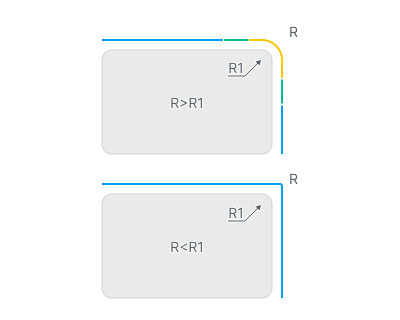
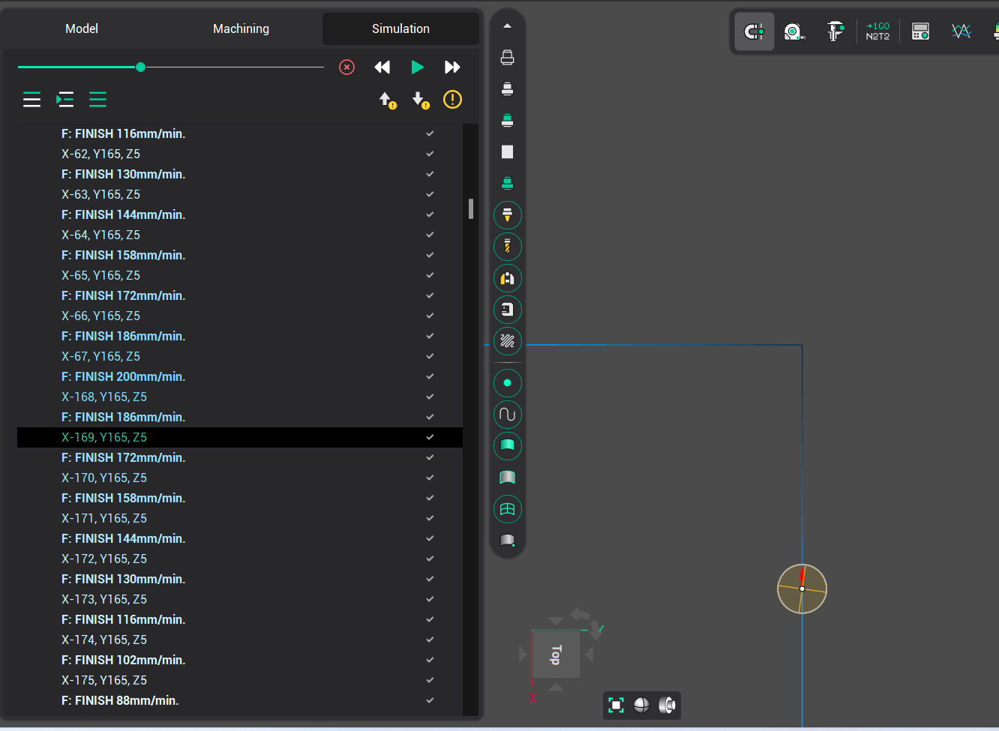

# Corner control

.png) .png)

## Application Area:

This group of parameters allows you to to add some specific behaviour to the toolpath corners. It is located on the bottom of "Feeds/Speeds" page.

> Note
>
> The corner control is only applied to the toolpath segments with an effective feed, which you can set through the <strong>Effective feeds</strong> parameter on the "Parameters" page.
>
> For the subtractive operations, the default set of the "Effective feeds" includes:
>
> - Work feed
> - Engage/Retract feeds
> - First feed
> - Finish feed

You can find the full list of operations that support "Corner control" option below:

Click here to expand..

- <strong>2D</strong>
  - 2D contouring
- <strong>2.5D</strong>
  - 2.5D contouring
- <strong>3D</strong>
  - 3D contouring
- <strong>3D/5D advanced</strong>
  - 6D contouring
- <strong>4D Rotary</strong>
  - 4D contouring
- <strong>Rest machining</strong>
  - Chamfering
- <strong>Cutting</strong>
  - Jet cutting
  - Jet cutting 5D
- <strong>Additive</strong>
  - Area cladding
  - Curve cladding
  - Cladding 3D
  - Cladding 5D
  - Non-planar slicing
- <strong>Welding</strong>
  - Welding 6D
- <strong>Spraying</strong>
  - Contour spraying
  - Surface spraying
  - Morph spraying
  - Rotary spraying
- <strong>Legacy</strong>
  - Welding 5D
  - 5D contouring

There are two main groups of parameters that allow you to control corners: <strong>Detection method</strong> and <strong>Action type</strong>.

## Detection Method:

"Detection method" group of parameters shows the system how to detect corners. Now, only one parameter is available - <strong>By angle</strong>.

### By Angle.

_(By_angle).png)

<strong>By angle.</strong> parameter defines the angle value in degrees. Two consecutive segments of the toolpath will be detected as a "corner", if the angle value between them is less than or equal to the defined value.

_(Angle).png)

For example, the first angle with a value of 102 degrees will be marked as a corner in the system if the "Angle" value is set to 110 degrees.

Also there are two additional parameters for more precise adjustment: <strong>Minimum line length</strong> and <strong>Minimum arc radius</strong>.

<strong>Minimum line length</strong> parameter allows you to smooth the toolpath before running the corner detection algorithm using the desired tolerance (or we can say the minimum line length) value. So, the detection method is applied to a smoothed toolpath, which ensures there are no false corner detections or missed corners. <em>Note: this parameter doesn't affect the final toolpath. It is only used for internal detection algorithms.</em>

<em>_(Minimum_line).png)</em>

**Minimum arc radius.** Sets the radius threshold **R** used to detect rounded corners. In the illustration, **R1** is the radius of the fillet on the model.

- **R > R1:** the fillet is treated as a corner, and the selected **Action type** is applied.
- **R < R1:** the fillet is not treated as a corner by this radius criterion.

## Action Type:

"Action type" group of parameters controls the system's behavior at toolpath corners. Three modes are available: <strong>Adjust feed</strong>, <strong>Adjust power</strong> and <strong>Adjust feed & power</strong>.

> Note
>
> The last two modes ( "Adjust power" and "Adjust feed & power") are <strong>only</strong> available for <strong>Cladding 5D</strong> and <strong>Non-planar slicing</strong> operations and only when the <strong>Power</strong> function is enabled on the <strong>Parameters</strong> page.

This group consists of 3 available options: <strong>Desired value</strong>, <strong>Number of steps</strong> and <strong>Step length</strong>.

### Adjust feed, Adjust power, Adjust feed & power

These modes allow you to adjust the feedrate and/or power at detected toolpath corners separately or simultaneously using a step-wise approach.

_(Slowdown_feed_by_step).png)

<strong>Desired value</strong> defines the target value as a percentage of the base parameter in the detected corner. Values below 100% will reduce the parameter, while values above 100% will increase it.

_(Slowdown_percentages).png)

<strong>Number of steps</strong> defines the number of steps required to reach the desired value.

_(Number_of_steps).png)

<strong>Step length</strong> defines the length of one step.

_(Step_length).png)

The effect of these parameters can be viewed on the Simulation page. Toolpath segments within corners will be displayed with a color gradient. Additionally, new commands with reduced feedrates will be added to the CLDATA and similarly highlighted with a gradient.

