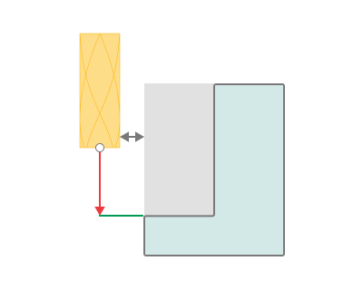
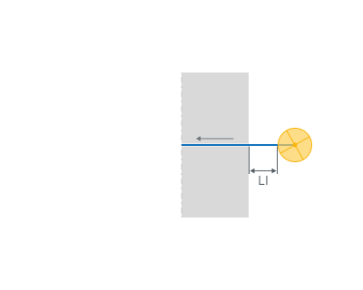
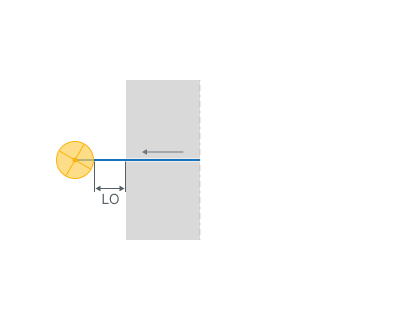

# Leads based on the Face Milling

## 

## Application Area:

Allows you to add additional engage and retract to the working moves.

<strong>Lead in.</strong> The distance from the workpiece at which a work pass starts. Used to avoid vertical plunging of the tool into material.

<strong>LI</strong> - Lead in

<strong>Lead out.</strong> The distance from the workpiece at which a work pass starts. Used to avoid vertical plunging of the tool into material.

<strong>LO</strong> - Lead out
