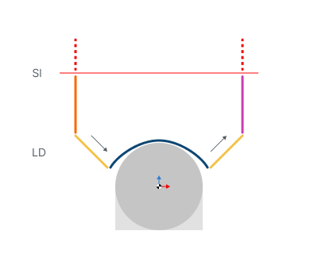
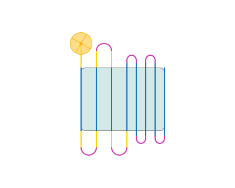
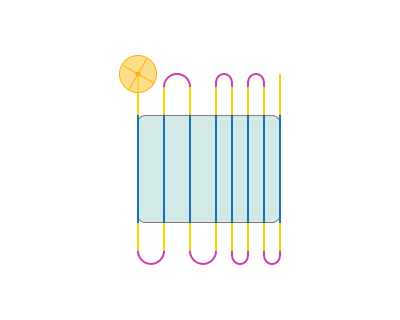
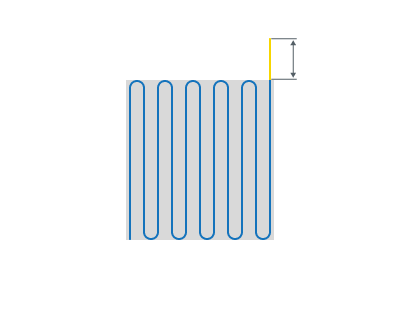
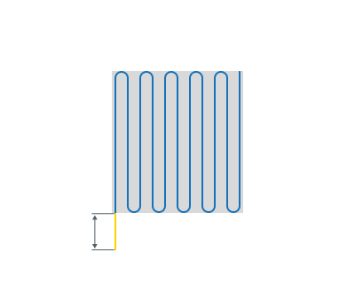

# Leads for сladding operations

<strong>Sl</strong> - Safe level

<strong>LD</strong> - Leads

## Application Area:

Allows you to add additional engage and retract to the working moves using their feed.

<strong>Engage.</strong>

Click here to expand..

<strong>Off.</strong> The Engage and Retract toolpath parts is not generated.

.png)

<strong>By Line.</strong> The engage is performed by angle to vertical to the first machining point

.png)

<strong>By Arc.</strong> The system adds an arc to the first point on the curve using the defined radius. The arc angle is constructed from the tangent of the work pass.

).png)

<strong>Length (Radius).</strong> Changes the length

.png) .png)

<strong>Angle.</strong> Changes the vertical angle

.png)

<strong>Retract.</strong>

Click here to expand..

<strong>Off.</strong> The Engage and Retract toolpath parts is not generated.

.png)

<strong>By Line.</strong> The retract is performed by angle to vertical to the last machining point

.png)

<strong>By Arc.</strong> The system adds an arc to the last point on the curve using the defined radius. The arc angle is constructed from the tangent of the work pass.

).png)

<strong>Length (Radius).</strong> Changes the length

.png) .png)

<strong>Angle.</strong> Changes the vertical angle

.png)

<strong>Use leads for.</strong>

Click here to expand..

<strong>Long links.</strong> Leads is used only on the Long links.

<strong>Long and Short links.</strong> Leads is used on both Long and Short links.

<strong>Overlaps.</strong>

Click here to expand..

<strong>Entry overlap.</strong> Allows you to set an overlap at the beginning.

<strong>Exit overlap.</strong> Allows you to set an overlap at the end.

<strong>Use leads for short links. Enable:</strong> When enabled leads are added to all links, including the short ones.

<strong>Disable:</strong> When disabled leads are added only to long links and entry/exit inks.

.png) .png)
