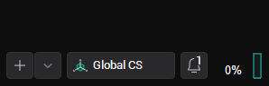
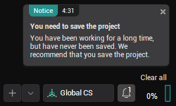

# Application events notifications

There is a mechanism to inform the user about events in the application that require special attention — <strong>pop-up notifications</strong>. When an event occurs, a small window pops up in the lower right corner of the main window, briefly describing the event. The icon in the corner also displays the total number of such notifications. By clicking on it, you can open a panel with the complete list of notifications.

  
