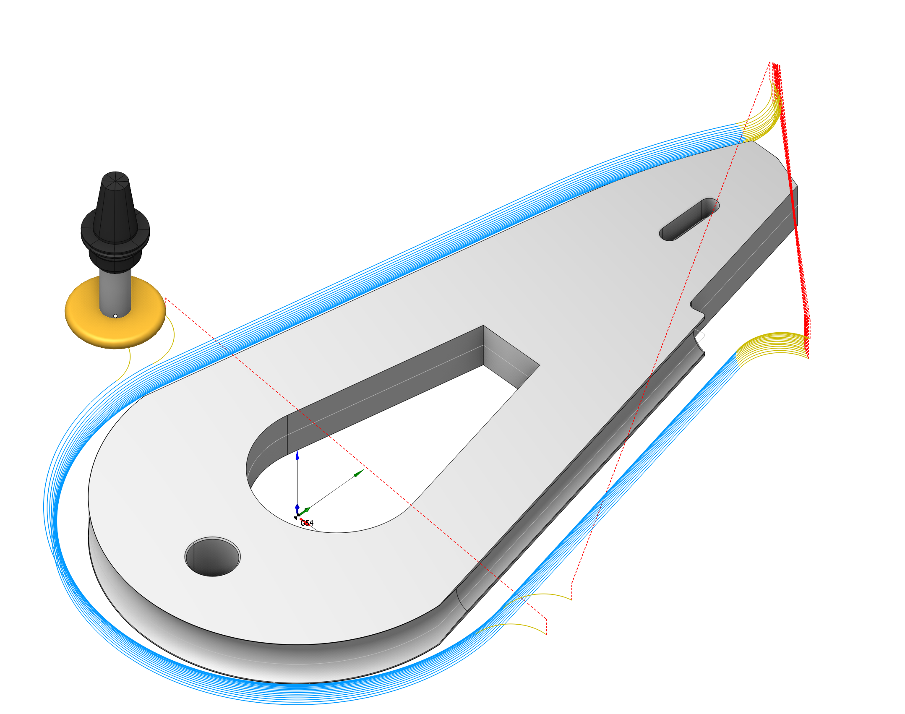
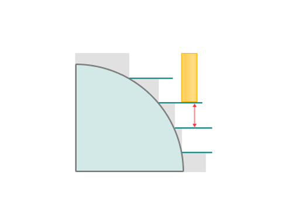
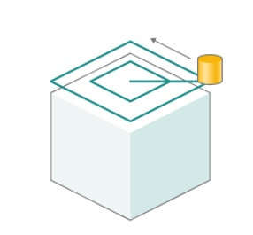

# Undercut waterline

## Application area:

<strong>Waterline undercut operation</strong> is required for creating recesses, grooves, or cavities using a milling tool. This operation generates a waterline trajectory for <strong>undercut tools</strong>.

### Setup:

The <strong>Setup</strong> tab is used to configure the primary parameters of the project. This can involve the positioning of the part on the equipment, the coordinate system of the part, and more. [Details](1022.md)

### Job assignment:

<strong>Faces.</strong> Select various surfaces of the part as the working task. The system will calculate the trajectory based on the chosen surfaces. [Details](102121.md)

<strong>Job Zone.</strong> Job zones are used to define the part areas that have to be machined by roughing and finishing milling operations. [Details](10151.md)

<strong>Restrict Zone.</strong> In addition to <strong>Job Zones</strong> in system you can use <strong>Restrict Zones</strong> to specify the workpiece areas that have not to be machined in the current operation. [Details](10152.md)

<strong>Top Level.</strong> Specifying the top level by model elements. [Details](10153.md)

<strong>Bottom Level.</strong> Specifying the bottom level by model elements. [Details](10153.md)

<strong>Properties.</strong> Displays the properties of an element. It is possible to add the stock. You can also call this menu by double clicking on an item in the list.

<strong>Delete.</strong> Removes an item from the list.

<strong>Restrictions.</strong> It allows you to restrict areas that should not be machined. [Details](101231.md)

### Strategy:

#### Depth Step.

Material removed in one pass along the tool axis between the <strong>Top</strong> and <strong>Bottom levels.</strong>

Click here to expand..

<strong>Adaptive step.</strong> Additional pass on the upper or lower level. Necessary for cleaning up parts.

.png) .png)

#### Roughing passes.

Toolpath is offset in plane by the 'Roughing step' thickness amount.

Click here to expand..

<strong>Machining strategy:</strong>

<strong>Equidistant.</strong> Processing along curves obtained by offsetting the part contour. [Details](10172.md)

<strong>Adaptive.</strong> The strategy is used to effectively remove large volumes of material with high feedrates, maximal cutting depths (up to the flutes length) and relatively shallow cutting widths (5% to 30% of the tool diameter). [Details](10171.md)

<strong>Roughing step.</strong> Step between roughing passes.

<strong>Rough rounding radius.</strong> The parameter is necessary for rounding corners during the roughing pass.

<strong>Linking radius.</strong> Linking radius for the 'links' and also the transitions for the trohoidal arcs.

<strong>Step count.</strong> Number of roughing passes.

<strong>Sorting.</strong> This tab is necessary for sorting the displayed passages. This parameter group works similarly to the <strong>Waterline roughing operation</strong>. [Details](736.md)

<strong>Check workpiece. If enabled:</strong> It adds the number of passes based on the values of the <strong>Roughing step</strong> and <strong>Step count</strong> parameters, taking into account the thickness of the workpiece. If the number of passes exceeds the thickness of the workpiece, the additional passes that do not cut the workpiece are not executed.

.png)

<strong>If disabled:</strong> It adds the number of passes based on the values of the <strong>Roughing step</strong> and <strong>Step count</strong> parameters, disregarding the workpiece.

.png)

#### Machining levels.

It defines the range along tool axis for the machining. This parameter group works similarly to the <strong>Waterline roughing operation</strong>. [Details](736.md)

#### Milling type.

Сan be assigned in almost all operations, except for the curve machining operations. This allows the user to control the required milling type (climb or conventional) during the toolpath calculation process. This parameter group works similarly to the <strong>Waterline roughing operation.</strong> [Details](736.md)

#### Sorting.

Controls the sequence of toolpath passes during the surface machining. This parameter group works similarly to the <strong>Waterline finishing operation.</strong> [Details](841.md)

### Parameters:

This tab contains the main parameters for controlling the part, workpiece, fixture and other items, which allow you to change the trajectory. [Details](100112.md)

### Links/Leads:

In the Links/Leads tab, you define the parameters for rapid movements. These movements include tool approach from the tool change position, engage to the start of the working stroke, retraction after the final cutting motion, transitions between working passes, and return to the tool change point. You can configure the sequence of movements along the coordinates, the trajectory of these motions, and the magnitude of displacements.

Click here to expand..

<strong>Сonsists of:</strong>

<strong>Approach/Return.</strong> This group of parameters manages the tool movements from the tool change position to the start of the engage toolpathes, and back. [Details](100116.md).

<strong>Links.</strong> Defines the rules governing Entry/Exit links and links between work moves. [Details](100130.md).

<strong>Leads.</strong> Allows you to add additional engage and retract to the working moves using their feed. [Details](100136.md).

<strong>Safe motions.</strong> Defines the type of <strong>Safety Surface</strong> and the distance from the workpiece to it. This surface facilitates transitions between the processed surfaces or tool paths, and the first stage of approach or return occurs toward it. [Details](100117.md).

<strong>Advanced links settings.</strong> This group of parameters specifies the features of trajectory formation for primarily five-axis operations, considering optimal movements of rotational axes. [Details](100118.md).

<strong>Distances.</strong> Distances used in Links rules [Details](100140.md).

### Feeds/Speeds:

Using this dialogue the user can define the spindle rotation speed; the rapid feed value and the feed values for different areas of the toolpath. Spindle rotation speed can be defined as either the rotations per minute or the cutting speed. The defining value will be underlined. The second value will be recalculated relative to the defining value, with regard to the tool diameter. [Details](100142.md)

### Transformations:

Parameter's kit of operation, which allow to execute converting of coordinates for calculated within operation the trajectory of the tool. [Details](10168.md)

### Part:

A Part is a group of geometrical elements that defines the space to check for gouges. [Details](330.md)

### Workpiece:

A workpiece model of an operation defines the material to be machined. [Details](738.md)

### Fixtures:

As the Fixtures the fixing aids such as chucks, grips, clamps, etc., and the restriction areas of any other nature are usually specified. [Details](10283.md)
