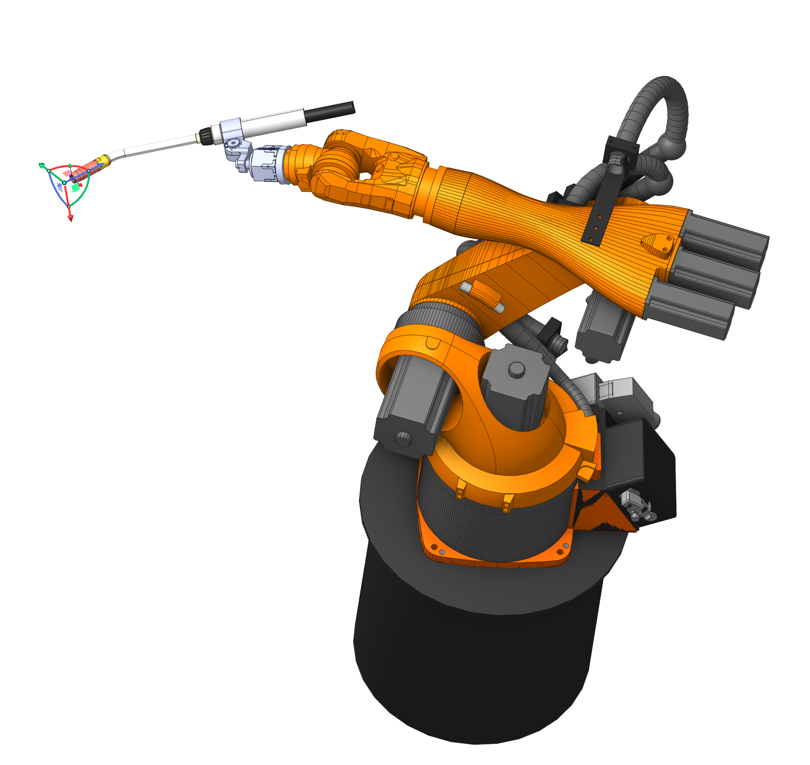
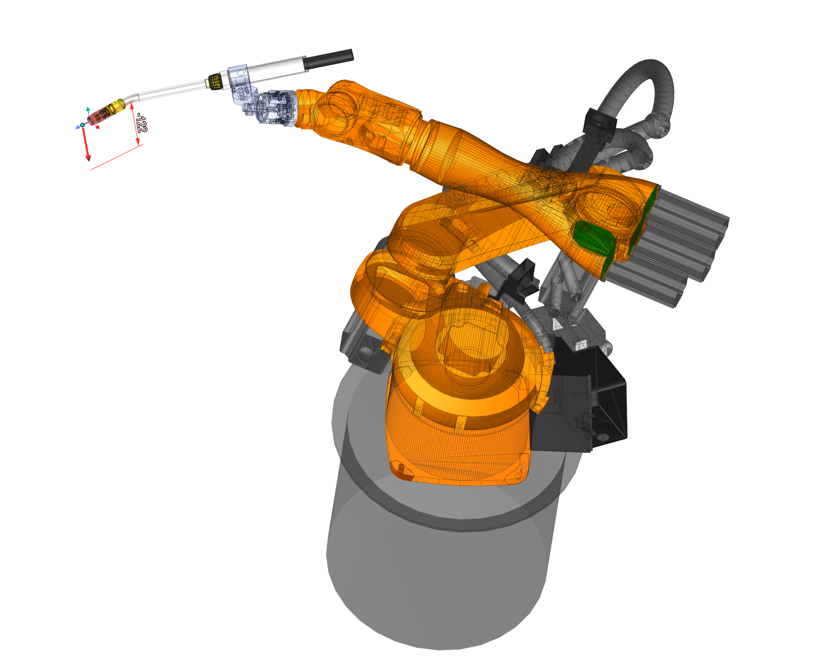
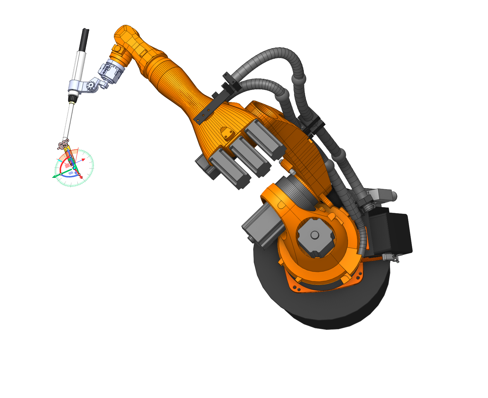

# Gimbals

  

## Application area:

Gimbals have been added as a visual tool for manipulating (moving, rotating) objects in 3D space. They provide an interactive way to precisely control the position and orientation of objects.

Gimbals have been added for use in the following cases:

- Robot TCP movements
- Defining 6th axis control via custom point
- Defining a point when controlling the tool axis via point
- Tool axis orientation
- Fixture placement
