# Recognize features

## Application Area:

The Recognize features option has been added for the 6D Contouring operation ([Details](10129.md)). It allows recognizing the following constructive elements: Circle, Rectangle, Rounded Rectangle, Slot, Hexagon, and Keyhole. This feature replaces primitive motion commands (line segments, arcs) in NC programs with high‑level constructive elements to improve code readability, compactness, and enable advanced post‑processing features

### Recognize features

**Feature Filter**

Allows you to select which <strong>types of recognize elements</strong> will be recognized. The default value is <strong>All</strong>.

**Face Selection**

Allows you to select the surface on which the feature will be recognized. (<em><strong>To select specific surfaces, you need to disable Tangency Propagation.</strong></em>)

Selecting faces

The selected surface is highlighted in the corresponding color. Additionally, any found elements are also highlighted.

Click on Selection and choose the required surface. By selecting surfaces one by one, you build a list of surfaces. To remove a surface from the list, click on the surface that has already been selected.

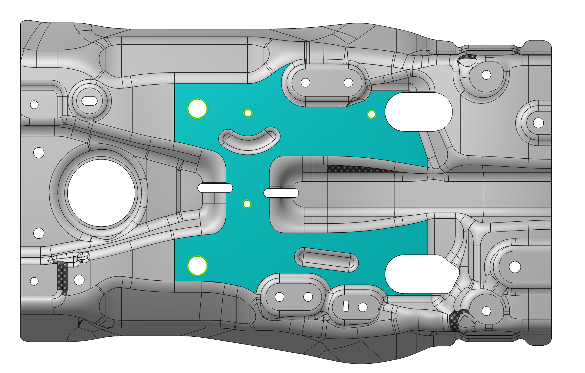 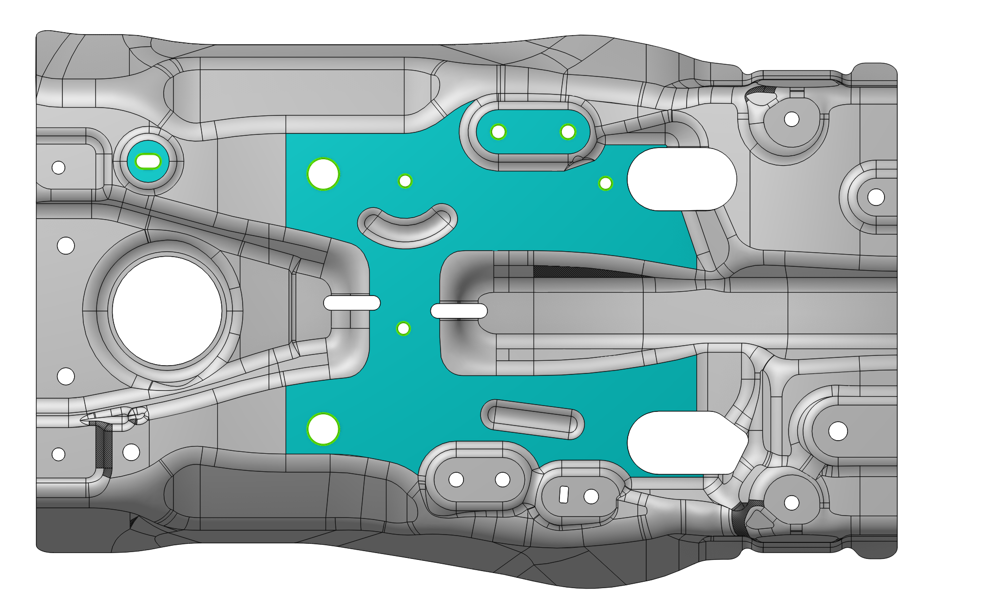

If an element is located on multiple surfaces, all relevant surfaces must be selected.

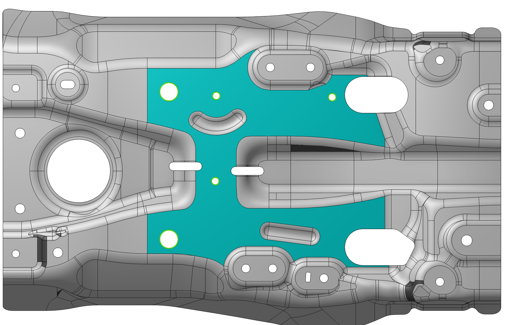 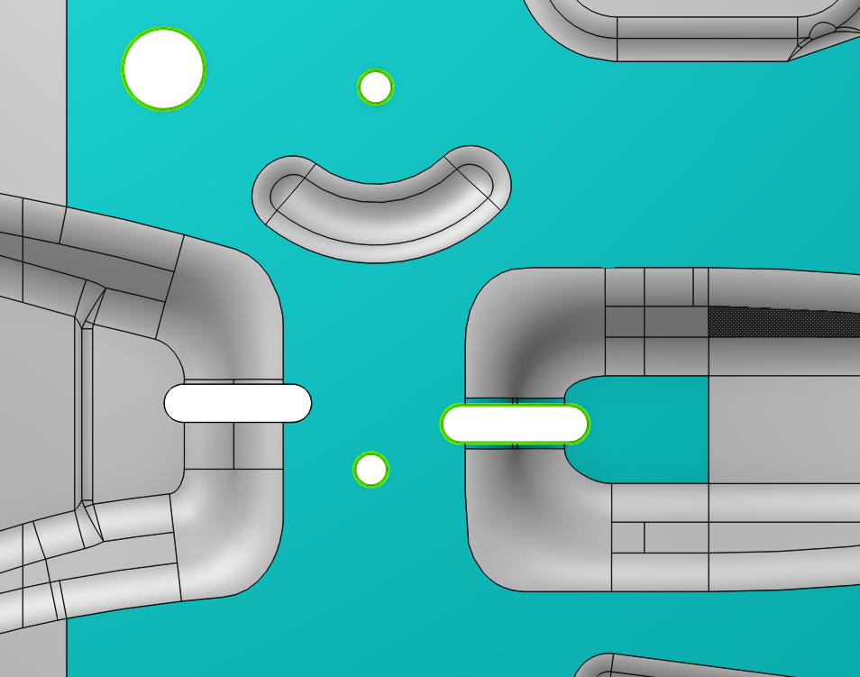

To reduce the labor intensity of surface selection, the <strong>Tangency</strong> <strong>Propagation</strong> option is enabled by default.

**Tangency Propagation**

This feature allows selecting smoothed surfaces.

Tangency propagation examples

By default, the angle is set to 0. In this case, the function operates similarly to the <strong>Smooth surface selection option</strong>. [Details](10029.md)

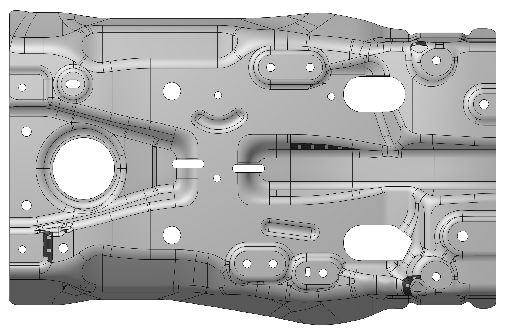 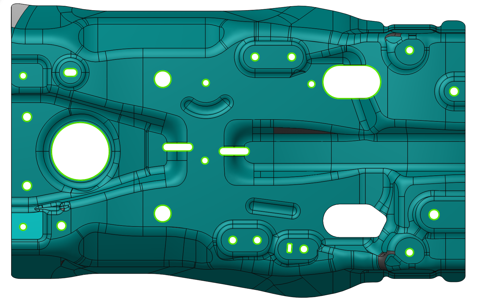

If this option is <strong>disabled</strong>, the system will recognize elements only on the surfaces that have been explicitly selected.

 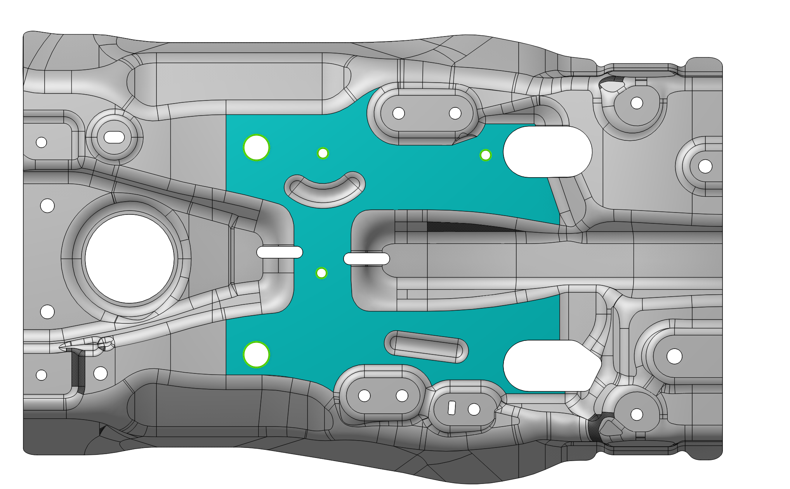

<strong>Increasing the angle</strong> allows selecting non‑smoothed surfaces as well.

Angle = 0

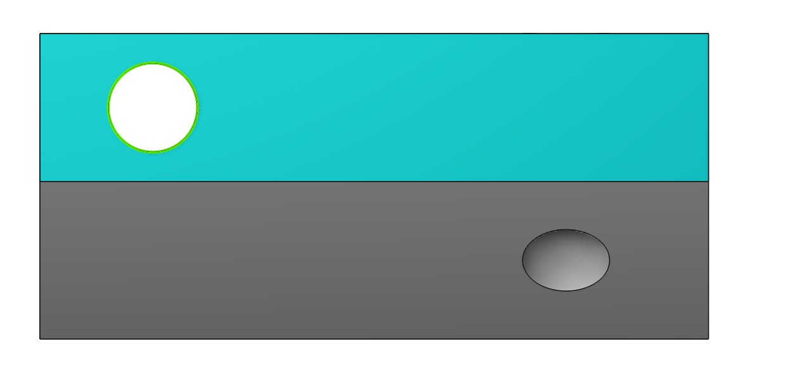

Angle = 45

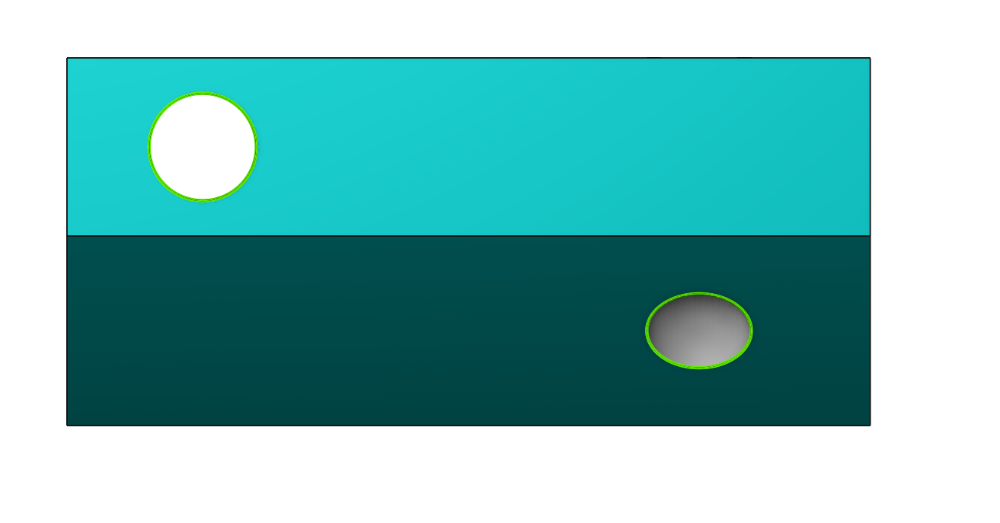

**Recognized Features**

List the types of <strong>recognize elements</strong>.

Recognized feature types

<strong>Circle.</strong> Defines a circle (it is possible to change the <strong>circle's radius</strong>).

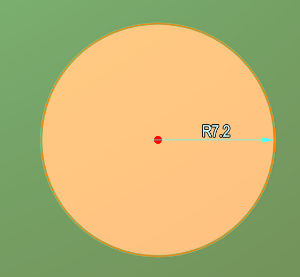

<strong>Rectangle.</strong> Allows defining a rectangle with or without corner rounding (It is possible to modify the <strong>width</strong>, <strong>length</strong> and <strong>corner radius</strong>.)

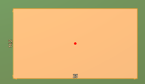 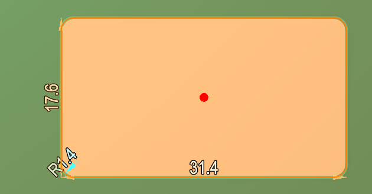

<strong>Slot.</strong> Defines a slot (it is possible to change the slot's <strong>length</strong> and <strong>radius</strong>, as well as the radius of the semicircular ends).

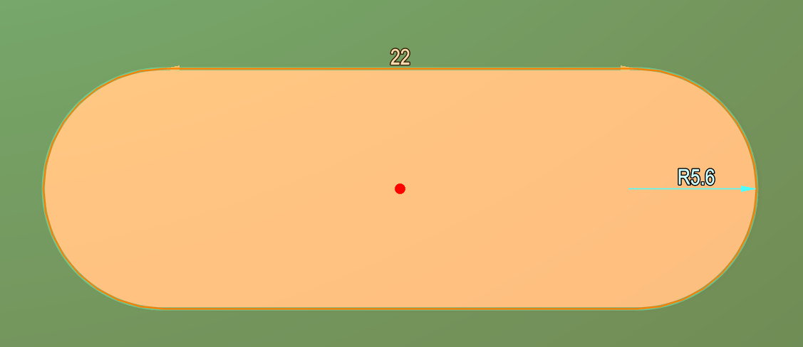

<strong>Polygon.</strong> The Polygon tool identifies all polygonal shapes having between 3 and 6 sides inclusive (<strong>edge length</strong> can be changed.).

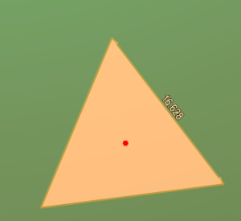 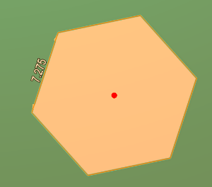

<strong>KeyHole.</strong> Defines a keyhole shape (it is possible to adjust the dimensions of both the circular part and the slot‑like extension of the keyhole).

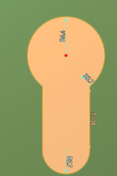

In addition to modifying the <strong>recognized elements</strong>, all elements can be moved within the selected plane by grabbing the red reference point at the element's centre.

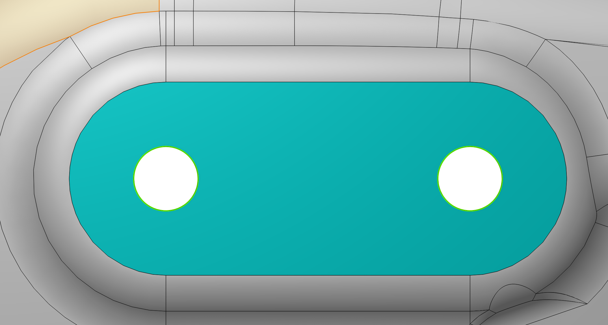 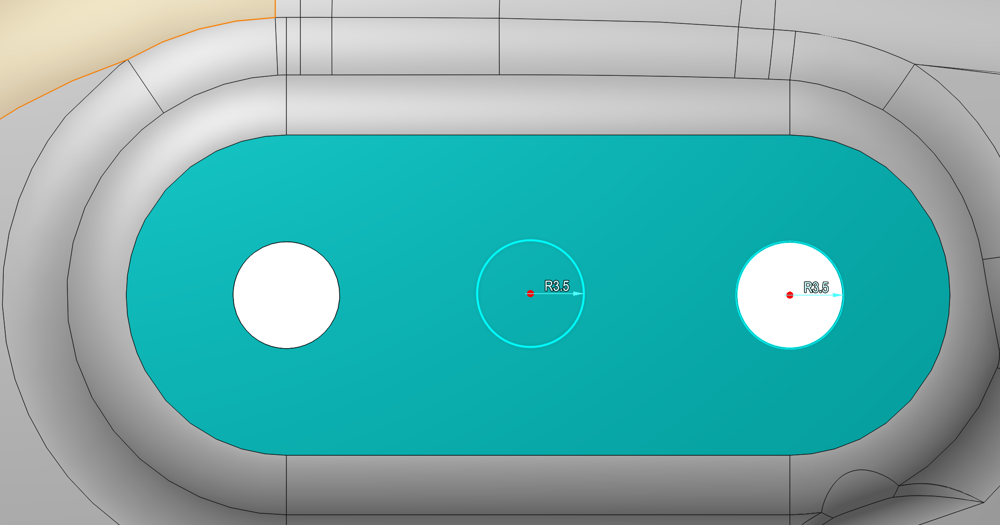

After the toolpath calculation, the <strong>CLDATA</strong> will contain commands corresponding to the <strong>constructive</strong> <strong>elements</strong>.

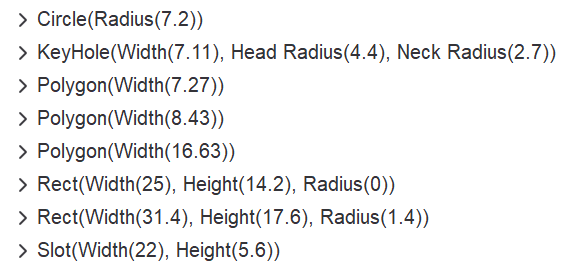

The trajectory output method can be controlled on the <strong>Parameters tab</strong> in the <strong>Features group</strong>. [Details](100112.md)
