# User defaults in inspector

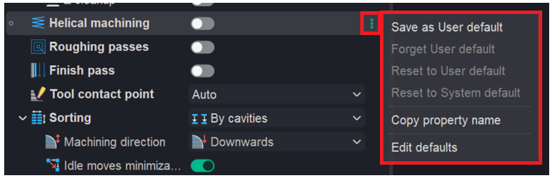

## Application Area:

These menu options let users save, reset, or customize property settings and copy property names for use elsewhere.

<strong>Save as User default</strong> - A separate file with the *.usrdef extension is created in the folder (%userprofile%\Documents\ENCY NB\Version 3\Operations\Defaults). This file contains the new default values for all parameters displayed in the inspector row.

Click here to expand..

<em>For example, if you set <strong>Helical machining</strong> to <strong>true</strong> in a <strong>2D Contouring.</strong></em>

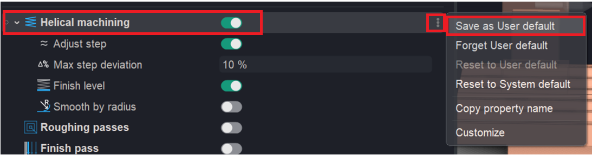

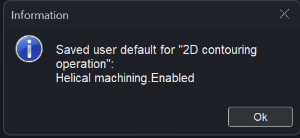

<em>The next <strong>2D contouring</strong> operation will have <strong>Helical machining</strong> already set to <strong>true.</strong></em>

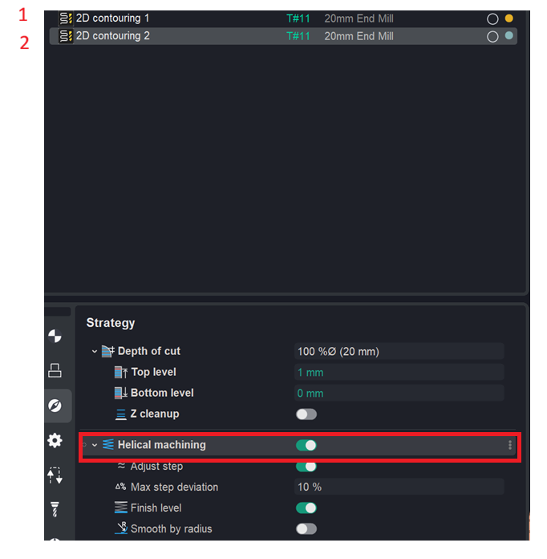

<strong>Forget user default</strong> — forget (delete) the user default. The value for all parameters of the current inspector row is removed from the *.usrdef file. If no defaults remain in the file, the entire file is deleted. The current value in the inspector remains unchanged.

Click here to expand..

<em>For example, you can also choose to forget this rule.</em>

<em>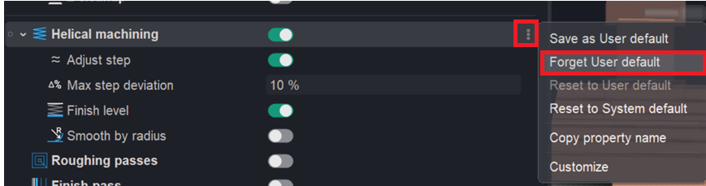</em>

<em>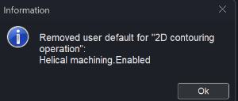</em>

<em>In this case, the next operation will be created without applying this setting.</em>

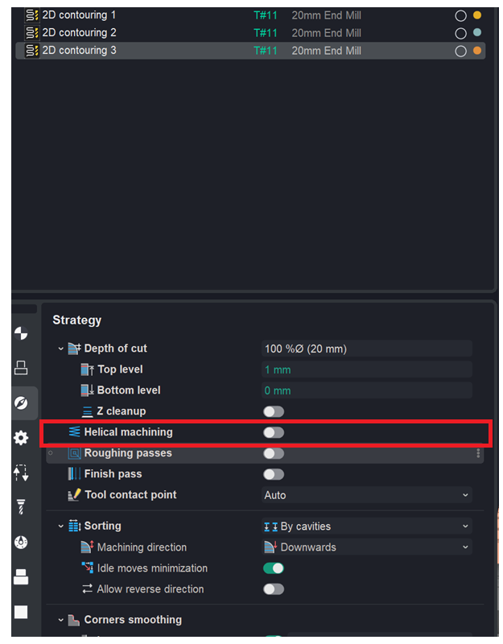

<strong>Reset to User default</strong> — reset to the user default. The current property value is replaced with the value saved in the user default settings.

Click here to expand..

<em>For example, if you need to apply your custom rules to an existing operation, use <strong>Reset to User default</strong> — the operation will adopt your saved defaults. <strong>Important: this applies to only one specific parameter.</strong></em>

<em>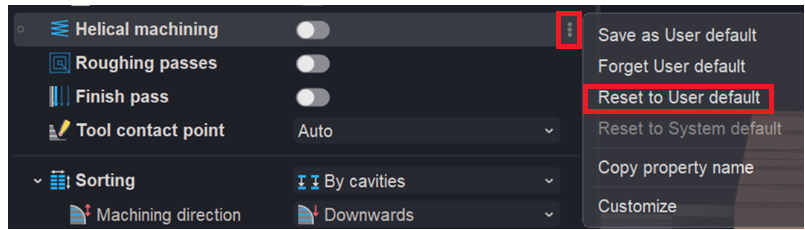</em>

<em>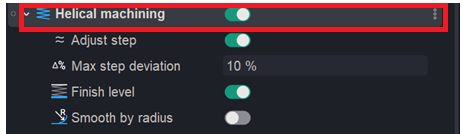</em>

<strong>Reset to System default</strong> — reset to the system default. The current property value is replaced with the value saved in the system default settings.

Click here to expand..

<em>For example, if you need to restore the system default settings for an existing operation, use <strong>Reset to System default</strong> — the operation's parameter will be reset to their original factory values. <strong>Important: this applies to only one specific parameter.</strong></em>

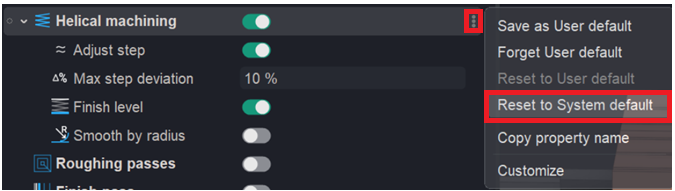

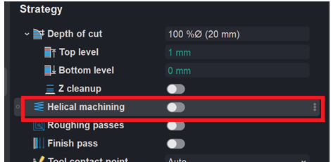

<strong>Copy property name</strong> — copy the property name. The unique property name is copied to the clipboard. You can use this name to refer to the property in expressions of other properties, in post‑processors, and in extensions via the API. If multiple properties are displayed in the row, their names are copied, separated by commas.

<strong>Edit defaults</strong>. A window will open where you can view and edit the expression for the selected property.

Click here to expand..

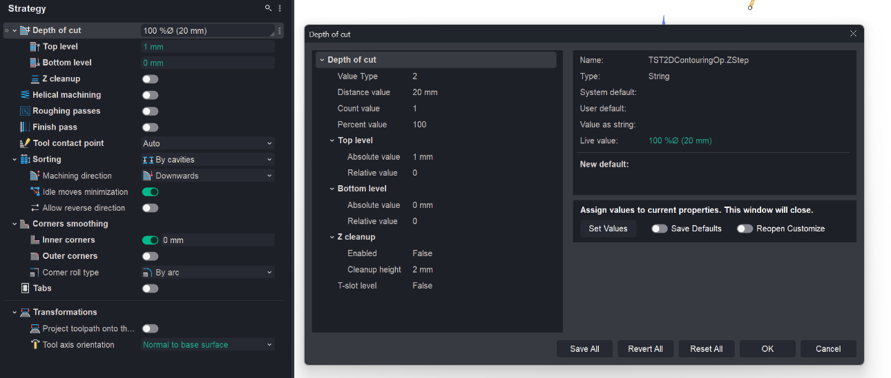

<strong>Set Values.</strong> When enabled, the assigned values are also written as the new default (the "New default" field above), so they persist for future use — not just for this instance.

<strong>Save Defaults.</strong> When enabled, the assigned values are also written as the new default (the "New default" field above), so they persist for future use — not just for this instance.

<strong>Reopen Customize.</strong> When enabled, after setting the values the Customize window reopens instead of staying closed, so you can keep editing.

<strong>Save All.</strong> Saves the current values of all properties as their defaults.

<strong>Revert All.</strong> Discards your unsaved edits and restores all properties back to their last-saved values.

<strong>Reset All.</strong> Resets all properties to the system default values

<strong>OK.</strong> Confirms and applies the changes, then closes the dialog.

<strong>Cancel.</strong> Closes the dialog without applying any changes.

The <strong>export and import</strong> functionality for settings (files in the <strong>*.usrdef</strong> format) is implemented similarly to the mechanism for working with user operation files. It can be accessed via the window for creating a <strong>new operation in Customize mode</strong>. [Details](91.md)
