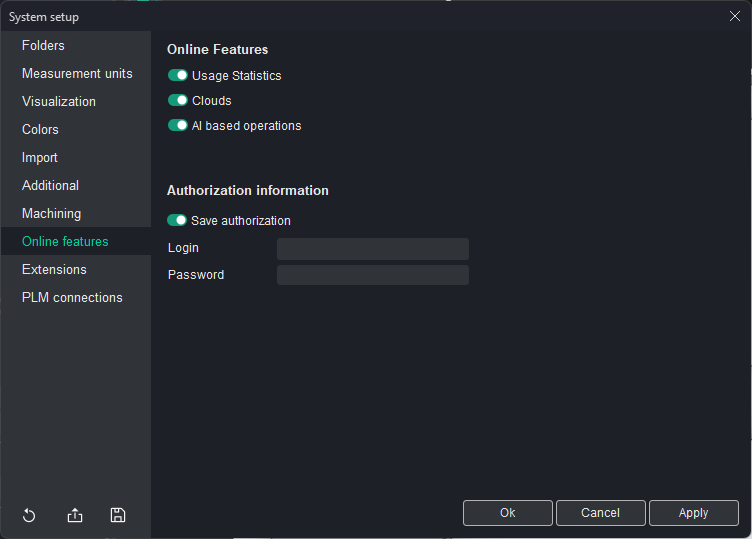

# Online features tab

## Online Features:

- <strong>Usage Statistics</strong> option allows you to enable or disable the collection of anonymous usage statistics. When enabled, the system gathers data on how features are used to help improve the software. No personal or sensitive information is collected, and the data is used solely for enhancing the user experience and optimizing system performance.
- **Clouds**. When this option is enabled, it grants access to the Clouds feature. [Details](100321.md).
- **AI-based operations**. When this option is enabled, user can create operations based on artificial intelligence. When it is disabled, this option does not appear in the list of operations available for creation..

## Authorization information:

- **Save authorization**. This option saves the user's login credentials (login and password) to the License Manager. When enabled, the system will remember the user's details, providing quicker access to online services.
- <strong>Login</strong>: This field is used to input the user's login required to access online features such as cloud collaboration or external integrations.
- <strong>Password</strong>: This field is for entering the password associated with the user's login credentials, allowing secure access to the system's online services.
