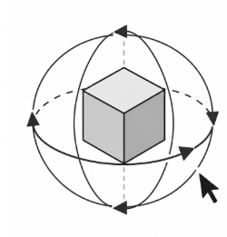
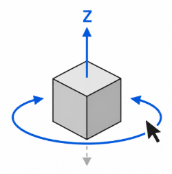

# Rotation Mode

## Application area:

Rotation Mode has been added as a camera navigation tool for controlling viewport rotation behavior in 3D scenes.

It allows switching between free Trackball rotation and constrained Orbit rotation. In Orbit mode, a selected local axis (X, Y or Z) remains vertical on screen, providing a predictable and stable camera orientation during navigation.

### Trackball.

Trackball mode provides unrestricted viewport rotation.

The scene can be rotated freely in all directions, allowing the user to inspect the model from any angle.

### Orbit.

Orbit mode constrains viewport rotation around a selected local axis.

When Orbit mode is activated:

- The selected local axis (X, Y or Z) is automatically aligned vertically on the screen.

- The view smoothly snaps to the new orientation.

- Horizontal mouse movement rotates the scene around the selected axis.

- The selected axis remains vertical throughout navigation.

