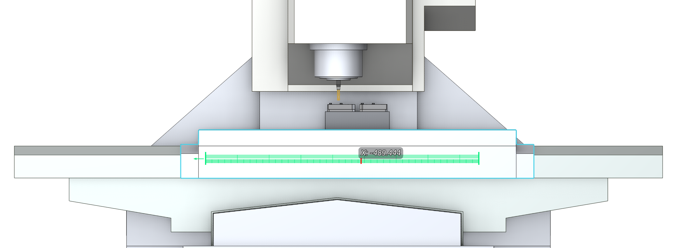

# Interactive linear axis ruler

## Application area:

The **interactive linear axis ruler** displays the position of a machine node while it is dragged along a linear axis in the **3D view**. It shows the **current axis coordinate** and **travel limits**, helping position the node and assess its location within the available travel range.

The ruler is used with **Interactive Machine** when adjusting the machine position directly in the graphic window.

## Ruler elements:

**Axis scale.** Represents the travel range along the linear axis being moved.

**Current axis coordinate.** Displays the axis name and its current coordinate beside the position marker. In the illustration, the label **X: -489.444** identifies the axis and its position.

**Travel limits.** Mark the ends of the axis travel range, allowing the current position to be compared with the limits.

*Linear axis ruler displayed while moving a machine node along the X axis.*
