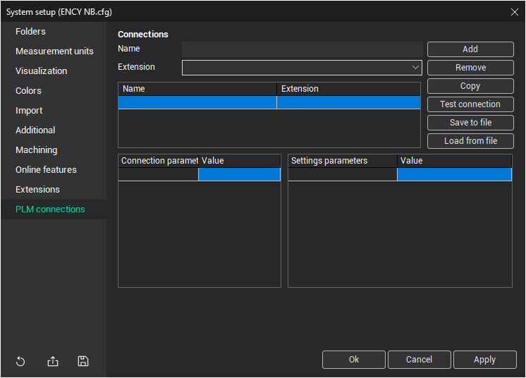

# PLM connections tab

This tab is used to configure PLM connections for different PLM systems. Configuration features are described in the [PLM connection setup](102017.md).

For detailed information, please refer to the documentation of the integration module with the corresponding PLM system.

