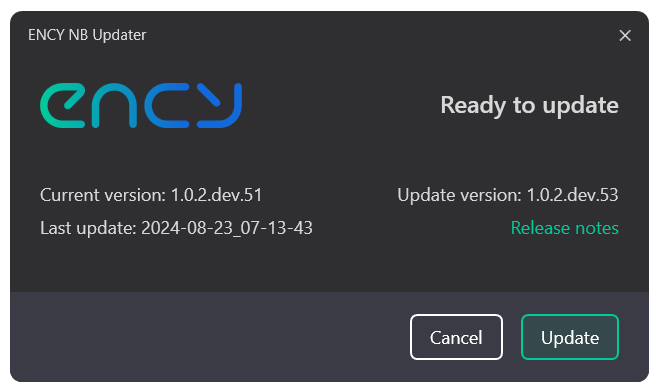
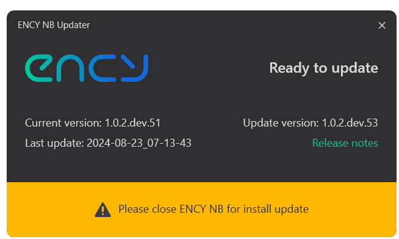

# Updating

CAM system checks for updates at each start. The system will automatically download all necessary files and check them. It is not necessary to keep CAM system open – background updates checking will be processed even after CAM system closes.

When updating systems find and successfully download modules, an updating prompt will be shown:

Press the **Update** button to run the updating process.

Updating process

The CAM system updating process includes three steps:

- The **Close CAM system** — system waits while the user saves all projects and closes CAM system manually. CAM system launching will be blocked during the update. It is possible to cancel the updating process in this step by closing this updating window.
- The **Updating** — system starts updating. CAM system can ask an administrative account to complete this step.
- The **Finish** — system deletes all temporary data, used for update.

After these steps, the updating window will be closed and CAM system will be started automatically.
