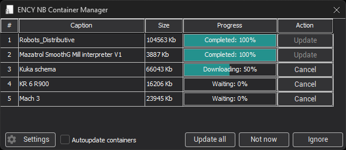
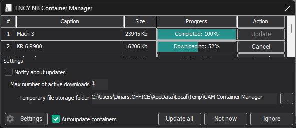
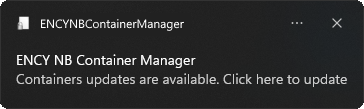
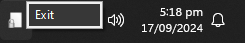

# Container manager

A container manager has been added to the CAM system. It automatically downloads and updates container files (.stfc), provided that licenses for the respective containers are available.

The system checks for uninstalled containers and container file updates each time the CAM system is launched and during license installation through the license manager.

When you click on a message or an icon in the tray, a window with a list of containers available for download or update appears:

- The <strong>Update</strong> button initiates the download and update process for the selected container.
- The <strong>Update all</strong> button initiates the download and update process for all containers in the list.
- The <strong>Not now</strong> button cancels the download/update process and minimizes the container manager to the tray. The system will prompt you to update next time.
- The <strong>Ignore</strong> button cancels the download/update process and minimizes the container manager to the tray. The system will no longer show update notifications until the <strong>Notify about updates</strong> option is enabled in the container manager settings panel.
- The <strong>Autoupdate containers</strong> option enables automatic container downloads/updates without user notification.
- The <strong>Settings</strong> button displays or hides the container manager settings panel:

- The <strong>Notify about updates</strong> checkbox enables or disables notifications about container updates. Clicking the <strong>Ignore</strong> button removes this flag.
- The <strong>Max number of active downloads</strong> field sets the number of simultaneous container downloads. If you have a slow internet connection, it is recommended to set the value to "1".
- The <strong>Temporary file storage folder</strong> field sets the directory for temporary storage of downloaded container files.

When the download process begins, container files are saved to the temporary directory specified in the settings panel. After the download is complete, the container manager will wait for the CAM system to close before moving the downloaded files to the system's container storage directory.

At the end of the process, the CAM system container manager will close automatically.

To force close the container manager, right-click on the tray icon and select <strong>Exit</strong> from the context menu:

If the container manager is forcefully closed, all active downloads will be terminated, and previously downloaded containers will not be moved to the CAM system container storage directory. The next time the system starts, it will automatically re-download any containers whose update was interrupted.
