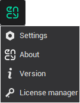
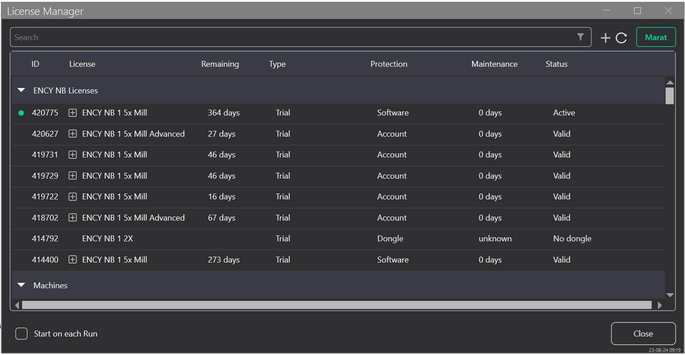
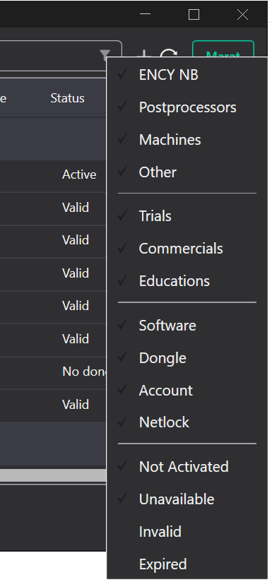
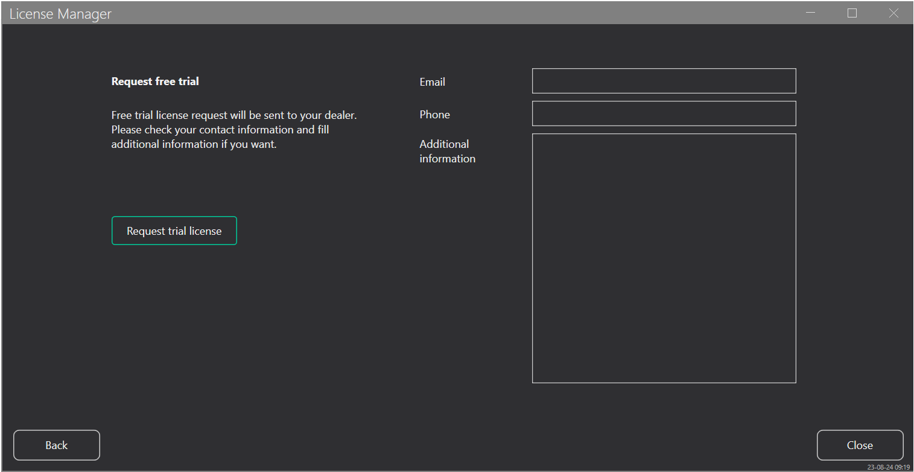
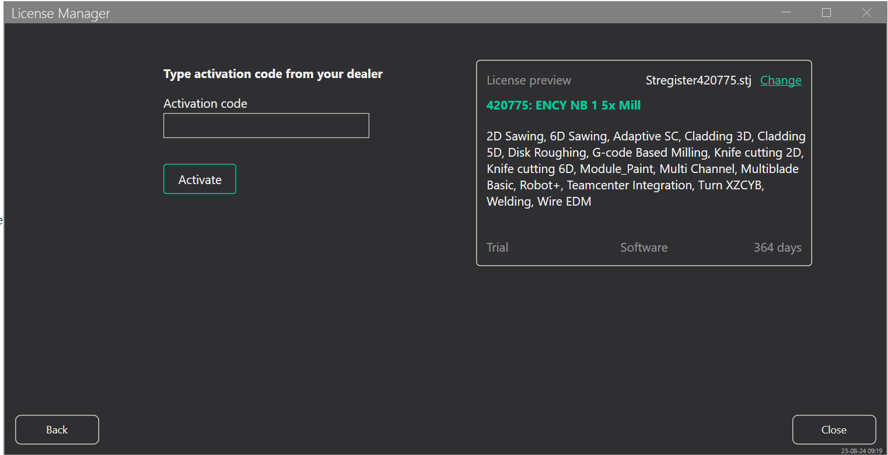

# Licence manager

The license manager contains functions for working with licenses for CAM system and licenses for its modules.

To start the manager, use the **License Manager** item in the drop-down list of the main menu.

*Information: The license manager opens automatically if there are no licenses available or if the option **Start on each run** is enabled.*

Each CAM system customer has a personal account in which all available licenses and functions are located.

<em>Information: Access to your personal account is provided by login / password and requires access to the Internet. To obtain data for authorization should contact your CAM system dealer.</em>

The main manager window is presented below:

The upper part of the window is occupied by the list of CAM system licenses already available on the computer, their status and brief information on the composition and the remaining working time.

At the bottom of the window on the right is a help button and button to close the license manager.

At the top of the window places search box and licenses filter. All licenses are divided by:

1) CAM system licenses.

2) Postprocessors.

3) Machines

4) Other containers licenses

5) Licenses type (Trials, Commercials, Educations)

6) Protection type (Software, Dongle, Account, Netlock)

7) License status (Not activated, Unavailable, Invalid, Expired)

When you hover over the line with the license, the area with 3 buttons is shown on the right:

**Activate** - Performs license activation.

**Refresh** - Updates information on the current license.

**Deactivate** - Deactivate the current license.

At the bottom of the window on the left is a button **Add**, by clicking opens this page:

**Request for new license**

If you do not have an Internet connection, when you click the **Request a new license** button, a window opens with the ability to receive a CM code to activate an offline license:

**I have license file** - Open the license file selection dialog. This menu item is useful when installing CAM system on a clean computer using an online installer.

**Start on each Run** - Turns on/off the start of the license manager every time CAM system starts.

**User settings** - Opens a window with user data settings

**Refresh licenses** - Updates the list of licenses.

**Sign out** - Logs out of the current authorized user account

The page allows you to: enter your personal account, restore a forgotten password, register a new user, as well as the possibility of authorization through social networks.

After authorization, a list of licenses from the server will be available.
