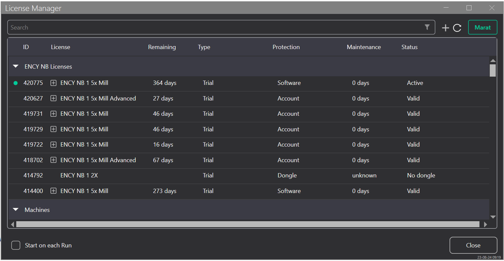
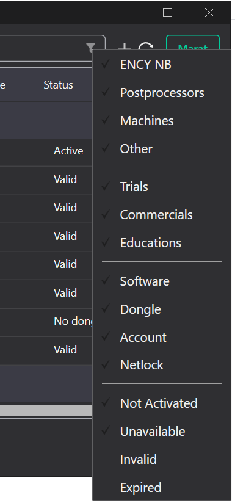
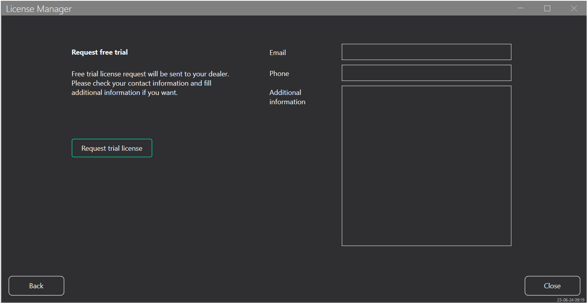
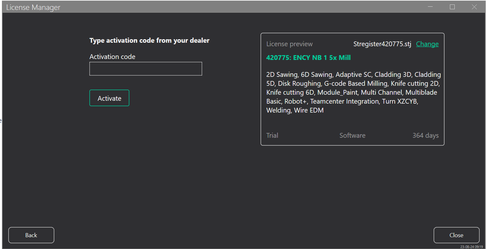

# ライセンスマネージャ

ライセンスマネージャには、CAMシステムのライセンスとモジュールのライセンスを扱う機能があります。

マネージャを起動するには、メインメニューのドロップダウンリストの `ライセンスマネージャ` 項目を選択します。

<em>情報利用可能なライセンスがない場合、または `ENCY起動時に実行` オプションが有効になっている場合は、ライセンスマネージャが自動的に開きます。</em>

各CAMシステムの顧客は、利用可能なすべてのライセンスと機能が配置されている個人アカウントを持っています。

<em>情報個人アカウントへのアクセスは、ログイン/パスワードによって提供され、インターネットへのアクセスが必要です。認証に必要なデータを取得するには、CAMシステムの販売代理店にお問い合わせてください。</em>

メインマネージャウィンドウを以下に表示します。

ウィンドウの上部は、コンピュータ上ですでに利用可能なCAMシステムライセンスのリスト、そのステータス、構成と残りの作業時間に関する簡単な情報で占められています。

右側のウィンドウの下部には、ヘルプボタンとライセンスマネージャを閉じるボタンがあります。

ウィンドウの上部には、検索ボックスとライセンスフィルタがあります。 すべてのライセンスは、以下で分割されています。

1) CAMシステムのライセンス

2) ポストプロセッサー

3) マシン

4) その他のコンテナライセンス

5) ライセンスの種類（トライアル、コマーシャル、エデュケーション）

6) プロテクトタイプ（ソフトウェア、ドングル、アカウント、ネットロック）

7)ライセンスの状態（非アクティブ、利用不可、無効、期限切れ）

ライセンスの行にカーソルを合わせると、右側に3つのボタンが表示されます。

`アクティベート` - ライセンスのアクティベーションを実行します。

`リフレッシュ` - 現在のライセンスの情報を更新します。

`ディアクティベート` - 現在のライセンスを無効にします。

左のウィンドウの下に`追加`というボタンがあり、クリックするとページが開きます。

`新規ライセンスをリクエスト`

インターネットに接続していない場合、`新規ライセンスをリクエスト`ボタンをクリックすると、オフラインライセンスをアクティベートするためのCMコードを受け取るためのウィンドウが開きます。

`ライセンスファイルを持っています` - ライセンスファイルの選択ダイアログを開きます。このメニュー項目は、オンラインインストーラーを使用してクリーンコンピュータにCAMシステムをインストールするときに便利です。

`ENCY起動時に実行` - CAMシステムが起動するたびにライセンスマネージャの起動をオン/オフにします。

<<strong>ユーザー設定</strong>- ユーザーデータ設定のウィンドウを開きます。

`ライセンス再読み込み` - ライセンスのリストを更新します。

`サインアウト` - 現在の認証ユーザーアカウントからログアウトします。

このページでは、個人アカウントの入力、忘れたパスワードの復元、新規ユーザー登録、ソーシャルネットワークを通じた認証が可能です。

認証が完了すると、サーバーのライセンス一覧が表示されます。
