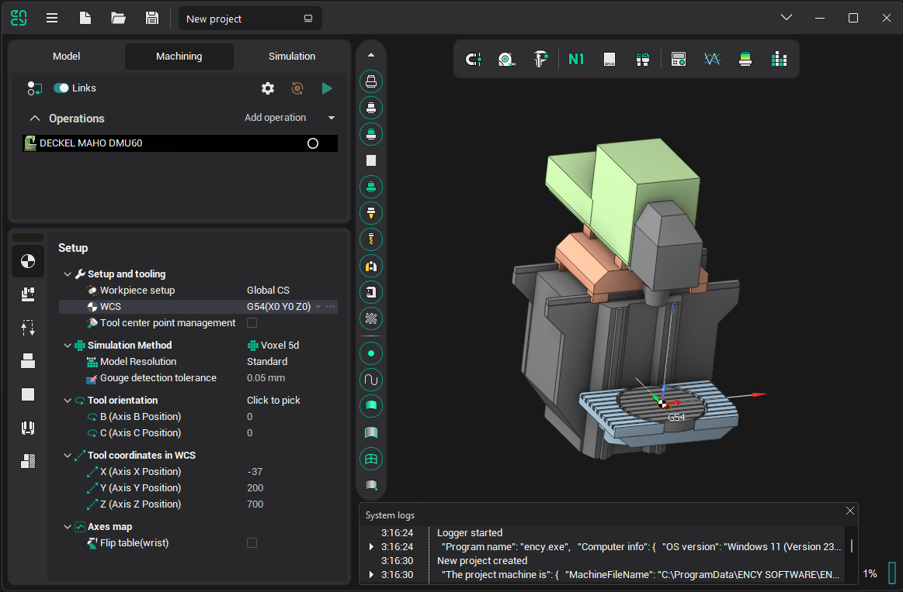

# System logs

The system provides the ability to view a list of main events that have occurred since the application was launched.

Events are displayed in a separate window, accessible via the <strong>Utilities System logs</strong> menu.

Each event includes the time of occurrence and a description. If the description is too long to fit on one line, an "Expand" button will appear at the beginning of the row. Events are color-coded based on their type: red for errors, yellow for warnings, and white for normal behavior.

This window can be particularly useful for troubleshooting, as it allows you to track event details and potentially identify the cause of issues.
