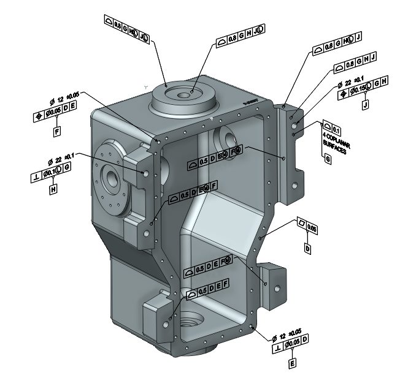
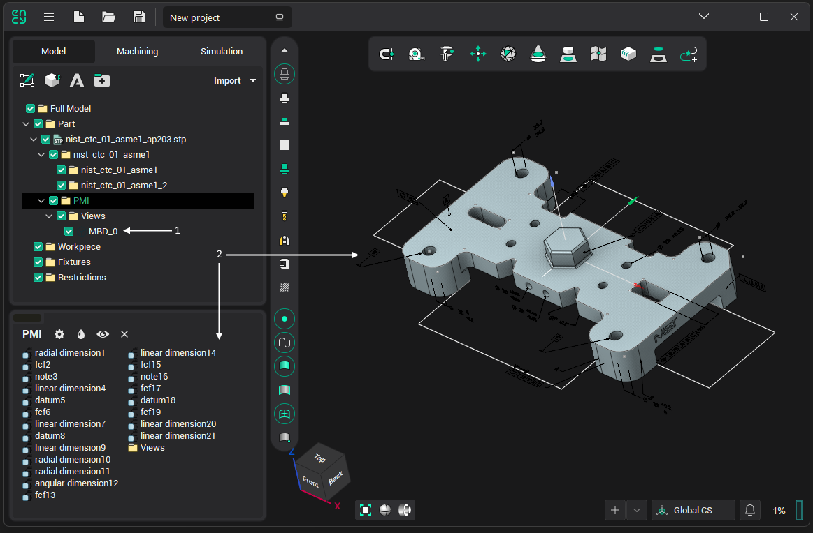
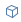
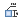

# PMI

 PMI - Product and manufacturing information. These are various dimensions and notes related to the specific 3D model elements.

PMI presented as curves is imported with the model and stored within the model folder.

In the [Geometrical model structure window](718.md), PMI is represented by the following objects:

1. <strong>Views</strong> 
2. <strong>PMI nodes</strong> 

Some <strong>PMI nodes</strong> have connections to 3D model objects.. When you select a <strong>PMI node</strong>, they are also highlighted.

When selecting the <strong>View</strong> model rotates in accordance with the coordinate system of <strong>View</strong>. If you change the visibility of <strong>View</strong>, the visibility of the associated <strong>PMI nodes</strong> also changes.

PMI import works for Step, JT, Prt(NX)
